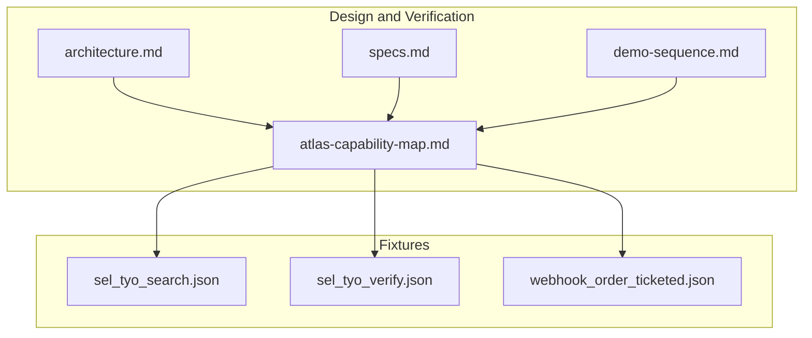
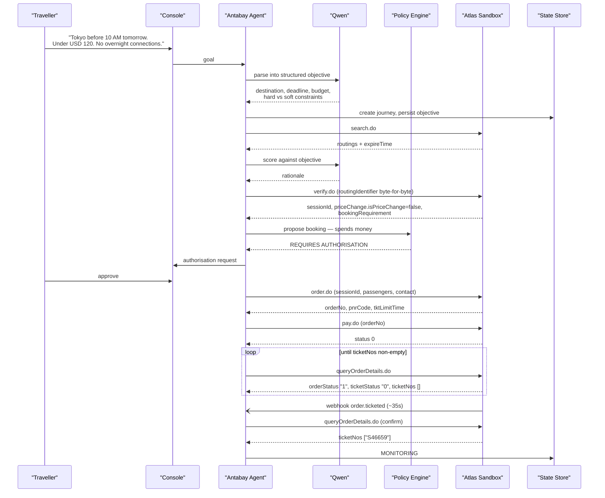
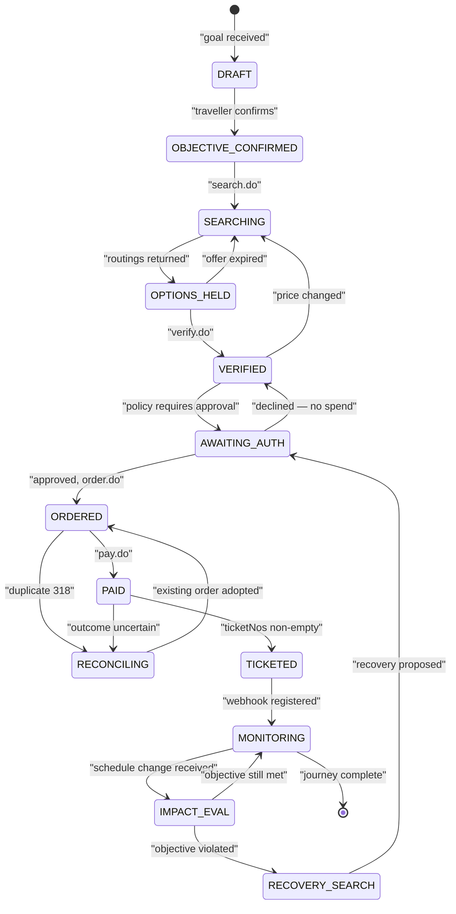
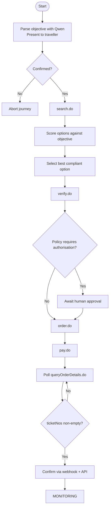
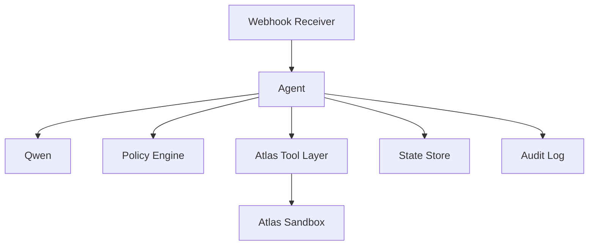

# Booking Workflow

<cite>
**Referenced Files in This Document**
- [architecture.md](file://.antabay/architecture.md)
- [specs.md](file://.antabay/specs.md)
- [demo-sequence.md](file://.antabay/demo-sequence.md)
- [atlas-capability-map.md](file://.antabay/atlas-capability-map.md)
- [sel_tyo_search.json](file://fixtures/atlas/sel_tyo_search.json)
- [sel_tyo_verify.json](file://fixtures/atlas/sel_tyo_verify.json)
- [webhook_order_ticketed.json](file://fixtures/atlas/webhook_order_ticketed.json)
</cite>

## Table of Contents
1. Introduction
2. Project Structure
3. Core Components
4. Architecture Overview
5. Detailed Component Analysis
6. Dependency Analysis
7. Performance Considerations
8. Troubleshooting Guide
9. Conclusion

## Introduction
This document describes the end-to-end booking workflow from a traveller’s natural-language goal to a confirmed ticket, grounded in verified Atlas sandbox behavior and the project’s architecture. It explains how the system parses objectives with Qwen, searches for options via search.do, scores and selects an option, verifies price and availability via verify.do, enforces policy authorisation, creates an order via order.do, processes payment via pay.do, and confirms ticketing by querying order details and reconciling webhooks. It also documents the three-clock system that drives state transitions: offer clock (~7–31 minutes), session clock (~2 hours), and ticketing deadline (30 minutes). Finally, it covers error handling for expired offers, price changes, duplicate orders, and payment failures, with concrete request/response flows and state changes at each step.

## Project Structure
The repository contains design and verification artifacts that define and validate the booking workflow:
- Architecture and sequence diagrams describe the full flow and state machine.
- The capability map defines the verified contract for Atlas endpoints, fields, clocks, and errors.
- Demo scenario and demo sequence provide a locked example run with real data.
- Fixtures capture live responses used as authoritative references for requests and responses.

**Diagram sources**
- [architecture.md:19-78](file://.antabay/architecture.md#L19-L78)
- [specs.md:303-398](file://.antabay/specs.md#L303-L398)
- [atlas-capability-map.md:25-34](file://.antabay/atlas-capability-map.md#L25-L34)

**Section sources**
- [architecture.md:19-78](file://.antabay/architecture.md#L19-L78)
- [specs.md:303-398](file://.antabay/specs.md#L303-L398)
- [atlas-capability-map.md:25-34](file://.antabay/atlas-capability-map.md#L25-L34)

## Core Components
- Objective parsing: Natural language is parsed into structured constraints (destination, deadline, budget, hard vs soft) using Qwen.
- Search: Real options are retrieved via search.do with currency and route parameters.
- Scoring and selection: Options are evaluated against the objective; hard constraints eliminate invalid options; preferences rank the rest.
- Verification: verify.do locks price and availability, returning sessionId and priceChange flags.
- Policy authorization: Deterministic policy engine decides whether human approval is required before spending money or taking irreversible actions.
- Order creation: order.do issues PNR and starts the ticketing deadline clock.
- Payment processing: pay.do charges the order; success does not equal ticketed.
- Ticket verification: queryOrderDetails.do is polled until ticketNos is non-empty; webhook events are treated as untrusted hints and must be confirmed via API.

**Section sources**
- [specs.md:429-531](file://.antabay/specs.md#L429-L531)
- [specs.md:565-646](file://.antabay/specs.md#L565-L646)
- [specs.md:675-766](file://.antabay/specs.md#L675-L766)
- [atlas-capability-map.md:152-228](file://.antabay/atlas-capability-map.md#L152-L228)
- [atlas-capability-map.md:236-313](file://.antabay/atlas-capability-map.md#L236-L313)
- [atlas-capability-map.md:315-379](file://.antabay/atlas-capability-map.md#L315-L379)

## Architecture Overview
The system composes a FastAPI backend with an agent ReAct loop, a deterministic policy engine, a webhook receiver, and a tool layer over the Atlas Sandbox. Qwen provides reasoning only; authority decisions are enforced by the policy engine. State lives in durable storage and is rehydrated on wake-ups. Webhooks are untrusted hints; queryOrderDetails.do is the truth.

**Diagram sources**
- [architecture.md:89-148](file://.antabay/architecture.md#L89-L148)
- [demo-sequence.md:10-110](file://.antabay/demo-sequence.md#L10-L110)
- [atlas-capability-map.md:236-313](file://.antabay/atlas-capability-map.md#L236-L313)
- [atlas-capability-map.md:315-379](file://.antabay/atlas-capability-map.md#L315-L379)

## Detailed Component Analysis

### Objective Parsing with Qwen
- Input: natural-language goal.
- Output: structured objective with origin, destination, latest arrival time, budget with currency, number of travellers, and stated preferences classified as hard constraints or soft preferences.
- Interaction: Qwen reasons; the system presents the parsed objective to the traveller for confirmation before any downstream action.

Key behaviors:
- Hard constraints cannot be violated; soft preferences influence ranking.
- Ambiguous or absent elements are asked rather than inferred.
- The journey record stores the confirmed objective and initial state.

**Section sources**
- [specs.md:429-531](file://.antabay/specs.md#L429-L531)
- [demo-sequence.md:21-29](file://.antabay/demo-sequence.md#L21-L29)

### Flight Search with search.do
- Request includes cid, tripType, adult/child/infant counts, fromCity/toCity, fromDate, currency, and requestSource.
- Response envelope contains routings array plus status and metadata.
- Each routing carries identifiers (fid, routingIdentifier), pricing components (adultPrice, adultTax, transactionFeePerPax), segments, scarcity signals (seatCount, riskSellout), and freshness (refreshTime, expireTime).
- Currency must be explicitly set to USD in sandbox.

Observed example:
- Fixture shows multiple routings with pricing breakdowns, segment times in local airport time, and per-offer expireTime windows.

Error handling:
- Rate limits: 10 QPS for search; respect retryAfter on 429.
- Zero options: report no options returned without error.
- Pre-aged offers: compute remaining usable time from current time, not receipt time.

**Section sources**
- [atlas-capability-map.md:40-98](file://.antabay/atlas-capability-map.md#L40-L98)
- [atlas-capability-map.md:107-126](file://.antabay/atlas-capability-map.md#L107-L126)
- [specs.md:565-646](file://.antabay/specs.md#L565-L646)
- [sel_tyo_search.json:1-120](file://fixtures/atlas/sel_tyo_search.json#L1-L120)

### Option Scoring and Selection
- Evaluate every returned option against the confirmed objective.
- Eliminate options violating hard constraints; record which constraint was violated.
- Rank remaining options using preferences; express arrival margin against deadline.
- Compute total cost using canonical formula: adultPrice + adultTax + transactionFeePerPax.
- Treat multi-leg options as connections; reject excluded connection types regardless of arrival/cost.
- Incorporate scarcity and sell-out risk signals.
- Produce rationale for selected option and reasons for high-ranking rejections.

Concrete example from demo:
- TW237 arrives earliest but exceeds budget.
- Connecting itineraries via Busan arrive in time and within budget but violate “no overnight connections” due to long layovers; rejected with explicit reason.
- ZE605 selected: meets deadline, cheapest compliant, seats available, no connection.

**Section sources**
- [specs.md:675-766](file://.antabay/specs.md#L675-L766)
- [demo-scenario.md:29-66](file://.antabay/demo-scenario.md#L29-L66)
- [demo-sequence.md:38-46](file://.antabay/demo-sequence.md#L38-L46)

### Price Verification with verify.do
- Request uses routingIdentifier byte-for-byte from search.
- Response returns sessionId, maxSeats, routing, bookingRequirement schema, and priceChange object.
- Freshness changes shape after verify: refreshTime and expireTime become null; short offer window replaced by sessionId window (documented up to 2 hours).
- priceChange.isPriceChange indicates if price changed since search; when true, prior human approval is void.

Observed values:
- For ZE605, search total and verify total both match; ancillary support and seat count provided.

Error handling:
- If price change detected, require re-authorization before proceeding.
- If offer expires before verify, return to search.

**Section sources**
- [atlas-capability-map.md:152-228](file://.antabay/atlas-capability-map.md#L152-L228)
- [sel_tyo_verify.json:1-40](file://fixtures/atlas/sel_tyo_verify.json#L1-L40)
- [sel_tyo_verify.json:374-393](file://fixtures/atlas/sel_tyo_verify.json#L374-L393)

### Policy Authorization Checks
- Deterministic policy engine evaluates proposed actions independently of model reasoning.
- Actions that spend money, void/cancel bookings, or are irreversible require human authorisation.
- Authorisation is specific to one action; if cost changes before execution, authorisation is voided.
- Silence is refusal; absence of response records refusal without spend.

Flow:
- After verify, propose booking → policy requires authorisation → present delta and impact → await approval → record outcome.

**Section sources**
- [specs.md:437-531](file://.antabay/specs.md#L437-L531)
- [demo-sequence.md:48-69](file://.antabay/demo-sequence.md#L48-L69)
- [demo-sequence.md:114-142](file://.antabay/demo-sequence.md#L114-L142)

### Order Creation with order.do
- Request includes sessionId (from verify), passenger list derived from bookingRequirement.passenger schema, contact info, and requestSource.
- Response includes orderNo, pnrCode, totalPrice, vendor totals, currency, tktLimitTime, and other metadata.
- A PNR is issued at order time; this is not proof of ticketing.
- Duplicate booking signal: duplicateOrders[] indicates existing order; reconcile rather than retry.

Observed:
- orderNo and pnrCode returned; tktLimitTime starts the 30-minute ticketing deadline.

Error handling:
- Duplicate booking (error code 318): read duplicateOrders[], query existing order, resume from its real state.
- Order not exists (error code 800): treat as internal bug, not retryable.

**Section sources**
- [atlas-capability-map.md:236-269](file://.antabay/atlas-capability-map.md#L236-L269)
- [atlas-capability-map.md:400-415](file://.antabay/atlas-capability-map.md#L400-L415)
- [demo-sequence.md:56-61](file://.antabay/demo-sequence.md#L56-L61)

### Payment Processing with pay.do
- Request includes cid, orderNo, and requestSource; no card details in this path (balance-based payment).
- Response includes orderNo, pnrCode, paymentMethod, airlines, status, msg.
- Payment success is NOT proof of ticketing; must confirm via order query.

Failure simulation:
- Cardholder name patterns trigger deterministic errors (e.g., declined or 3DS) for VCC flows; balance path uses different mechanics.

**Section sources**
- [atlas-capability-map.md:271-284](file://.antabay/atlas-capability-map.md#L271-L284)
- [atlas-capability-map.md:127-130](file://.antabay/atlas-capability-map.md#L127-L130)
- [demo-sequence.md:59-61](file://.antabay/demo-sequence.md#L59-L61)

### Ticket Verification and Webhook Handling
- Poll queryOrderDetails.do until ticketNos is non-empty; paid ≠ ticketed.
- Webhook order.ticketed arrives asynchronously; treat as untrusted hint due to lack of authentication.
- Confirm webhook claims by querying order details again.

Observed timing:
- Paid then ticketed ~35 seconds later; webhook received shortly after payment.

Webhook characteristics:
- type: "order.ticketed"; status -1 on successful event; orderStatus integer in webhook vs string in API; normalise on ingest.

**Section sources**
- [atlas-capability-map.md:285-313](file://.antabay/atlas-capability-map.md#L285-L313)
- [atlas-capability-map.md:315-379](file://.antabay/atlas-capability-map.md#L315-L379)
- [webhook_order_ticketed.json:1-53](file://fixtures/atlas/webhook_order_ticketed.json#L1-L53)
- [demo-sequence.md:61-69](file://.antabay/demo-sequence.md#L61-L69)

### Three-Clock System and State Transitions
- Offer clock: expireTime from search.do; observed 7m43s to 31m; may arrive pre-aged; governs pre-verify phase.
- Session clock: sessionId from verify.do; replaces offer clock post-verify; documented up to ~2 hours.
- Ticketing deadline: tktLimitTime from order.do; 30-minute window to complete ticketing.

Each expiry sends the journey back to search. All three are tracked in state and displayed with time remaining.

**Diagram sources**
- [architecture.md:212-257](file://.antabay/architecture.md#L212-L257)
- [atlas-capability-map.md:304-313](file://.antabay/atlas-capability-map.md#L304-L313)

**Section sources**
- [architecture.md:212-257](file://.antabay/architecture.md#L212-L257)
- [atlas-capability-map.md:304-313](file://.antabay/atlas-capability-map.md#L304-L313)

### Concrete Request/Response Flows and State Changes

#### Goal to Ticketed Sequence
- Understand: parse objective with Qwen; confirm with traveller.
- Observe: search.do returns options with expireTime; start offer clock.
- Reason: score options; select best compliant option; present rationale.
- Act & Verify: verify.do returns sessionId and priceChange; policy gate; order.do returns orderNo and tktLimitTime; pay.do returns success; poll queryOrderDetails.do until ticketNos populated; confirm via webhook then API.

**Diagram sources**
- [architecture.md:89-148](file://.antabay/architecture.md#L89-L148)
- [demo-sequence.md:10-110](file://.antabay/demo-sequence.md#L10-L110)
- [atlas-capability-map.md:236-313](file://.antabay/atlas-capability-map.md#L236-L313)

#### Error Handling Flows

- Expired offer:
  - Detect expireTime elapsed before verify or selection.
  - Return to search; update UI with offer clock spent.

- Price change:
  - verify.do priceChange.isPriceChange=true invalidates prior authorisation.
  - Require re-approval; present new cost delta.

- Duplicate order:
  - Error code 318 with duplicateOrders[].
  - Reconcile by querying existing order; do not retry.

- Payment failure:
  - pay.do returns error codes; handle deterministically.
  - For VCC simulations, use known cardholder names to trigger declines or 3DS.

- Unauthenticated webhook:
  - Treat as hint; confirm via queryOrderDetails.do before updating state.

**Section sources**
- [atlas-capability-map.md:107-130](file://.antabay/atlas-capability-map.md#L107-L130)
- [atlas-capability-map.md:285-313](file://.antabay/atlas-capability-map.md#L285-L313)
- [atlas-capability-map.md:400-415](file://.antabay/atlas-capability-map.md#L400-L415)
- [specs.md:675-766](file://.antabay/specs.md#L675-L766)

## Dependency Analysis
The booking workflow depends on a strict contract with Atlas and internal components:
- Agent depends on Qwen for reasoning only; never decides authority.
- Policy engine enforces deterministic rules independent of model output.
- Tool layer calls Atlas endpoints; webhook receiver integrates external events.
- State store persists journey, objectives, clocks, audit trail, and authorisations.

**Diagram sources**
- [architecture.md:19-78](file://.antabay/architecture.md#L19-L78)

**Section sources**
- [architecture.md:19-78](file://.antabay/architecture.md#L19-L78)

## Performance Considerations
- Rate limits: search.do 10 QPS; verify.do and getOffers.do share 60 QPM; seatAvailability.do and getLuggage.do share 60 QPM. Respect retryAfter on 429; no retry loops.
- Call budgets: enforce per-journey call budgets for rate-limited endpoints to prevent runaway loops.
- Offer freshness: offers can be partially aged; compute remaining time from current time; re-verify before committing.
- Currency mixing: fares in USD; refund/change fees may be in other currencies; do not combine without explicit conversion.

[No sources needed since this section provides general guidance]

## Troubleshooting Guide
Common issues and resolutions:
- Expired offer: detect expireTime; return to search; display spent clock.
- Price change: read priceChange.isPriceChange; require re-approval; show updated cost.
- Duplicate booking: error 318; read duplicateOrders[]; query existing order; resume from real state.
- Payment failure: handle error codes; simulate declines or 3DS for testing; reconcile outcomes.
- Webhook misinterpretation: do not trust webhook status; always confirm via queryOrderDetails.do; normalise orderStatus types.

**Section sources**
- [atlas-capability-map.md:107-130](file://.antabay/atlas-capability-map.md#L107-L130)
- [atlas-capability-map.md:285-313](file://.antabay/atlas-capability-map.md#L285-L313)
- [atlas-capability-map.md:400-415](file://.antabay/atlas-capability-map.md#L400-L415)

## Conclusion
The booking workflow transforms a natural-language goal into a confirmed ticket through disciplined parsing, real-time search, objective-driven scoring, price verification, deterministic policy authorisation, order creation, payment processing, and robust ticket verification. The three-clock system ensures timely progression while guarding against stale offers, sessions, and unpaid tickets. Error handling is explicit and resilient, treating webhooks as hints and relying on authoritative queries. This approach balances speed, safety, and transparency, making the process auditable and user-controlled.

[No sources needed since this section summarizes without analyzing specific files]