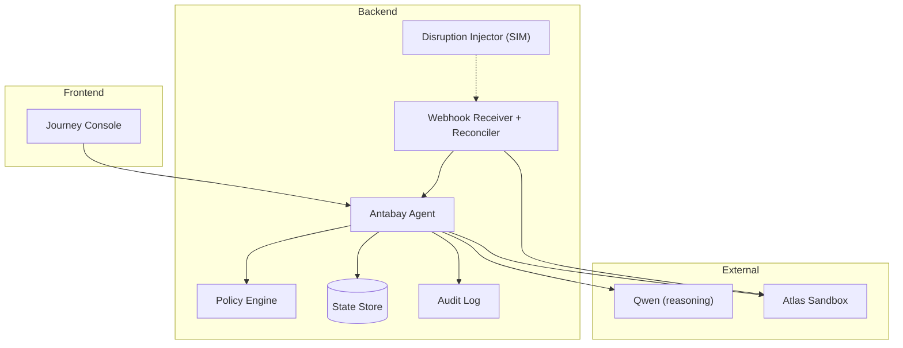
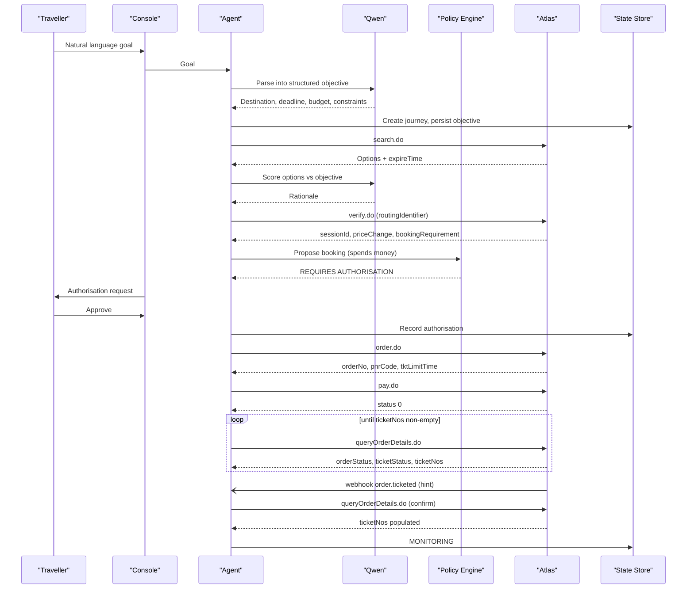
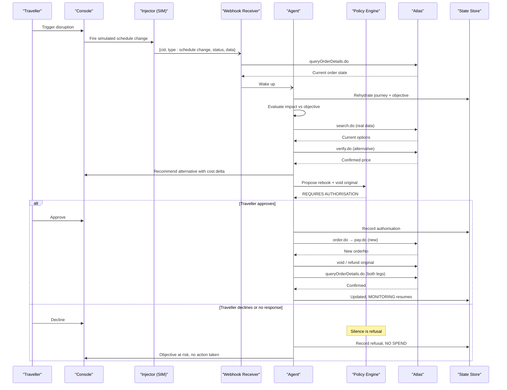
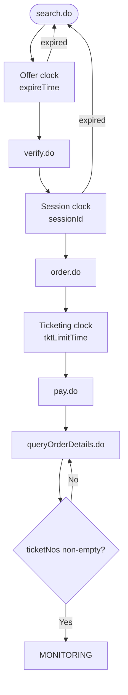
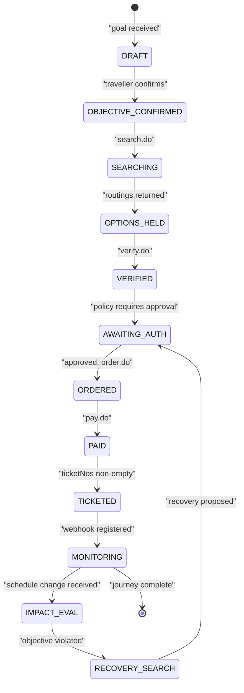
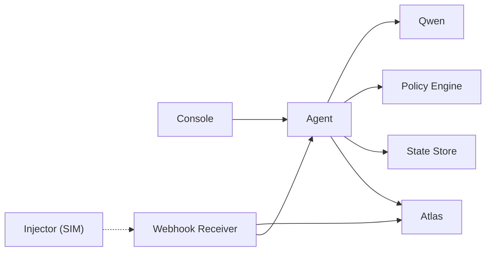

# Component Interactions

<cite>
**Referenced Files in This Document**
- [architecture.md](file://.antabay/architecture.md)
- [demo-sequence.md](file://.antabay/demo-sequence.md)
- [specs.md](file://.antabay/specs.md)
- [atlas-capability-map.md](file://.antabay/atlas-capability-map.md)
- [plan.md](file://.antabay/plan.md)
- [webhook_order_ticketed.json](file://fixtures/atlas/webhook_order_ticketed.json)
</cite>

## Table of Contents
1. Introduction
2. Project Structure
3. Core Components
4. Architecture Overview
5. Detailed Component Analysis
6. Dependency Analysis
7. Performance Considerations
8. Troubleshooting Guide
9. Conclusion

## Introduction
This document explains Antabay’s component interaction patterns across the full booking lifecycle and disruption recovery flow. It focuses on how Traveller, Console, Agent, Qwen, Policy Engine, and Atlas collaborate to move from a natural-language goal to a ticketed booking, and how the system detects disruptions, evaluates impact, proposes recovery, obtains human authorisation, executes changes, and reconciles state. It also documents the three-clock system that governs offer freshness, session validity, and ticketing deadlines, and maps journey state transitions with their triggers.

## Project Structure
The repository contains design and verification artifacts that define the system’s architecture, sequences, contracts, and fixtures:
- Architecture and sequence diagrams describe end-to-end flows and state machine transitions.
- The capability map records verified endpoints, error codes, clocks, and webhook behavior observed in the Atlas sandbox.
- Demo scenario and sequence files provide a locked, real-data walkthrough used for demonstration and assessment.
- Fixtures capture real responses (redacted) to support tests and replay.

**Diagram sources**
- [architecture.md:21-78](file://.antabay/architecture.md#L21-L78)

**Section sources**
- [architecture.md:1-86](file://.antabay/architecture.md#L1-L86)
- [atlas-capability-map.md:1-39](file://.antabay/atlas-capability-map.md#L1-L39)

## Core Components
- Traveller: Provides goals and approvals via the Console.
- Console: Renders objective, state, clocks, trace stream, and authorisation prompts.
- Antabay Agent: Owns the ReAct loop; reasons with Qwen, consults Policy Engine, persists state, calls Atlas tools, and drives the journey state machine.
- Qwen: Reasoning model used by the Agent; never decides authority or acts directly.
- Policy Engine: Deterministic rules that decide whether an action requires human authorisation.
- Webhook Receiver + Reconciler: Accepts inbound events (untrusted hints), normalises them, queries authoritative state, and wakes the Agent.
- Disruption Injector: Simulates schedule-change events for demonstration; labelled SIMULATED.
- Atlas Tool Layer: search.do, verify.do, order.do, pay.do, queryOrderDetails.do, void/refund.
- State Store and Audit Log: Durable journey state, identifiers with TTLs, and append-only audit trail.

Key principles enforced by the architecture:
- Qwen reasons; Policy Engine decides authority; the line never crosses.
- Journey state lives outside the agent; every wake-up rehydrates from durable storage.
- Webhooks are untrusted hints; queryOrderDetails.do is the truth.
- Every travel fact shown to the traveller traces back to an Atlas response.

**Section sources**
- [architecture.md:19-86](file://.antabay/architecture.md#L19-L86)
- [specs.md:429-530](file://.antabay/specs.md#L429-L530)
- [atlas-capability-map.md:315-378](file://.antabay/atlas-capability-map.md#L315-L378)

## Architecture Overview
The happy path moves from goal to ticketed through a strict sequence of interactions. The disruption path receives a schedule change, verifies impact against the objective, proposes recovery, gates execution through policy, and resumes monitoring after successful reconciliation.

**Diagram sources**
- [architecture.md:91-148](file://.antabay/architecture.md#L91-L148)
- [demo-sequence.md:21-69](file://.antabay/demo-sequence.md#L21-L69)
- [atlas-capability-map.md:236-313](file://.antabay/atlas-capability-map.md#L236-L313)

**Section sources**
- [architecture.md:89-148](file://.antabay/architecture.md#L89-L148)
- [demo-sequence.md:8-110](file://.antabay/demo-sequence.md#L8-L110)

## Detailed Component Analysis

### Happy Path: Goal to Ticketed Booking
- Understand: Agent parses the goal into a structured objective using Qwen and persists it.
- Observe: Agent calls search.do and tracks the offer clock (expireTime).
- Reason: Agent scores options against hard constraints and preferences; rejects invalid options even if they appear compliant superficially.
- Act & Verify: Agent verifies selected option, checks priceChange, proposes booking to Policy Engine, obtains approval, orders, pays, and polls until ticketNos are present.
- Confirm: Webhook arrives but is treated as a hint; Agent confirms via queryOrderDetails.do before moving to MONITORING.

Timing considerations:
- Offer expiry can be very short and may arrive partially aged.
- Session validity replaces offer expiry post-verify.
- Payment success does not equal ticketing; polling continues until ticketNos are non-empty.
- Webhook typically arrives within seconds after payment but must be confirmed.

Error handling and retries:
- Respect rate limits and wait instructions; do not retry loops.
- Treat duplicate booking (error 318) as reconcilable; adopt existing order.
- Do not treat HTTP 200 as success; assert API status fields.

**Section sources**
- [architecture.md:89-148](file://.antabay/architecture.md#L89-L148)
- [atlas-capability-map.md:107-129](file://.antabay/atlas-capability-map.md#L107-L129)
- [atlas-capability-map.md:236-313](file://.antabay/atlas-capability-map.md#L236-L313)
- [specs.md:273-352](file://.antabay/specs.md#L273-L352)

### Disruption and Recovery Flow
- Trigger: A schedule change event arrives (simulated injector or real webhook).
- Receive: Webhook receiver accepts the event, treats it as an untrusted hint, and queries Atlas for authoritative state.
- Wake: Agent rehydrates the journey and objective from durable storage.
- Evaluate: Agent compares new arrival time against the deadline; if violated, enters recovery search.
- Search & Verify: Agent searches current options, verifies alternatives, and computes cost delta vs current position.
- Authorise: Recovery involves spending money and potentially voiding/refunding the original; Policy Engine requires human authorisation.
- Execute: On approval, Agent books new leg, initiates void/refund on original, and verifies both legs independently.
- Resume: After confirmation, journey returns to MONITORING.

Sequence diagram for disruption and recovery:

**Diagram sources**
- [architecture.md:154-208](file://.antabay/architecture.md#L154-L208)
- [demo-sequence.md:71-109](file://.antabay/demo-sequence.md#L71-L109)

**Section sources**
- [architecture.md:152-208](file://.antabay/architecture.md#L152-L208)
- [specs.md:437-531](file://.antabay/specs.md#L437-L531)

### Three-Clock System
The booking lifecycle is governed by three distinct clocks:
- Offer clock (expireTime): Pre-verify window; observed between ~7m43s and 31m; may arrive pre-aged.
- Session clock (sessionId): Post-verify window; documented up to ~2 hours.
- Ticketing clock (tktLimitTime): Post-order window; observed as 30 minutes.

Each expiry sends the journey back to search. All three are tracked in state and displayed in the console with remaining time.

Flowchart of clocks and transitions:

**Diagram sources**
- [architecture.md:263-278](file://.antabay/architecture.md#L263-L278)
- [atlas-capability-map.md:304-313](file://.antabay/atlas-capability-map.md#L304-L313)

**Section sources**
- [architecture.md:261-278](file://.antabay/architecture.md#L261-L278)
- [atlas-capability-map.md:107-129](file://.antabay/atlas-capability-map.md#L107-L129)
- [atlas-capability-map.md:304-313](file://.antabay/atlas-capability-map.md#L304-L313)

### Journey State Machine and Transitions
The journey progresses through defined states with explicit triggers:
- DRAFT → OBJECTIVE_CONFIRMED: Traveller confirms parsed objective.
- OBJECTIVE_CONFIRMED → SEARCHING: Agent calls search.do.
- SEARCHING → OPTIONS_HELD: Routings returned with offer clock.
- OPTIONS_HELD → VERIFIED: verify.do called; offer clock replaced by session clock.
- VERIFIED → AWAITING_AUTH: Policy requires approval.
- AWAITING_AUTH → ORDERED: Approved; order.do called.
- ORDERED → PAID: pay.do executed.
- PAID → TICKETED: ticketNos non-empty (confirmed via queryOrderDetails.do).
- TICKETED → MONITORING: Webhook registered; monitoring active.
- MONITORING → IMPACT_EVAL: Schedule change received.
- IMPACT_EVAL → RECOVERY_SEARCH: Objective violated; search alternatives.
- RECOVERY_SEARCH → AWAITING_AUTH: Recovery proposed; requires authorisation.
- MONITORING → [*]: Journey complete.

**Diagram sources**
- [architecture.md:214-257](file://.antabay/architecture.md#L214-L257)

**Section sources**
- [architecture.md:212-257](file://.antabay/architecture.md#L212-L257)

### Error Handling, Retry Logic, and State Reconciliation
- Rate limiting: Honour wait instructions; no retry loops.
- Duplicate bookings: Error 318 indicates duplicate; read duplicateOrders[], query existing order, resume from its real state—never retry.
- Idempotency: Atlas enforces idempotency server-side; reconcile rather than retry when outcome uncertain.
- Webhook authenticity: Webhooks are unauthenticated; always confirm via queryOrderDetails.do before changing state.
- Currency mixing: Fares and rules may be in different currencies; do not combine without explicit conversion.
- Identifier TTLs: Trust per-offer expireTime; trust sessionId for post-verify; track tktLimitTime post-order.

**Section sources**
- [atlas-capability-map.md:107-129](file://.antabay/atlas-capability-map.md#L107-L129)
- [atlas-capability-map.md:315-378](file://.antabay/atlas-capability-map.md#L315-L378)
- [specs.md:303-398](file://.antabay/specs.md#L303-L398)

## Dependency Analysis
Component coupling and external dependencies:
- Agent depends on Qwen for reasoning only; never delegates authority decisions.
- Policy Engine is deterministic and independent of LLMs; it gates actions that spend money, void/cancel, or breach hard constraints.
- Webhook Receiver depends on Atlas for authoritative state; does not trust inbound events.
- Console depends on SSE event stream; renders state, clocks, and authorisation prompts without holding internal state.
- Atlas Tool Layer exposes search, verify, order, pay, query, void/refund; all calls are logged and audited.

**Diagram sources**
- [architecture.md:21-78](file://.antabay/architecture.md#L21-L78)

**Section sources**
- [architecture.md:19-86](file://.antabay/architecture.md#L19-L86)
- [specs.md:437-531](file://.antabay/specs.md#L437-L531)

## Performance Considerations
- Offer windows are short and variable; check freshness before every decision.
- Rate limits: search.do has high QPS; verify.do and related endpoints share lower quotas; honour wait instructions.
- Call budgets per journey prevent runaway loops; display remaining budget in the console.
- Avoid redundant calls; reconcile duplicates instead of retrying.
- Use recorded fixtures for replay to avoid network variability during demos.

[No sources needed since this section provides general guidance]

## Troubleshooting Guide
Common issues and resolutions:
- Webhook misinterpretation: Do not gate handling on webhook status; correct events can have status -1. Always confirm via queryOrderDetails.do.
- Paid ≠ ticketed: Poll queryOrderDetails.do until ticketNos are non-empty; do not assume payment success equals ticket issuance.
- Duplicate booking: On error 318, read duplicateOrders[] and adopt existing order; never retry.
- Currency mismatch: Refund/change rules may be in different currencies; convert explicitly before comparisons.
- Stale identifiers: Trust expireTime and sessionId; refresh offers and sessions as needed.

Operational tips:
- Keep audit logs and event streams for replay and debugging.
- Mark simulated events clearly in storage and interface.
- Ensure authorisation outcomes (including refusals) are recorded.

**Section sources**
- [atlas-capability-map.md:315-378](file://.antabay/atlas-capability-map.md#L315-L378)
- [specs.md:437-531](file://.antabay/specs.md#L437-L531)

## Conclusion
Antabay’s interaction model separates reasoning from authority, ensures durability and observability, and treats external signals as hints requiring authoritative confirmation. The three-clock system tightly bounds each phase of the booking lifecycle, while the journey state machine enforces safe transitions. Disruption detection, impact evaluation, and recovery execution are gated by deterministic policy and human authorisation, with robust reconciliation and verification ensuring correctness.

[No sources needed since this section summarizes without analyzing specific files]