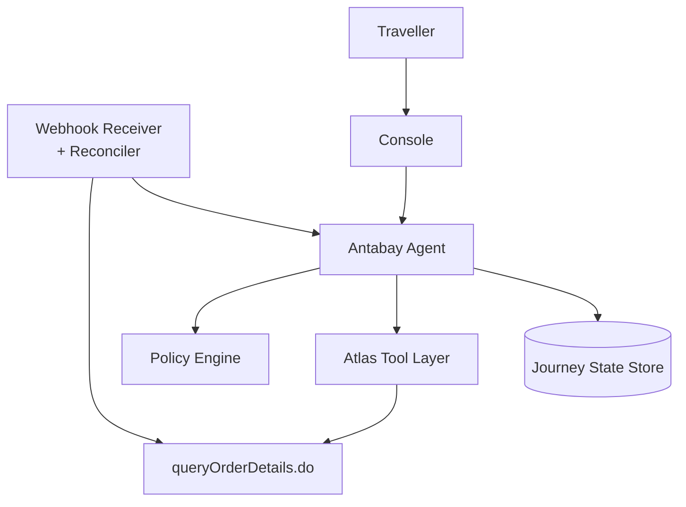
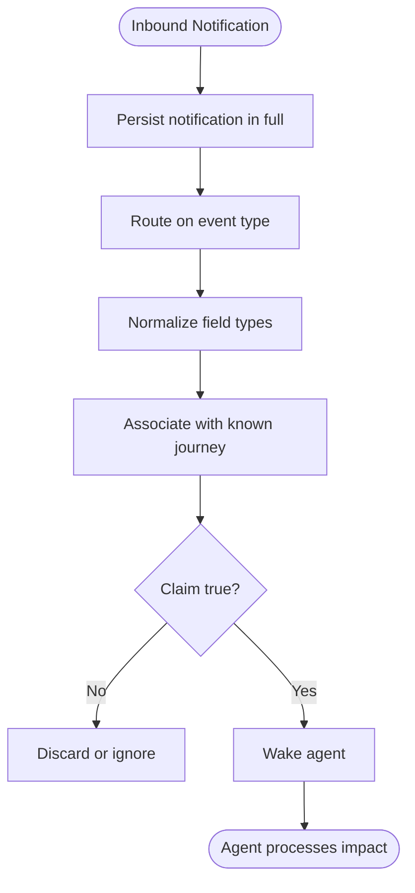
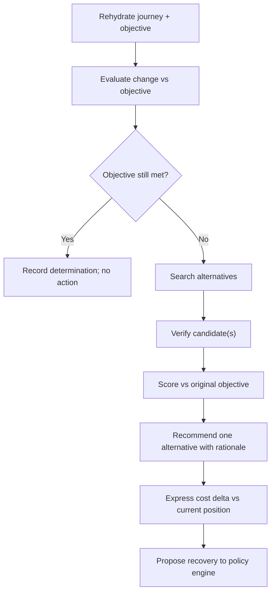
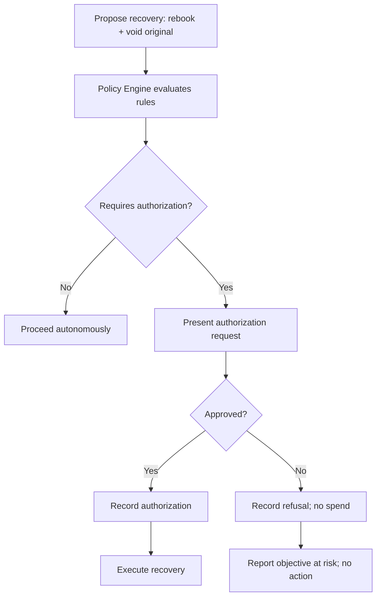
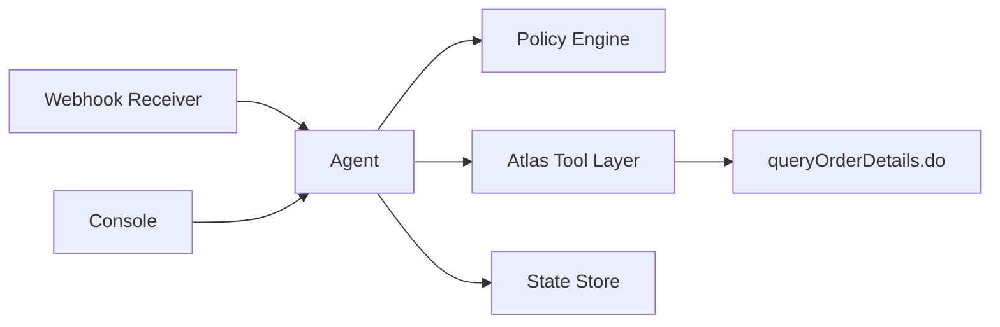

# Disruption Recovery

<cite>
**Referenced Files in This Document**
- [architecture.md](file://.antabay/architecture.md)
- [specs.md](file://.antabay/specs.md)
- [atlas-capability-map.md](file://.antabay/atlas-capability-map.md)
- [constitution.md](file://.antabay/constitution.md)
- [demo-scenario.md](file://.antabay/demo-scenario.md)
- [demo-sequence.md](file://.antabay/demo-sequence.md)
- [webhook_order_ticketed.json](file://fixtures/atlas/webhook_order_ticketed.json)
</cite>

## Table of Contents
1. [Introduction](#introduction)
2. [Project Structure](#project-structure)
3. [Core Components](#core-components)
4. [Architecture Overview](#architecture-overview)
5. [Detailed Component Analysis](#detailed-component-analysis)
6. [Dependency Analysis](#dependency-analysis)
7. [Performance Considerations](#performance-considerations)
8. [Troubleshooting Guide](#troubleshooting-guide)
9. [Conclusion](#conclusion)
10. [Appendices](#appendices)

## Introduction
This document explains the disruption detection and recovery workflow end-to-end: how untrusted webhook hints are received, reconciled against authoritative Atlas data, evaluated against traveler objectives, and turned into approved recovery actions that restore the journey. It also covers policy authorization requirements for spending money and irreversible operations, examples of schedule change scenarios with cost-benefit analysis, traveler approval workflows, and edge cases such as duplicate webhooks, network failures, and partial recovery outcomes.

The system treats webhooks as untrusted hints and always confirms state changes through queryOrderDetails.do before updating journey state. Recovery is implemented as a new booking followed by void/refund of the original, with independent verification at each step.

**Section sources**
- [architecture.md:19-85](file://.antabay/architecture.md#L19-L85)
- [atlas-capability-map.md:315-378](file://.antabay/atlas-capability-map.md#L315-L378)
- [specs.md:1396-1478](file://.antabay/specs.md#L1396-L1478)
- [specs.md:1610-1689](file://.antabay/specs.md#L1610-L1689)
- [specs.md:1720-1805](file://.antabay/specs.md#L1720-L1805)

## Project Structure
The disruption recovery capability spans several coordinated components:
- Webhook receiver and reconciler receive provider notifications and reconcile them against authoritative data.
- Antabay Agent rehydrates journey state, evaluates impact against objectives, searches alternatives, and proposes recovery.
- Policy Engine decides whether human authorization is required for any action that spends money or is irreversible.
- Atlas Tool Layer executes search, verify, order, pay, query, and void/refund calls.
- Journey State Store persists objective, orders, clocks, audit trail, and authorizations.



**Diagram sources**
- [architecture.md:19-85](file://.antabay/architecture.md#L19-L85)
- [specs.md:1396-1478](file://.antabay/specs.md#L1396-L1478)
- [specs.md:1610-1689](file://.antabay/specs.md#L1610-L1689)
- [specs.md:1720-1805](file://.antabay/specs.md#L1720-L1805)

**Section sources**
- [architecture.md:19-85](file://.antabay/architecture.md#L19-L85)
- [specs.md:1396-1478](file://.antabay/specs.md#L1396-L1478)

## Core Components
- Webhook Receiver and Reconciler: Accept inbound notifications, persist them, treat them as untrusted assertions, route on event type, normalize field types, associate with journeys, tolerate duplicates, and wake the agent only after confirmation via queryOrderDetails.do.
- Impact Evaluation and Alternatives: On wake-up, reconstruct the journey and objective, evaluate confirmed changes against hard constraints, quantify violations, search alternatives when needed, verify candidates, express costs relative to current position, recommend one alternative with rationale, and report when no alternative preserves the objective.
- Recovery Execution: Execute authorized recovery by creating and paying for replacement booking, confirming ticketing independently, initiating cancellation of superseded booking only after replacement is confirmed, treating replacement and cancellation as separate verified outcomes, recording partial success states, never leaving the traveler without a confirmed booking during recovery, updating current booking only after replacement confirmed, returning to monitoring, and reporting final position in terms of the objective.
- Policy Authorization: Deterministic rules require human authorization for any action that spends money, cancels or voids a booking, cannot be reversed, or breaches a stated hard constraint. Silence is refusal; prior authorizations are invalidated if cost changes; authorizations apply to one specific action only.

**Section sources**
- [specs.md:1396-1478](file://.antabay/specs.md#L1396-L1478)
- [specs.md:1610-1689](file://.antabay/specs.md#L1610-L1689)
- [specs.md:1720-1805](file://.antabay/specs.md#L1720-L1805)
- [specs.md:1272-1366](file://.antabay/specs.md#L1272-L1366)

## Architecture Overview
Disruption recovery follows a strict sequence: receive webhook hint, reconcile with authoritative query, evaluate impact against objectives, propose recovery, obtain deterministic policy authorization, execute replacement booking and original cancellation, verify both legs, update state, and resume monitoring.

```mermaid
sequenceDiagram
participant T as "Traveller"
participant UI as "Console"
participant INJ as "Injector (SIM)"
participant RX as "Webhook Receiver"
participant AG as "Antabay Agent"
participant POL as "Policy Engine"
participant AT as "Atlas"
participant DB as "State Store"
T->>UI : "trigger disruption"
UI->>INJ : "fire schedule change"
INJ-)RX : "{cid, type : schedule change, status, data}"
RX->>AT : "queryOrderDetails.do"
Note over RX,AT : "Webhook is a hint; API is truth"
AT-->>RX : "current order state"
RX-)AG : "wake up"
AG->>DB : "rehydrate journey + objective"
AG->>AG : "evaluate impact vs deadline/budget"
AG->>AT : "search.do (real options)"
AT-->>AG : "options"
AG->>AT : "verify.do (recommended alternative)"
AT-->>AG : "sessionId, confirmed price"
AG->>POL : "propose rebook + void original"
Note over POL : "spends money AND voids booking AND irreversible"
POL-->>AG : "REQUIRES AUTHORISATION"
AG->>UI : "show cost delta + objective impact"
alt Traveller approves
T->>UI : "approve"
AG->>DB : "record authorisation"
AG->>AT : "order.do → pay.do (new)"
AT-->>AG : "new orderNo"
AG->>AT : "void / refund original"
AG->>AT : "queryOrderDetails.do (both legs)"
AT-->>AG : "confirmed"
AG->>DB : "journey updated, MONITORING resumes"
else Traveller declines or does not respond
T->>UI : "decline"
Note over POL : "silence is refusal"
AG->>DB : "record refusal, NO SPEND"
AG->>UI : "objective at risk, no action taken"
end
```

**Diagram sources**
- [architecture.md:152-208](file://.antabay/architecture.md#L152-L208)
- [demo-sequence.md:71-109](file://.antabay/demo-sequence.md#L71-L109)
- [specs.md:1396-1478](file://.antabay/specs.md#L1396-L1478)
- [specs.md:1610-1689](file://.antabay/specs.md#L1610-L1689)
- [specs.md:1720-1805](file://.antabay/specs.md#L1720-L1805)

**Section sources**
- [architecture.md:152-208](file://.antabay/architecture.md#L152-L208)
- [demo-sequence.md:71-109](file://.antabay/demo-sequence.md#L71-L109)

## Detailed Component Analysis

### Webhook Reception and Reconciliation
- Inbound notifications are accepted promptly and persisted in full before acting.
- Every notification is treated as an untrusted assertion because the channel carries no authentication.
- The claim is confirmed against the provider’s interface before changing any journey state.
- Routing is based on the declared event type; status values are not interpreted as success/failure indicators.
- Field types differing between notifications and queries are normalized.
- Notifications are associated with journeys by order reference; unmatched notifications are discarded.
- Duplicate notifications are tolerated without duplicating resulting actions.
- Periodic reconciliation runs for active journeys independent of notifications.
- The agent is woken only after a notification’s claim has been confirmed.



**Diagram sources**
- [specs.md:1396-1478](file://.antabay/specs.md#L1396-L1478)
- [atlas-capability-map.md:315-378](file://.antabay/atlas-capability-map.md#L315-L378)

**Section sources**
- [specs.md:1396-1478](file://.antabay/specs.md#L1396-L1478)
- [atlas-capability-map.md:315-378](file://.antabay/atlas-capability-map.md#L315-L378)

### Impact Evaluation Against Traveler Objectives
- On wake-up, the agent reconstructs the journey and its objective from durable storage.
- Confirmed changes are evaluated against every element of the objective; results are stated in terms of the objective rather than flight details.
- Violations are quantified; if the objective remains satisfied, no further action is taken and the determination is recorded.
- If violated, alternatives are searched using real data, evaluated against the original objective using the same scoring rules, and verified before recommendation.
- Costs are expressed relative to the current position; one alternative is recommended with rationale.
- When the only alternative preserving the objective breaches a stated constraint, this is explicitly stated.
- When no alternative preserves the objective, this is reported.
- Alternative searches count against the journey’s call budget.



**Diagram sources**
- [specs.md:1610-1689](file://.antabay/specs.md#L1610-L1689)
- [demo-scenario.md:92-117](file://.antabay/demo-scenario.md#L92-L117)

**Section sources**
- [specs.md:1610-1689](file://.antabay/specs.md#L1610-L1689)
- [demo-scenario.md:92-117](file://.antabay/demo-scenario.md#L92-L117)

### Recovery Proposal and Policy Authorization
- Recovery proposals are evaluated deterministically by the policy engine without consulting a language model.
- Human authorization is required for any action that spends money, cancels or voids a booking, cannot be reversed, or would breach a stated hard constraint.
- An authorization request presents the proposed action, cost relative to current position, and effect on the objective.
- Absence of response is treated as refusal; prior authorizations are voided if cost changes; authorizations apply to one specific action only.
- Every authorization decision, including refusals and non-responses, is recorded in the audit trail.



**Diagram sources**
- [specs.md:1272-1366](file://.antabay/specs.md#L1272-L1366)
- [demo-sequence.md:91-99](file://.antabay/demo-sequence.md#L91-L99)

**Section sources**
- [specs.md:1272-1366](file://.antabay/specs.md#L1272-L1366)
- [demo-sequence.md:91-99](file://.antabay/demo-sequence.md#L91-L99)

### Recovery Execution Flow
- Replacement booking is created and paid; ticketing is confirmed by independent query before considering recovery successful.
- Cancellation of the superseded booking is initiated only after replacement is confirmed.
- Replacement and cancellation are treated as separate outcomes, each independently verified.
- Partial success states are recorded and surfaced rather than concealed.
- The traveler is never left without a confirmed booking as a result of a recovery attempt.
- Current booking is updated only after replacement is confirmed; journey returns to monitoring once recovery is complete.
- Final position is reported in terms of the objective.

```mermaid
sequenceDiagram
participant AG as "Agent"
participant AT as "Atlas"
participant DB as "State Store"
AG->>AT : "order.do + pay.do (replacement)"
AT-->>AG : "orderNo"
AG->>AT : "queryOrderDetails.do (replacement)"
AT-->>AG : "ticketNos non-empty"
AG->>AT : "void / refund original"
AT-->>AG : "cancellation outcome"
AG->>AT : "queryOrderDetails.do (original)"
AT-->>AG : "void/refund confirmed"
AG->>DB : "update current booking; resume monitoring"
```

**Diagram sources**
- [specs.md:1720-1805](file://.antabay/specs.md#L1720-L1805)
- [demo-sequence.md:101-109](file://.antabay/demo-sequence.md#L101-L109)

**Section sources**
- [specs.md:1720-1805](file://.antabay/specs.md#L1720-L1805)
- [demo-sequence.md:101-109](file://.antabay/demo-sequence.md#L101-L109)

### Schedule Change Scenarios and Cost-Benefit Analysis
- Example scenario: ZE605 arrival pushed past 10:00, violating the “arrive before 10 AM” hard constraint.
- Alternatives evaluated: LJ201 arrives 09:55 with +USD 6.24 delta, within budget and compliant; TW237 arrives 09:30 but +USD 51.55 breaks budget.
- Recommendation: LJ201, +USD 6.24, arrives 09:55, five minutes inside deadline, no connection, nine seats.
- Approval gate requires explicit authorization because recovery spends money and voids the original booking.

**Section sources**
- [demo-scenario.md:81-117](file://.antabay/demo-scenario.md#L81-L117)
- [demo-sequence.md:71-99](file://.antabay/demo-sequence.md#L71-L99)

### Edge Cases and Resilience
- Duplicate webhooks: The receiver tolerates duplicates without duplicating actions; reconciliation ensures idempotency.
- Network failures: Uncertain outcomes are reconciled by query; no repeated actions; post-action verification ensures state consistency.
- Partial recovery: Replacement succeeded but cancellation did not is recorded and surfaced; traveler is never left without a confirmed booking during recovery.
- Stale identifiers and expired offers: Freshness windows are tracked; re-verification occurs earlier than documented limits; offer expiry resets to search.
- Rate limits: Per-journey call budget enforced; wait instructions honored; no retry loops.

**Section sources**
- [specs.md:1396-1478](file://.antabay/specs.md#L1396-L1478)
- [specs.md:1720-1805](file://.antabay/specs.md#L1720-L1805)
- [atlas-capability-map.md:107-130](file://.antabay/atlas-capability-map.md#L107-L130)
- [constitution.md:44-60](file://.antabay/constitution.md#L44-L60)

## Dependency Analysis
Disruption recovery depends on:
- Webhook Receiver and Reconciler for ingestion and confirmation.
- Atlas Tool Layer for search, verify, order, pay, query, and void/refund.
- Policy Engine for deterministic authorization decisions.
- Journey State Store for durable objective, orders, clocks, audit trail, and authorizations.
- Console for presenting events, clocks, and authorization requests.



**Diagram sources**
- [architecture.md:19-85](file://.antabay/architecture.md#L19-L85)
- [specs.md:1396-1478](file://.antabay/specs.md#L1396-L1478)
- [specs.md:1610-1689](file://.antabay/specs.md#L1610-L1689)
- [specs.md:1720-1805](file://.antabay/specs.md#L1720-L1805)

**Section sources**
- [architecture.md:19-85](file://.antabay/architecture.md#L19-L85)

## Performance Considerations
- Offer expiry windows are short and variable; re-verification is required before commitment.
- Currency mixing hazards exist across surfaces; do not combine IDR and USD without explicit conversion.
- Rate limits must be respected; per-journey call budgets prevent runaway loops.
- Post-action verification avoids false confirmations; ticketing proof requires queryOrderDetails.do.
- Simulation is confined to event triggers; all travel data used in recovery comes from live Atlas responses.

**Section sources**
- [atlas-capability-map.md:107-130](file://.antabay/atlas-capability-map.md#L107-L130)
- [specs.md:1720-1805](file://.antabay/specs.md#L1720-L1805)
- [constitution.md:92-104](file://.antabay/constitution.md#L92-L104)

## Troubleshooting Guide
- Unauthenticated webhooks: Treat as hints; always confirm via queryOrderDetails.do before state updates.
- Duplicate bookings: Read duplicateOrders from Atlas; reconcile against existing order; never retry creation.
- Payment success ≠ ticketed: Poll queryOrderDetails.do until ticketNos is populated; track tktLimitTime.
- Price changes: If verify.do reports price increase, prior human approval is void; return to traveler with new number.
- Partial recovery: Record and surface states where replacement succeeded but cancellation failed; ensure traveler retains a confirmed booking.
- Network failures: Reconcile uncertain outcomes by query; do not repeat actions; maintain append-only audit trail.

**Section sources**
- [atlas-capability-map.md:315-378](file://.antabay/atlas-capability-map.md#L315-L378)
- [atlas-capability-map.md:400-415](file://.antabay/atlas-capability-map.md#L400-L415)
- [specs.md:1173-1243](file://.antabay/specs.md#L1173-L1243)
- [specs.md:1720-1805](file://.antabay/specs.md#L1720-L1805)
- [constitution.md:44-60](file://.antabay/constitution.md#L44-L60)

## Conclusion
Disruption recovery in this system is built on strict principles: webhooks are untrusted hints, authoritative data drives state changes, impacts are measured against traveler objectives, and high-impact actions require deterministic policy authorization. Recovery execution secures a replacement before releasing the original, verifies both legs independently, and records partial outcomes transparently. The workflow balances speed under tight offer windows with safety through verification and human authority, ensuring travelers’ objectives are protected even when disruptions occur.

## Appendices

### Appendix A: Key References
- Webhook reception and reconciliation: specs 007
- Impact evaluation and alternatives: specs 009
- Recovery execution: specs 011
- Post-action verification: specs 012
- Policy authorization: specs 010
- Verified Atlas contract and endpoints: atlas-capability-map.md
- Demo scenario and sequence: demo-scenario.md, demo-sequence.md
- Constitution principles governing truth, verification, authority, simulation, and operational discipline: constitution.md

**Section sources**
- [specs.md:1272-1366](file://.antabay/specs.md#L1272-L1366)
- [specs.md:1396-1478](file://.antabay/specs.md#L1396-L1478)
- [specs.md:1610-1689](file://.antabay/specs.md#L1610-L1689)
- [specs.md:1720-1805](file://.antabay/specs.md#L1720-L1805)
- [atlas-capability-map.md:25-39](file://.antabay/atlas-capability-map.md#L25-L39)
- [demo-scenario.md:81-117](file://.antabay/demo-scenario.md#L81-L117)
- [demo-sequence.md:71-109](file://.antabay/demo-sequence.md#L71-L109)
- [constitution.md:24-104](file://.antabay/constitution.md#L24-L104)