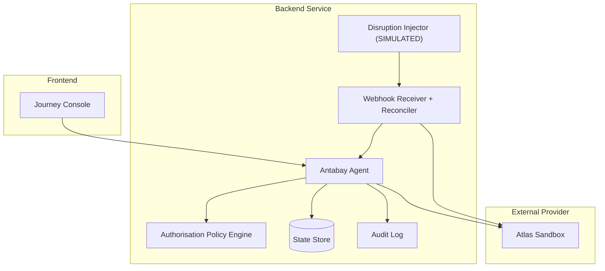
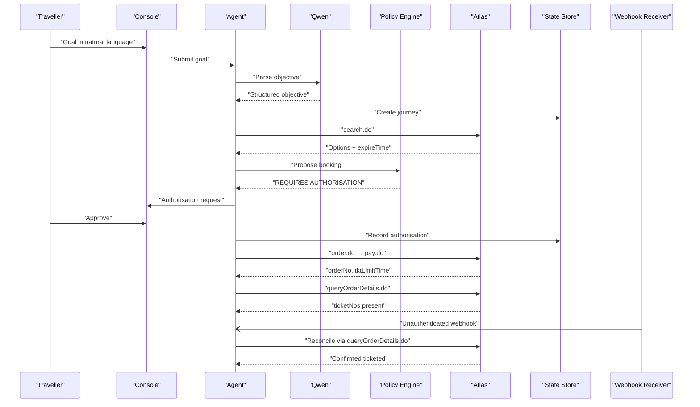
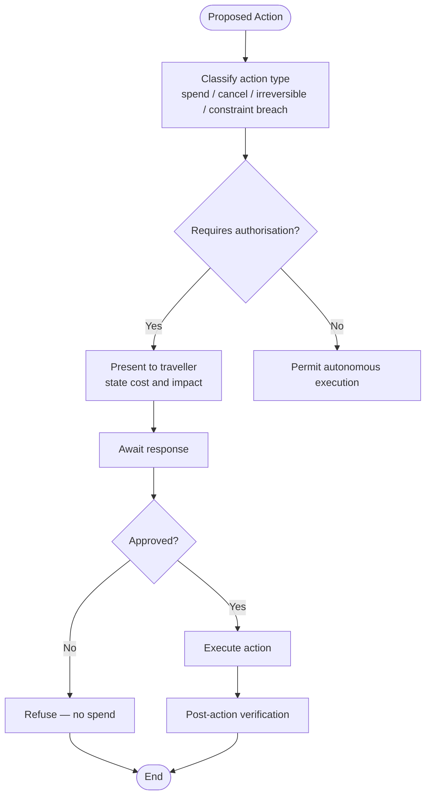
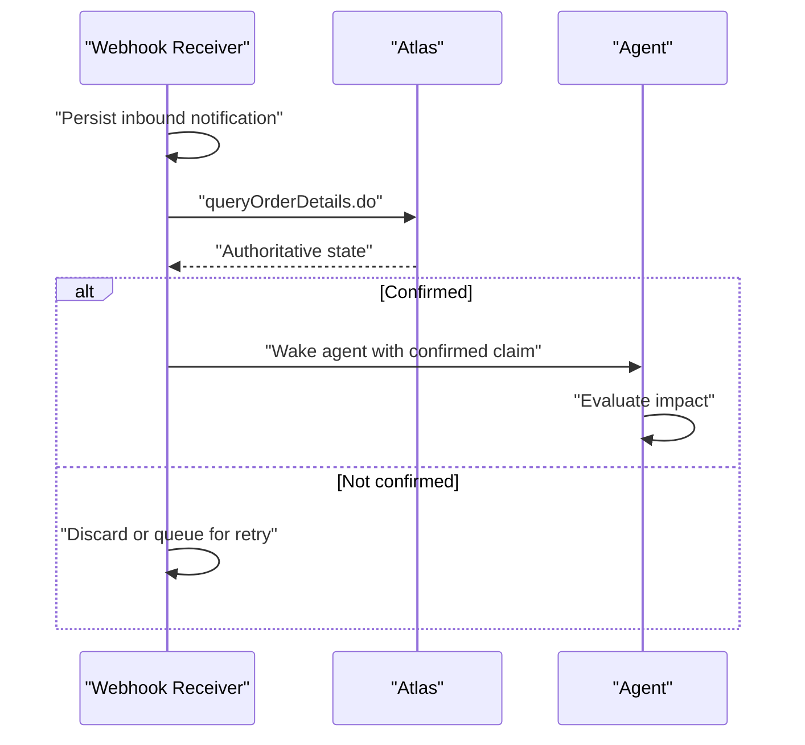
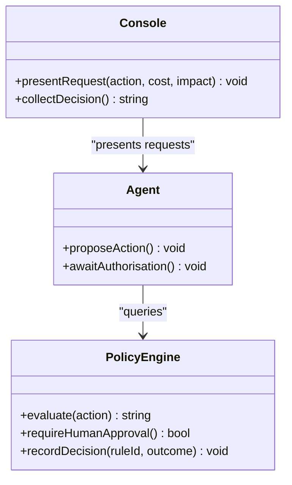
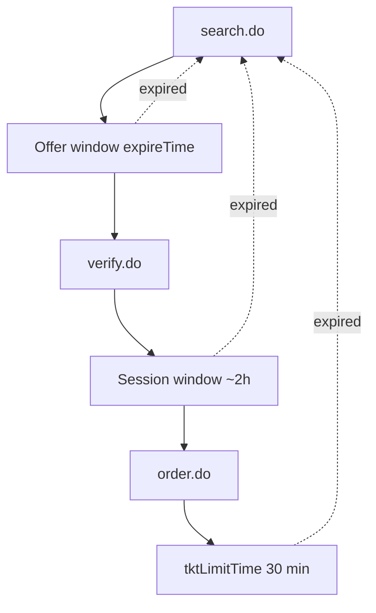
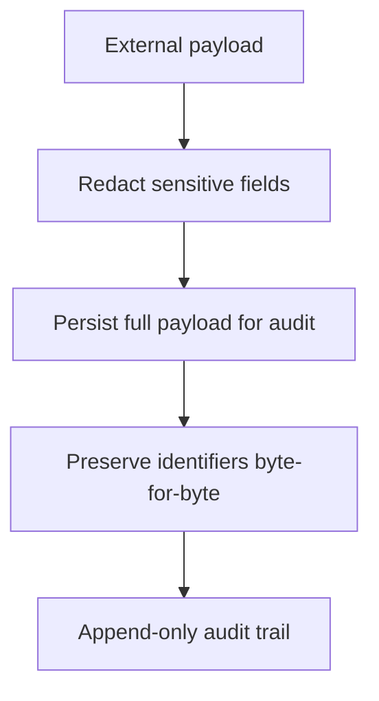
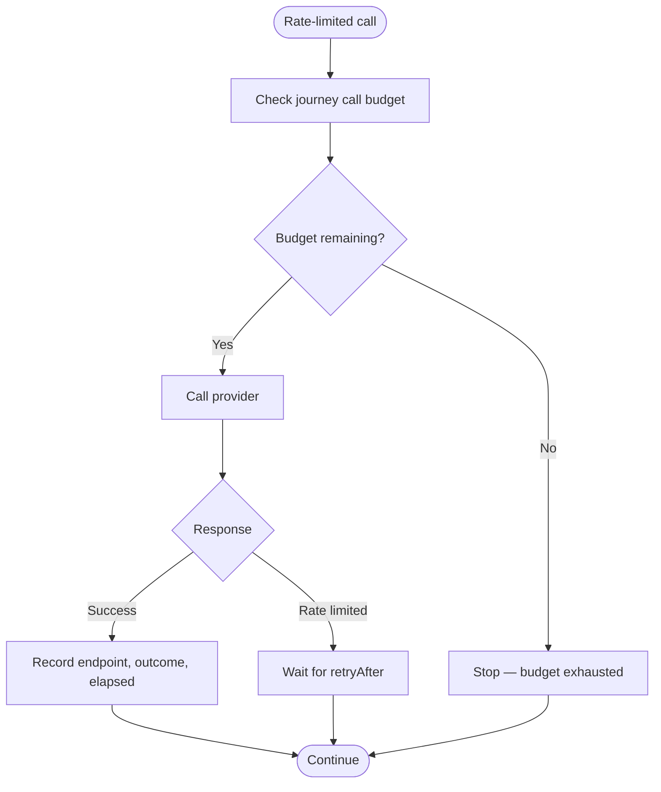
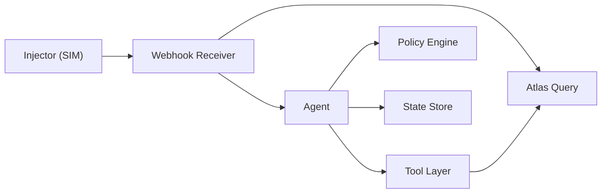

# Security Design

<cite>
**Referenced Files in This Document**
- [architecture.md](file://.antabay/architecture.md)
- [constitution.md](file://.antabay/constitution.md)
- [specs.md](file://.antabay/specs.md)
- [webhook_order_ticketed.json](file://fixtures/atlas/webhook_order_ticketed.json)
</cite>

## Table of Contents
1. [Introduction](#introduction)
2. [Project Structure](#project-structure)
3. [Core Components](#core-components)
4. [Architecture Overview](#architecture-overview)
5. [Detailed Component Analysis](#detailed-component-analysis)
6. [Dependency Analysis](#dependency-analysis)
7. [Performance Considerations](#performance-considerations)
8. [Troubleshooting Guide](#troubleshooting-guide)
9. [Conclusion](#conclusion)

## Introduction
This document describes Antabay’s security model with a focus on the separation between AI reasoning and authorization decisions, webhook trust boundaries, authentication and authorization for API endpoints, session management, access control policies, data protection, audit trail security, compliance considerations, vulnerability management, dependency scanning, monitoring practices, rate limiting, input validation, and secure communication patterns. The design is grounded in the project’s architecture diagrams, constitution principles, and feature specifications that define how the system interacts with external travel APIs and how it handles untrusted events.

## Project Structure
The repository contains architectural documentation, a governing constitution, detailed feature specifications, and fixtures representing verified external payloads. These artifacts collectively define the security model:
- Architecture and sequence/state diagrams define component boundaries, trust zones, and flows.
- The constitution codifies non-negotiable security principles such as truth, verification, authority, simulation honesty, operational discipline, and engineering governance.
- Specifications detail functional requirements for policy evaluation, webhook handling, post-action verification, recovery execution, and observability.
- Fixtures provide real-world event shapes used to validate behavior and ensure fidelity to provider contracts.

**Diagram sources**
- [architecture.md:21-78](file://.antabay/architecture.md#L21-L78)

**Section sources**
- [architecture.md:1-78](file://.antabay/architecture.md#L1-L78)
- [constitution.md:24-105](file://.antabay/constitution.md#L24-L105)
- [specs.md:303-398](file://.antabay/specs.md#L303-L398)

## Core Components
- Antabay Agent: Reasoning loop that parses objectives, evaluates options, proposes actions, and persists state. It never decides authority; it reasons only.
- Authorisation Policy Engine: Deterministic decision maker for whether an action may proceed autonomously or requires human approval. It enforces rules around spending money, cancellations, irreversibility, and constraint violations.
- Webhook Receiver and Reconciler: Ingests inbound notifications from the provider, treats them as untrusted hints, reconciles claims via authoritative queries, and wakes the agent only after confirmation.
- Disruption Injector: Simulated event source for testing disruption scenarios; strictly labelled as simulated and isolated from production-like flows.
- State Store and Audit Trail: Durable storage for journey state, identifiers, clocks, authorisations, and append-only audit records.
- Atlas Tool Layer: Enforced contract layer over the external travel API, ensuring only verified endpoints are called and responses are preserved exactly.

Key security properties enforced by these components:
- Separation of concerns: Qwen reasons; the policy engine decides authority.
- Untrusted webhooks: External events are hints requiring reconciliation against authoritative queries.
- Deterministic authorization: No LLM involvement in authority decisions; explicit human approval required for high-impact actions.
- Truth and verification: Every travel fact traces to an external response; writes are not proof—reads confirm outcomes.
- Append-only audit: Every observation, decision, call, and approval is recorded with timestamps.

**Section sources**
- [architecture.md:21-78](file://.antabay/architecture.md#L21-L78)
- [constitution.md:24-105](file://.antabay/constitution.md#L24-L105)
- [specs.md:1272-1366](file://.antabay/specs.md#L1272-L1366)
- [specs.md:1396-1478](file://.antabay/specs.md#L1396-L1478)
- [specs.md:1173-1244](file://.antabay/specs.md#L1173-L1244)

## Architecture Overview
The system enforces strict boundaries between reasoning and authorization, and between untrusted external events and authoritative state.

**Diagram sources**
- [architecture.md:91-148](file://.antabay/architecture.md#L91-L148)

**Section sources**
- [architecture.md:91-148](file://.antabay/architecture.md#L91-L148)
- [specs.md:1272-1366](file://.antabay/specs.md#L1272-L1366)
- [specs.md:1396-1478](file://.antabay/specs.md#L1396-L1478)

## Detailed Component Analysis

### Separation of Concerns: AI Reasoning vs Authorization Decisions
- The agent uses the reasoning model to parse objectives, score options, and propose actions. It never decides authority.
- The policy engine evaluates proposed actions deterministically based on cost delta, constraint violation, and reversibility. It produces rule-based decisions and requires explicit human authorization for high-impact actions.
- Silence is refusal; absence of response does not authorize action.

**Diagram sources**
- [specs.md:1272-1366](file://.antabay/specs.md#L1272-L1366)

**Section sources**
- [constitution.md:62-77](file://.antabay/constitution.md#L62-L77)
- [specs.md:1272-1366](file://.antabay/specs.md#L1272-L1366)

### Webhook Security: Untrusted Hints Requiring Reconciliation
- Webhooks arrive at a publicly reachable endpoint without authentication; they must be treated as untrusted assertions.
- The receiver persists every inbound notification before acting, routes by declared event type, and reconciles claims via authoritative queries before changing journey state.
- Duplicate notifications are tolerated; delivery is not guaranteed, so periodic reconciliation of active journeys is required.
- Only after confirmation should the agent be woken to evaluate impact and act.

**Diagram sources**
- [specs.md:1396-1478](file://.antabay/specs.md#L1396-L1478)

**Section sources**
- [specs.md:1396-1478](file://.antabay/specs.md#L1396-L1478)
- [webhook_order_ticketed.json:1-53](file://fixtures/atlas/webhook_order_ticketed.json#L1-L53)

### Authentication and Authorization for API Endpoints
- The console includes an authorisation gate that presents requests to the traveller when required by policy.
- The policy engine classifies actions into permitted or requiring human authorization; it enforces rules for spending money, cancellations, irreversibility, and constraint breaches.
- Authorisation decisions are deterministic, rule-based, and independent of the reasoning model.
- Every authorisation outcome—including refusals—is recorded in the audit trail.

**Diagram sources**
- [specs.md:1272-1366](file://.antabay/specs.md#L1272-L1366)

**Section sources**
- [specs.md:1272-1366](file://.antabay/specs.md#L1272-L1366)
- [specs.md:800-919](file://.antabay/specs.md#L800-L919)

### Session Management and Access Control Policies
- Offer-level freshness windows transition to session-level windows upon verification; both are tracked separately with distinct expiry behaviors.
- Sessions have documented lifetimes and must be re-verified earlier than expiry due to potential inventory or price changes.
- Access control is enforced through the policy engine; no configuration or prompt can bypass required authorisation.
- Journeys persist state outside the agent process; every wake-up rehydrates from durable storage.

**Diagram sources**
- [architecture.md:263-275](file://.antabay/architecture.md#L263-L275)

**Section sources**
- [specs.md:949-1030](file://.antabay/specs.md#L949-L1030)
- [specs.md:1059-1144](file://.antabay/specs.md#L1059-L1144)
- [constitution.md:92-105](file://.antabay/constitution.md#L92-L105)

### Data Protection Strategies for Sensitive Travel Information
- All externally issued identifiers are preserved byte-for-byte; no parsing, inference, or mutation is allowed.
- Fixtures redact sensitive fields (e.g., card numbers, names, tickets) to prevent leakage in test artifacts.
- Every external call, decision, and approval is recorded in an append-only audit trail with timestamps.
- Provenance is permanent: sandbox status, reasoning model, and any active simulation are always visible.

**Diagram sources**
- [specs.md:103-136](file://.antabay/specs.md#L103-L136)
- [specs.md:800-919](file://.antabay/specs.md#L800-L919)

**Section sources**
- [specs.md:103-136](file://.antabay/specs.md#L103-L136)
- [specs.md:800-919](file://.antabay/specs.md#L800-L919)
- [webhook_order_ticketed.json:1-53](file://fixtures/atlas/webhook_order_ticketed.json#L1-L53)

### Audit Trail Security and Compliance Considerations
- The audit trail covers observations, reasoning, tool calls, decisions, approvals, and outcomes with timestamps.
- Post-action verification ensures state updates only from independently verified reads; discrepancies are recorded.
- Compliance is demonstrated through deterministic authorization, untrusted webhook handling, per-journey call budgets, and free-tier operation visibility.
- Simulation is honest: injected events are labelled simulated everywhere and never merge with provider-originated events.

**Section sources**
- [specs.md:1173-1244](file://.antabay/specs.md#L1173-L1244)
- [constitution.md:78-105](file://.antabay/constitution.md#L78-L105)
- [specs.md:1508-1582](file://.antabay/specs.md#L1508-L1582)

### Vulnerability Management, Dependency Scanning, and Security Monitoring
- Contract enforcement prevents calling unverified endpoints; build-time checks reject invented endpoints.
- Recorded fixtures come from live sandbox runs and are never handwritten, reducing fabrication risk.
- Observability surfaces emit events for every external call, decision, and authorisation request, enabling monitoring and auditing.
- Rate limits are respected as design constraints; retries obey provider instructions.

**Section sources**
- [specs.md:303-398](file://.antabay/specs.md#L303-L398)
- [specs.md:800-919](file://.antabay/specs.md#L800-L919)
- [constitution.md:92-105](file://.antabay/constitution.md#L92-L105)

### Rate Limiting, Input Validation, and Secure Communication Patterns
- Rate limits: search has a per-second limit; verify and getOffers share a per-minute limit. On rejection, wait for the returned interval and do not retry-loop.
- Call budget: each journey maintains a declared budget for rate-limited endpoints; searches and verifications count against it.
- Input validation: all external payloads are validated against the verified contract; field types are normalised where they differ between interfaces.
- Secure communication: the agent communicates with the provider through the enforced tool layer; webhooks are received at a public endpoint but treated as untrusted until reconciled.

**Diagram sources**
- [specs.md:303-398](file://.antabay/specs.md#L303-L398)

**Section sources**
- [specs.md:303-398](file://.antabay/specs.md#L303-L398)
- [specs.md:565-646](file://.antabay/specs.md#L565-L646)
- [specs.md:949-1030](file://.antabay/specs.md#L949-L1030)

## Dependency Analysis
The system’s security depends on clear boundaries and enforced contracts:
- The agent depends on the policy engine for authority decisions and on the state store for durability.
- The webhook receiver depends on the provider’s query interface for reconciliation; it cannot change state on assertion alone.
- The disruption injector is isolated and labelled simulated; it feeds the same reception path as provider events but never fabricates travel data.
- The tool layer depends on the verified capability map; any deviation causes build failure.

**Diagram sources**
- [architecture.md:21-78](file://.antabay/architecture.md#L21-L78)

**Section sources**
- [architecture.md:21-78](file://.antabay/architecture.md#L21-L78)
- [specs.md:303-398](file://.antabay/specs.md#L303-L398)

## Performance Considerations
- Respect provider rate limits and honor retry-after instructions to avoid cascading failures.
- Track offer, session, and ticketing deadlines; re-verify earlier than documented expiry to mitigate stale data risks.
- Use per-journey call budgets to constrain resource consumption and maintain predictable performance under load.
- Stream events to the console without polling to reduce latency and improve responsiveness.

[No sources needed since this section provides general guidance]

## Troubleshooting Guide
Common issues and their security-aware handling:
- Unauthenticated webhook arrives for unknown order: discard or queue; associate by order reference if known.
- Notification contradicts provider state: reconcile via authoritative query; do not act on assertion alone.
- Duplicate notifications: tolerate without duplicating actions; deduplicate by order reference and event processing state.
- Rate-limit rejection: wait for instructed interval; do not retry-loop; record the rejection and elapsed time.
- Uncertain outcome after write: reconcile by query; never repeat the action; record discrepancy.
- Authorisation silence: treat as refusal; no spend occurs; record refusal in audit trail.

**Section sources**
- [specs.md:1396-1478](file://.antabay/specs.md#L1396-L1478)
- [specs.md:1173-1244](file://.antabay/specs.md#L1173-L1244)
- [specs.md:1272-1366](file://.antabay/specs.md#L1272-L1366)

## Conclusion
Antabay’s security model centers on strict separation of reasoning and authorization, treating external events as untrusted hints requiring reconciliation, enforcing deterministic policy-based access control, and maintaining durable, append-only audit trails. The design ensures that every travel fact traces to an authoritative source, that high-impact actions require explicit human approval, and that rate limits and call budgets protect both the provider and the user experience. By adhering to these principles, Antabay delivers safe, compliant, and observable agentic travel guardianship.