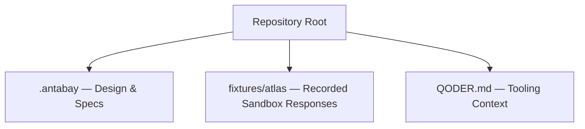
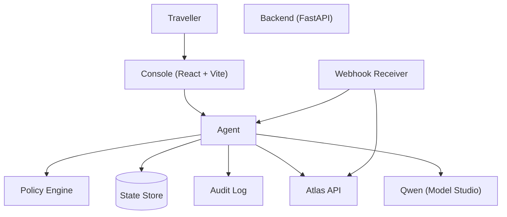
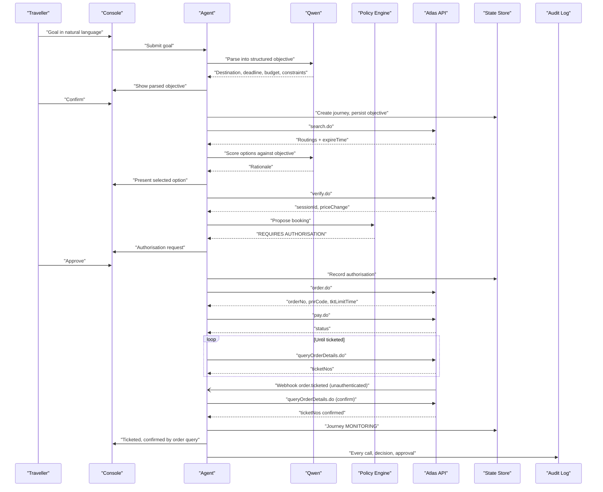
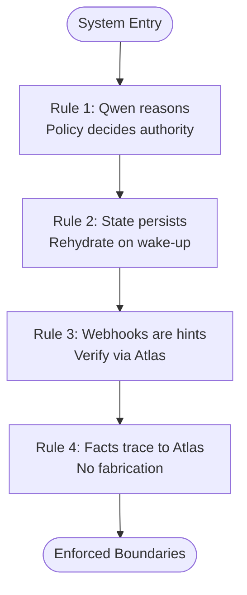
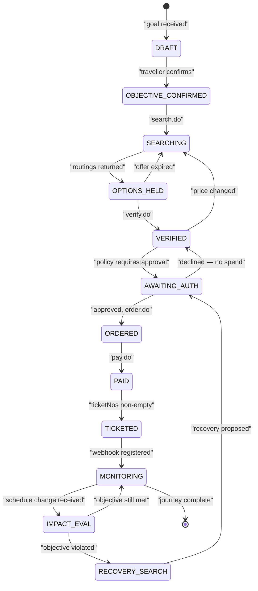
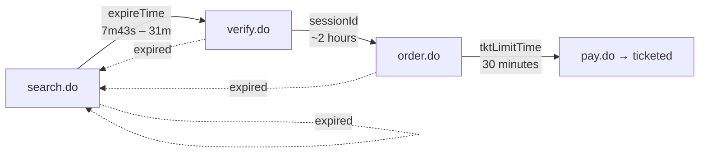
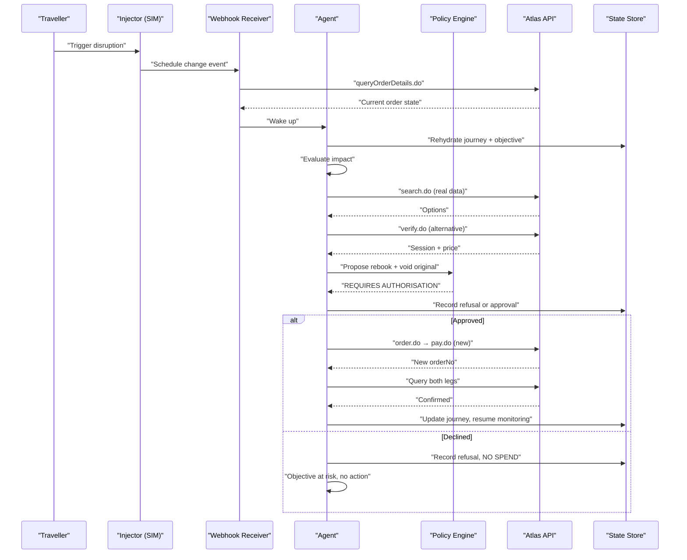
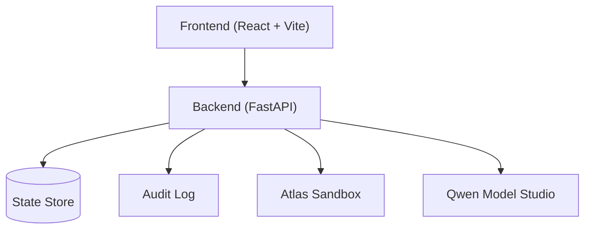
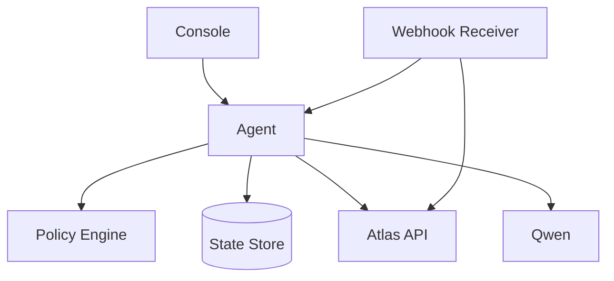

# System Architecture

<cite>
**Referenced Files in This Document**
- [architecture.md](file://.antabay/architecture.md)
- [constitution.md](file://.antabay/constitution.md)
- [specs.md](file://.antabay/specs.md)
- [atlas-capability-map.md](file://.antabay/atlas-capability-map.md)
- [demo-scenario.md](file://.antabay/demo-scenario.md)
- [plan.md](file://.antabay/plan.md)
</cite>

## Table of Contents
1. [Introduction](#introduction)
2. [Project Structure](#project-structure)
3. [Core Components](#core-components)
4. [Architecture Overview](#architecture-overview)
5. [Detailed Component Analysis](#detailed-component-analysis)
6. [Dependency Analysis](#dependency-analysis)
7. [Performance Considerations](#performance-considerations)
8. [Troubleshooting Guide](#troubleshooting-guide)
9. [Conclusion](#conclusion)
10. [Appendices](#appendices)

## Introduction
Antabay is an agentic travel guardian that protects a traveller’s objective from goal to journey completion and beyond. The system enforces four architectural rules:
- Qwen reasons but does not decide authority; a deterministic policy engine decides whether actions require human approval.
- Journey state lives outside the agent; every wake-up rehydrates from durable storage.
- Webhooks are untrusted hints; authoritative truth comes from Atlas order queries.
- All travel facts shown to the traveller trace to verified Atlas responses.

The architecture separates concerns across a React console, a FastAPI backend with an Agent, Policy Engine, and Webhook receiver, external integrations via the Atlas API and Qwen Model Studio free tier, and durable persistence for journeys, objectives, clocks, audit trails, and authorisations.

**Section sources**
- [architecture.md:19-86](file://.antabay/architecture.md#L19-L86)
- [constitution.md:24-77](file://.antabay/constitution.md#L24-L77)

## Project Structure
The repository organises design and execution artefacts under .antabay, with fixtures capturing verified Atlas sandbox responses used by tests and demos. Key documents include:
- Architecture diagrams and sequence flows
- Constitution governing principles and safety constraints
- Thirteen feature specifications (execution plan reduced to four core specs)
- Verified Atlas capability map defining endpoints, schemas, rate limits, and error handling
- Locked demo scenario mapping real data to a three-minute video
- 48-hour execution plan guiding delivery order and cuts

**Diagram sources**
- [specs.md:10-101](file://.antabay/specs.md#L10-L101)
- [atlas-capability-map.md:393-398](file://.antabay/atlas-capability-map.md#L393-L398)

**Section sources**
- [specs.md:10-101](file://.antabay/specs.md#L10-L101)
- [plan.md:10-81](file://.antabay/plan.md#L10-L81)

## Core Components
- UI Layer: React + Vite console presenting parsed objectives, journey state, expiry clocks, live agent trace, and authorisation gates. It renders both operator and traveller views from the same event stream.
- Backend Services:
  - Antabay Agent: ReAct loop that Understands → Observes → Reasons → Acts → Verifies → Adapts.
  - Policy Engine: Deterministic decisions on whether actions require human authorisation based on cost delta, constraint violation, and reversibility.
  - Webhook Receiver + Reconciler: Accepts inbound events as untrusted hints and reconciles against Atlas before updating state.
  - Disruption Injector (SIM): Emits schedule-change events conforming to observed webhook shape for demonstration.
- External Integrations:
  - Atlas API: search.do, verify.do, order.do, pay.do, queryOrderDetails.do, and webhooks.
  - Qwen LLM (Model Studio free tier): Reasoning only; never holds authority.
- Data Persistence:
  - Journey state store: objectives, orders, clocks, audit trail, authorisations.
  - Structured trace and audit log: append-only records of observations, decisions, tool calls, approvals.

**Diagram sources**
- [architecture.md:21-78](file://.antabay/architecture.md#L21-L78)

**Section sources**
- [architecture.md:19-86](file://.antabay/architecture.md#L19-L86)
- [specs.md:798-800](file://.antabay/specs.md#L798-L800)

## Architecture Overview
The system enforces strict boundaries between reasoning and authority, ensures durability of journey state, treats external events as hints requiring verification, and ties all visible facts to Atlas responses.

**Diagram sources**
- [architecture.md:91-148](file://.antabay/architecture.md#L91-L148)

**Section sources**
- [architecture.md:89-148](file://.antabay/architecture.md#L89-L148)

## Detailed Component Analysis

### Four Architectural Rules
- Qwen reasons but does not decide authority: The model explains and scores options; the policy engine determines if human approval is required.
- Journey state lives outside the agent: Every wake-up rehydrates from durable storage; no correctness-critical state resides in memory or context windows.
- Webhooks are untrusted hints: Inbound events trigger reconciliation via queryOrderDetails.do before any state change.
- All travel facts trace to Atlas responses: No fabricated itineraries, prices, or statuses; provenance is permanent.

**Diagram sources**
- [architecture.md:80-86](file://.antabay/architecture.md#L80-L86)
- [constitution.md:24-77](file://.antabay/constitution.md#L24-L77)

**Section sources**
- [architecture.md:80-86](file://.antabay/architecture.md#L80-L86)
- [constitution.md:24-77](file://.antabay/constitution.md#L24-L77)

### Journey State Machine
The journey progresses through defined states with explicit transitions governed by offer/session/ticketing clocks and policy outcomes.

**Diagram sources**
- [architecture.md:214-257](file://.antabay/architecture.md#L214-L257)

**Section sources**
- [architecture.md:212-257](file://.antabay/architecture.md#L212-L257)

### Three Clocks
Offer, session, and ticketing deadlines govern freshness and must be tracked and displayed.

**Diagram sources**
- [architecture.md:263-275](file://.antabay/architecture.md#L263-L275)
- [atlas-capability-map.md:304-313](file://.antabay/atlas-capability-map.md#L304-L313)

**Section sources**
- [architecture.md:261-279](file://.antabay/architecture.md#L261-L279)
- [atlas-capability-map.md:304-313](file://.antabay/atlas-capability-map.md#L304-L313)

### Disruption and Recovery Sequence
A simulated disruption triggers webhook ingestion, reconciliation, impact evaluation, alternative search, policy gate, and recovery execution with verification.

**Diagram sources**
- [architecture.md:154-208](file://.antabay/architecture.md#L154-L208)

**Section sources**
- [architecture.md:152-208](file://.antabay/architecture.md#L152-L208)

### Technology Stack Decisions
- Backend: FastAPI service with a custom ReAct loop; framework risk avoided by not using AgentScope.
- Frontend: React + Vite console streaming live events; operator and traveller views from one stream.
- LLM: Qwen Model Studio free tier (Singapore endpoint) used for reasoning only; not for authority decisions.
- External API: Atlas sandbox for search, verification, ordering, payment, and order details; webhooks treated as unauthenticated hints.

**Section sources**
- [architecture.md:9-15](file://.antabay/architecture.md#L9-L15)
- [specs.md:57-71](file://.antabay/specs.md#L57-L71)
- [atlas-capability-map.md:12-23](file://.antabay/atlas-capability-map.md#L12-L23)

### Infrastructure Requirements
- Environment variables for Atlas sandbox credentials and DashScope key; use Singapore base URL for free quota.
- Publicly reachable backend for webhook registration; frontend deployable to static hosting (e.g., Vercel).
- Durable state store for journeys, objectives, clocks, audit trail, and authorisations.
- Structured logging and audit trail for every call, decision, and approval.

**Section sources**
- [specs.md:57-71](file://.antabay/specs.md#L57-L71)
- [plan.md:40-54](file://.antabay/plan.md#L40-L54)

### Scalability Considerations
- Rate limits: search.do 10 QPS; verify.do/getOffers.do share 60 QPM; seatAvailability/getLuggage share 60 QPM. Respect retryAfter and avoid retry loops.
- Per-journey call budgets to prevent runaway loops and manage provider quotas.
- Stateless UI rendering from event streams; backend handles concurrency and state persistence.
- Rehydration on wake-up ensures resilience to process restarts and scaling events.

**Section sources**
- [atlas-capability-map.md:119-121](file://.antabay/atlas-capability-map.md#L119-L121)
- [specs.md:376-377](file://.antabay/specs.md#L376-L377)
- [constitution.md:94-98](file://.antabay/constitution.md#L94-L98)

### Deployment Topology
- Frontend: React/Vite app served via CDN/static host; connects to backend via SSE/event stream.
- Backend: Long-lived FastAPI process exposing REST endpoints and webhook receiver; integrates with Atlas and Qwen.
- External: Atlas sandbox and Qwen Model Studio accessed over HTTPS; webhooks delivered to public backend URL.
- Storage: Persistent store for journeys and audit logs; logs streamed to structured output.

**Diagram sources**
- [architecture.md:21-78](file://.antabay/architecture.md#L21-L78)

**Section sources**
- [architecture.md:19-42](file://.antabay/architecture.md#L19-L42)

## Dependency Analysis
- UI depends on backend event stream; no local state beyond rendering.
- Agent depends on Qwen for reasoning and Atlas for travel facts; never writes travel data directly.
- Policy Engine is independent and deterministic; consulted before any high-impact action.
- Webhook Receiver depends on Atlas for reconciliation; never trusts inbound status fields.
- State Store is central; every component reads/writes durable records.

**Diagram sources**
- [architecture.md:21-78](file://.antabay/architecture.md#L21-L78)

**Section sources**
- [architecture.md:19-86](file://.antabay/architecture.md#L19-L86)

## Performance Considerations
- Offer expiry is short and variable; always compute remaining time from current clock rather than receipt time.
- Currency mixing hazard: fares in USD vs fees in IDR; do not combine without explicit conversion.
- Rate limiting enforced per journey; honour retryAfter and avoid loops.
- Verification replaces short offer window with longer session window; track both phases.
- Ticketing confirmation requires polling until ticketNos non-empty; paid ≠ ticketed.

**Section sources**
- [atlas-capability-map.md:107-129](file://.antabay/atlas-capability-map.md#L107-L129)
- [atlas-capability-map.md:217-235](file://.antabay/atlas-capability-map.md#L217-L235)
- [atlas-capability-map.md:285-303](file://.antabay/atlas-capability-map.md#L285-L303)

## Troubleshooting Guide
- Duplicate bookings: On error code 318, read duplicateOrders and reconcile against existing order; never retry.
- Auth failures: Error code 900 indicates credential/account issues; do not retry.
- Order not exists: Error code 800 signals internal state bug; treat as terminal and investigate.
- Webhook misinterpretation: Do not gate handling on webhook status field; successful events may carry negative status.
- Stale identifiers: Re-verify earlier than documented TTLs; trust per-offer expireTime over nominal limits.
- Unauthorised spend: Silence is refusal; record refusals and prevent execution without approval.

**Section sources**
- [atlas-capability-map.md:400-415](file://.antabay/atlas-capability-map.md#L400-L415)
- [atlas-capability-map.md:353-378](file://.antabay/atlas-capability-map.md#L353-L378)
- [constitution.md:44-77](file://.antabay/constitution.md#L44-L77)

## Conclusion
Antabay’s architecture enforces clear boundaries between reasoning and authority, ensures durable journey state, treats external events as untrusted hints, and anchors all visible facts to Atlas responses. The React console provides visibility into agent behaviour and policy decisions, while the FastAPI backend orchestrates search, scoring, verification, booking, and recovery. Qwen powers reasoning within strict guardrails, and the policy engine guarantees safe, auditable actions. With careful attention to rate limits, currency handling, and verification, the system delivers a robust, demonstrable travel guardian experience.

## Appendices

### Demo Scenario Highlights
- Goal parsing into hard constraints and preferences.
- Real option set from Atlas sandbox with explicit rejection of overnight connections despite meeting naive filters.
- Freshness pressure with short offer windows and re-verification before commitment.
- Booking path ending in ticketing confirmation via order query.
- Simulated disruption triggering recovery with policy gate and verification.

**Section sources**
- [demo-scenario.md:13-118](file://.antabay/demo-scenario.md#L13-L118)

### Execution Plan Summary
- Delivery order prioritises contract, journey model, booking path, console, and disruption/recovery.
- Cuts include mobile view, preemptive risk rule, two-tier automation, and void/refund in this iteration.
- Focus on completeness over polish; video evidence is critical.

**Section sources**
- [plan.md:134-173](file://.antabay/plan.md#L134-L173)
- [plan.md:557-570](file://.antabay/plan.md#L557-L570)