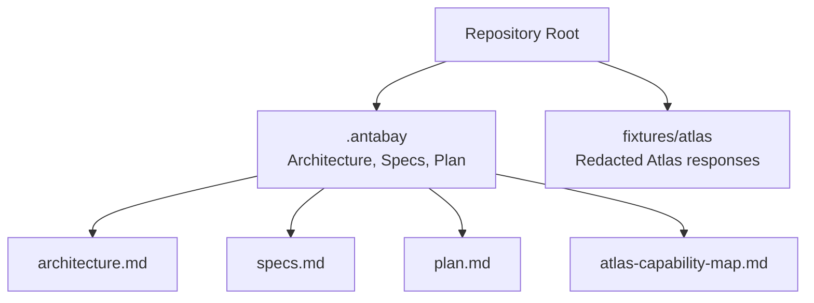
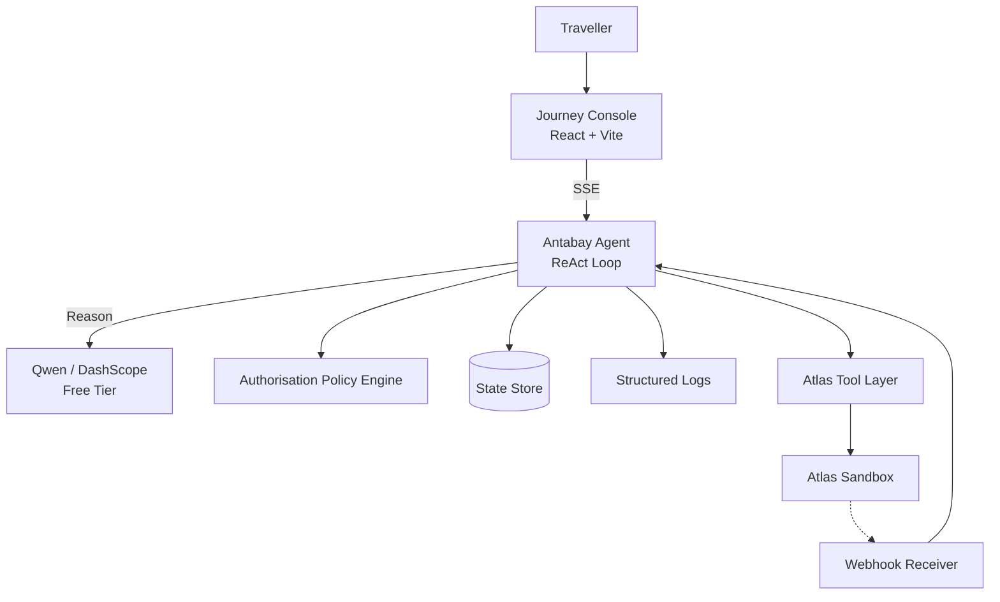
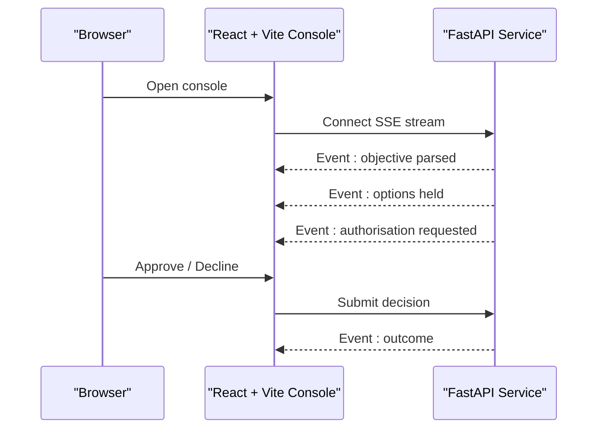
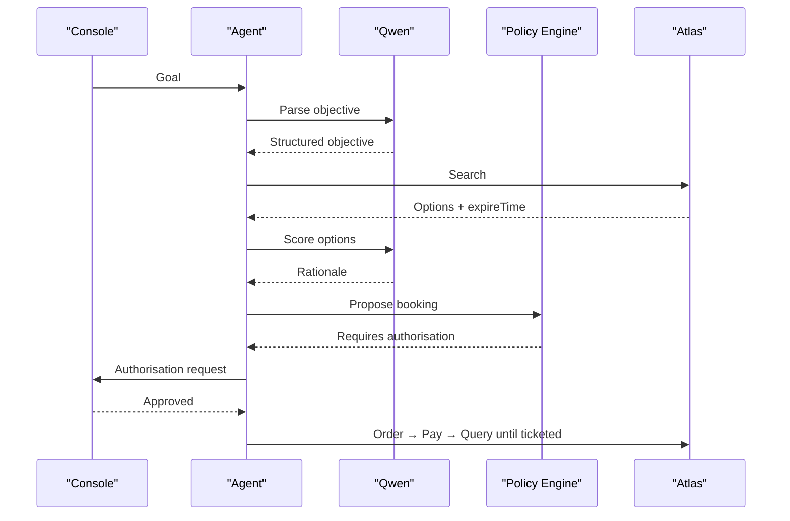
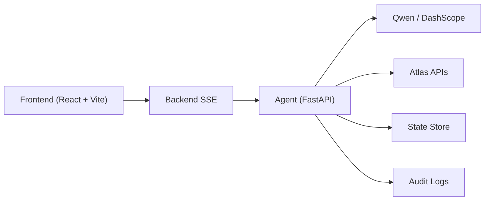

# Technology Stack

<cite>
**Referenced Files in This Document**
- [architecture.md](file://.antabay/architecture.md)
- [plan.md](file://.antabay/plan.md)
- [specs.md](file://.antabay/specs.md)
- [atlas-capability-map.md](file://.antabay/atlas-capability-map.md)
</cite>

## Table of Contents
1. Introduction
2. Project Structure
3. Core Components
4. Architecture Overview
5. Detailed Component Analysis
6. Dependency Analysis
7. Performance Considerations
8. Troubleshooting Guide
9. Conclusion
10. Appendices

## Introduction
This document describes Antabay’s technology stack and how the system works end-to-end: a React + Vite journey console that streams real-time events to the browser, a long-lived FastAPI backend implementing a ReAct loop, external integrations with Qwen Model Studio (free tier) for reasoning and Atlas Travel API for flight inventory, pricing, and booking, plus infrastructure choices for state persistence, audit logging, and deployment. It also covers environment setup, version compatibility considerations, and dependency management guidance based on the repository’s specifications and configuration.

## Project Structure
Antabay is organized around specification-driven development and verified contracts:
- .antabay contains architecture diagrams, capability maps, specs, and execution plans that define behavior and constraints.
- fixtures/atlas holds redacted JSON captures from live Atlas sandbox runs used as seeds for recorded tests.
- The root includes a plan file describing environment setup, tooling, and delivery order.

**Diagram sources**
- [architecture.md:1-80](file://.antabay/architecture.md#L1-L80)
- [specs.md:1-100](file://.antabay/specs.md#L1-L100)
- [plan.md:1-120](file://.antabay/plan.md#L1-L120)
- [atlas-capability-map.md:1-40](file://.antabay/atlas-capability-map.md#L1-L40)

**Section sources**
- [architecture.md:1-80](file://.antabay/architecture.md#L1-L80)
- [specs.md:1-100](file://.antabay/specs.md#L1-L100)
- [plan.md:1-120](file://.antabay/plan.md#L1-L120)
- [atlas-capability-map.md:1-40](file://.antabay/atlas-capability-map.md#L1-L40)

## Core Components
- Frontend: Journey Console built with React + Vite. It renders the traveller’s objective, current journey state, expiry clocks, and an agent trace panel. It consumes a live event stream and supports mobile-responsive layouts per spec requirements.
- Backend: Long-lived FastAPI service hosting the Antabay Agent with its own ReAct loop (Understand → Observe → Reason → Act → Verify → Adapt), an authorisation policy engine, webhook receiver, and disruption injector.
- External Integrations:
  - Qwen via Model Studio/DashScope free tier for reasoning tasks only.
  - Atlas Travel API for search, verify, order, pay, and order query; webhooks provide asynchronous updates.
- Infrastructure:
  - Durable journey state store for objective, orders, clocks, audit trail, and authorisations.
  - Structured trace and audit logs for observability and compliance.
  - Deployment targets: frontend on Vercel; backend on any public host or tunnel during development.

**Section sources**
- [architecture.md:19-86](file://.antabay/architecture.md#L19-L86)
- [specs.md:356-433](file://.antabay/specs.md#L356-L433)
- [plan.md:40-70](file://.antabay/plan.md#L40-L70)

## Architecture Overview
The system enforces strict separation of concerns:
- The UI is stateless and driven entirely by server-emitted events.
- The agent reasons with Qwen but never decides authority; a deterministic policy engine gates actions that spend money or alter bookings.
- All travel facts originate from Atlas; webhooks are treated as untrusted hints and reconciled against authoritative queries.
- State persists across restarts; every action is logged.

**Diagram sources**
- [architecture.md:19-86](file://.antabay/architecture.md#L19-L86)

**Section sources**
- [architecture.md:19-86](file://.antabay/architecture.md#L19-L86)

## Detailed Component Analysis

### Frontend: React + Vite Journey Console
- Real-time event streaming: The console receives a live event stream from the backend and renders it without polling. Events include external calls, decisions, authorisation requests, and status changes.
- Mobile-responsive design: A single-column layout adapts below a breakpoint to ensure legibility on phone-sized screens; the same event stream powers both console and traveller views.
- Stateless rendering: The interface holds no journey state; it displays exactly what the event stream provides.

**Diagram sources**
- [specs.md:356-433](file://.antabay/specs.md#L356-L433)

**Section sources**
- [specs.md:356-433](file://.antabay/specs.md#L356-L433)

### Backend: FastAPI Service and ReAct Loop
- ReAct loop: The agent cycles through Understand, Observe, Reason, Act, Verify, and Adapt. It uses Qwen for reasoning but delegates authority decisions to a deterministic policy engine.
- Webhook receiver: Accepts inbound notifications, treats them as untrusted hints, and reconciles claims against authoritative Atlas queries before updating state.
- Disruption injector: Emits simulated schedule-change events for demonstration, clearly labelled as simulated.

**Diagram sources**
- [architecture.md:89-148](file://.antabay/architecture.md#L89-L148)

**Section sources**
- [architecture.md:89-148](file://.antabay/architecture.md#L89-L148)

### External Integrations

#### Qwen Model Studio (Free Tier)
- Purpose: Reasoning only (parsing objectives, scoring rationale, impact analysis).
- Environment: Uses DashScope base URL and model name configured via environment variables. Free tier endpoint recommended for cost control.

**Section sources**
- [plan.md:40-70](file://.antabay/plan.md#L40-L70)
- [specs.md:57-71](file://.antabay/specs.md#L57-L71)

#### Atlas Travel API
- Endpoints exercised: search.do, verify.do, order.do, pay.do, queryOrderDetails.do; webhook registration supported.
- Contracts: Verified schemas, error codes, rate limits, identifier TTLs, and total price formula are captured and enforced at build time.
- Webhooks: Unauthenticated; must be reconciled against authoritative queries before changing state.

**Section sources**
- [atlas-capability-map.md:25-39](file://.antabay/atlas-capability-map.md#L25-L39)
- [atlas-capability-map.md:99-129](file://.antabay/atlas-capability-map.md#L99-L129)
- [atlas-capability-map.md:236-313](file://.antabay/atlas-capability-map.md#L236-L313)
- [atlas-capability-map.md:315-378](file://.antabay/atlas-capability-map.md#L315-L378)
- [atlas-capability-map.md:400-415](file://.antabay/atlas-capability-map.md#L400-L415)

### Infrastructure Choices
- Database: Durable store for journey state, objective, orders, clocks, audit trail, and authorisations. Ensures journeys can be fully reconstructed after process termination.
- Logging: Structured trace and audit logs record every external call, decision, and authorisation outcome.
- Deployment: Frontend on Vercel; backend on any public host or tunnel during development.

**Section sources**
- [architecture.md:19-86](file://.antabay/architecture.md#L19-L86)
- [specs.md:429-531](file://.antabay/specs.md#L429-L531)
- [plan.md:164-173](file://.antabay/plan.md#L164-L173)

## Dependency Analysis
- Frontend depends on a stable SSE endpoint provided by the backend.
- Backend depends on:
  - Qwen for reasoning (environment-configured).
  - Atlas APIs for all travel data and outcomes.
  - Durable storage for state persistence.
  - Structured logging for auditability.
- Contract enforcement: Build-time checks prevent calls to endpoints not declared in the verified contract.

**Diagram sources**
- [architecture.md:19-86](file://.antabay/architecture.md#L19-L86)
- [specs.md:303-398](file://.antabay/specs.md#L303-L398)

**Section sources**
- [specs.md:303-398](file://.antabay/specs.md#L303-L398)
- [atlas-capability-map.md:25-39](file://.antabay/atlas-capability-map.md#L25-L39)

## Performance Considerations
- Offer expiry is short and variable; always check freshness before decisions.
- Rate limits apply to search and verify endpoints; honour retry-after instructions and avoid retry loops.
- Use structured logs sparingly under high load; prefer sampling where appropriate.
- Keep the UI stateless to minimize client-side overhead; rely on efficient event payloads.

**Section sources**
- [atlas-capability-map.md:107-129](file://.antabay/atlas-capability-map.md#L107-L129)

## Troubleshooting Guide
- Duplicate booking (error code 318): Reconcile using returned duplicateOrders instead of retrying.
- Auth failures (error code 900): Check credentials and account scope; do not retry blindly.
- Webhook misinterpretation: Do not gate handling on webhook status; reconcile via queryOrderDetails.do.
- Price changes: If priceChange indicates a change, prior human approval is void and must be re-validated.

**Section sources**
- [atlas-capability-map.md:400-415](file://.antabay/atlas-capability-map.md#L400-L415)
- [atlas-capability-map.md:183-196](file://.antabay/atlas-capability-map.md#L183-L196)
- [atlas-capability-map.md:315-378](file://.antabay/atlas-capability-map.md#L315-L378)

## Conclusion
Antabay combines a reactive, event-driven console with a robust, spec-driven backend. The ReAct loop orchestrates reasoning, action, and verification while a deterministic policy engine ensures safe authorisation. External integrations are strictly governed by verified contracts, and infrastructure choices emphasize durability and auditability. This stack enables reliable, observable automation of flight booking and recovery workflows.

## Appendices

### Environment Setup and Version Compatibility
- Required environment variables:
  - ATLAS_BASE_URL, ATLAS_CLIENT_ID, ATLAS_CLIENT_SECRET
  - DASHSCOPE_API_KEY, DASHSCOPE_BASE_URL, QWEN_MODEL
- Base URLs and models:
  - Atlas sandbox base URL configured via environment.
  - Qwen free-tier endpoint recommended; model name set via environment.
- Node and Python versions:
  - Not specified in repository files; use recent stable versions compatible with React + Vite and FastAPI ecosystems.
- Dependency management:
  - Frontend: package manager (e.g., npm/yarn/pnpm) with node_modules excluded from version control.
  - Backend: Python virtual environment with dependencies pinned; __pycache__ excluded from version control.

**Section sources**
- [plan.md:40-70](file://.antabay/plan.md#L40-L70)
- [specs.md:57-71](file://.antabay/specs.md#L57-L71)