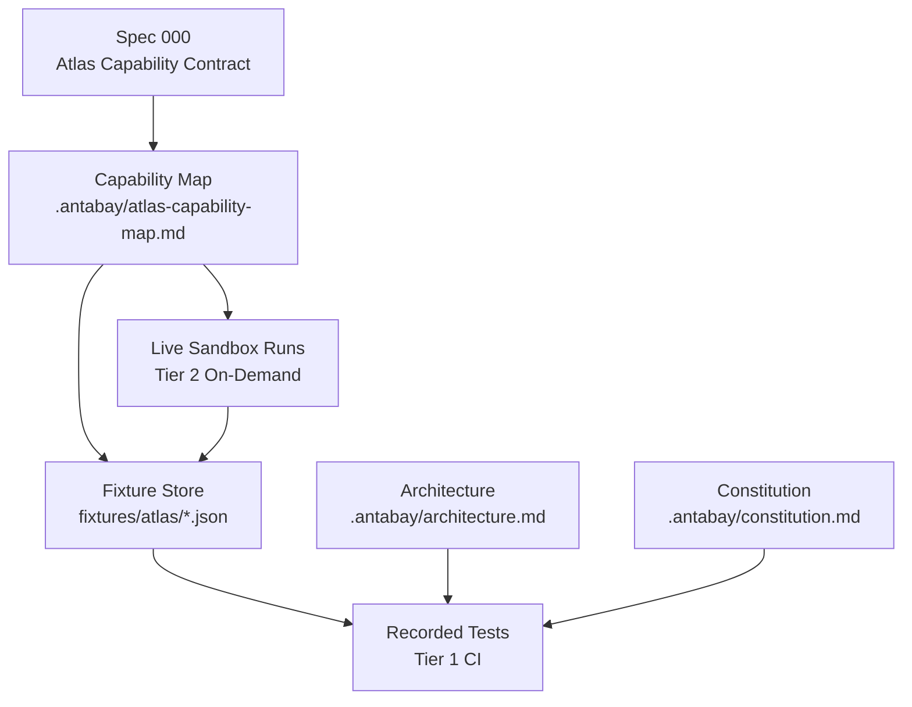
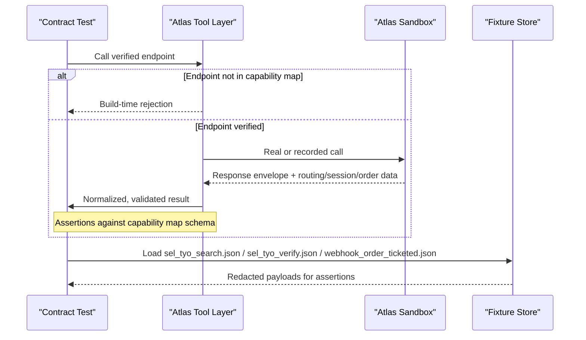
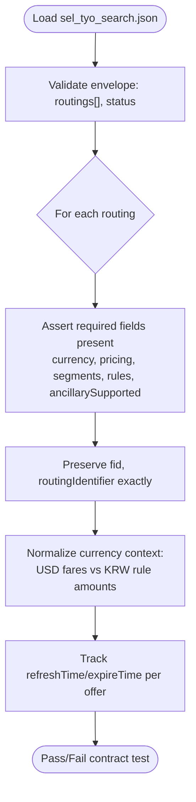
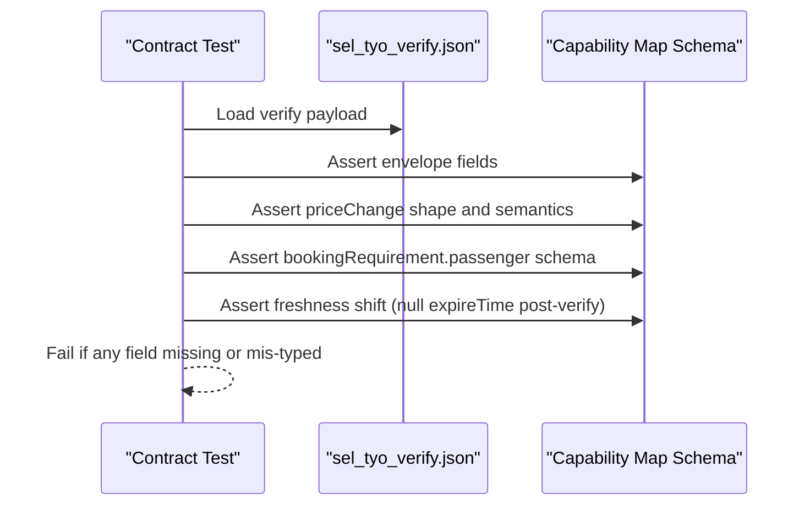
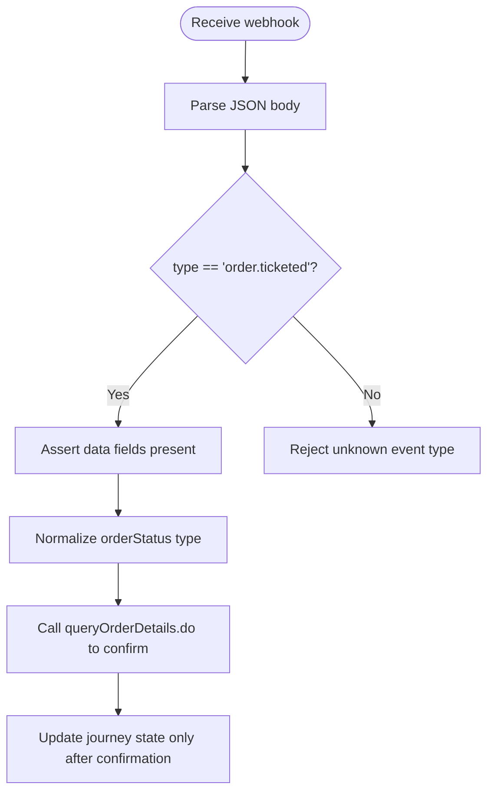
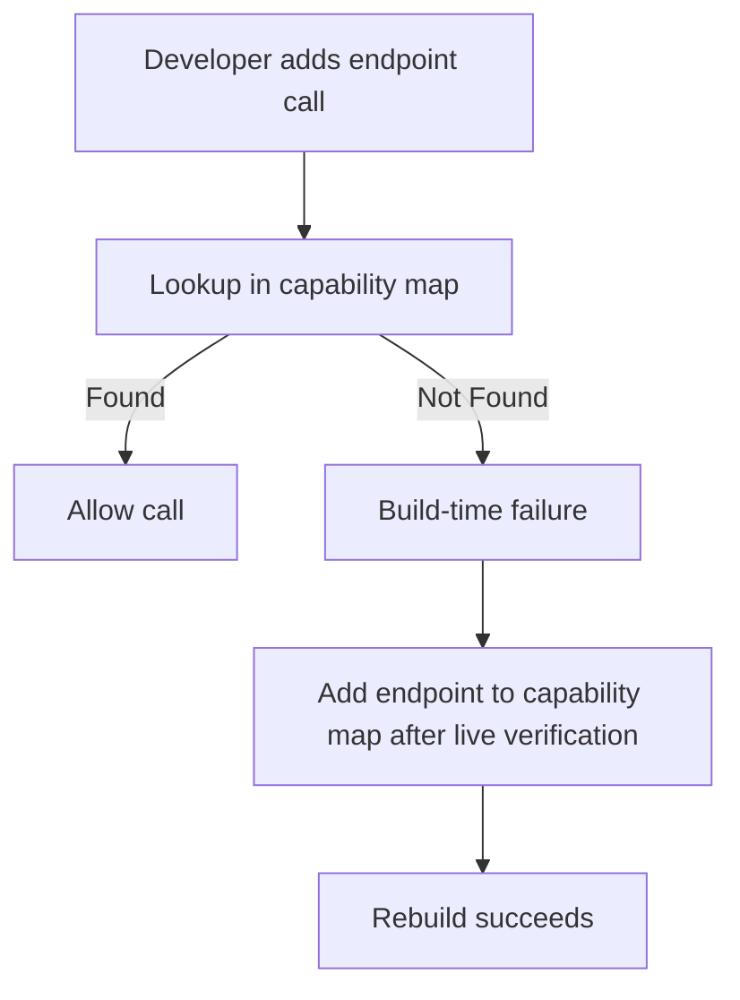
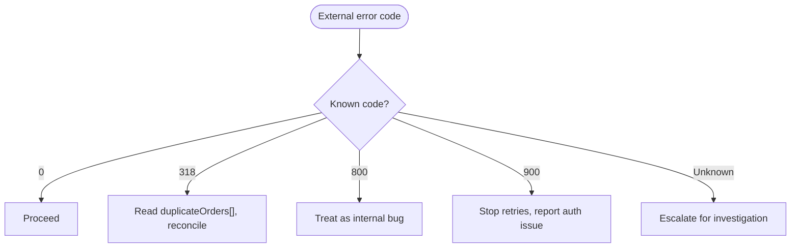
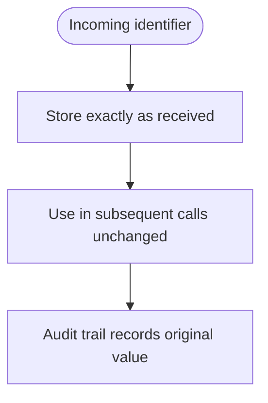
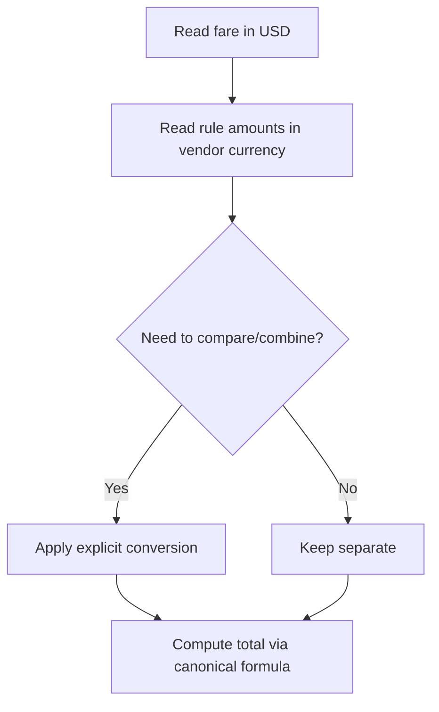
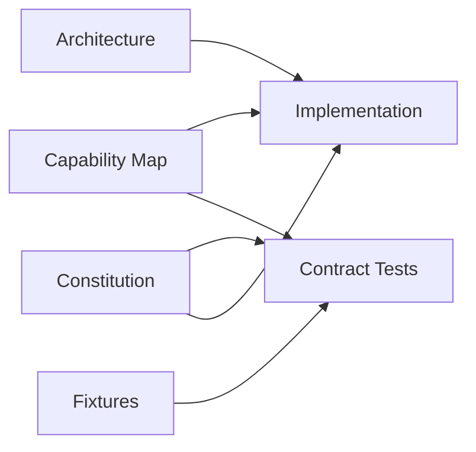

# Contract Testing

<cite>
**Referenced Files in This Document**
- [atlas-capability-map.md](file://.antabay/atlas-capability-map.md)
- [architecture.md](file://.antabay/architecture.md)
- [specs.md](file://.antabay/specs.md)
- [constitution.md](file://.antabay/constitution.md)
- [sel_tyo_search.json](file://fixtures/atlas/sel_tyo_search.json)
- [sel_tyo_verify.json](file://fixtures/atlas/sel_tyo_verify.json)
- [webhook_order_ticketed.json](file://fixtures/atlas/webhook_order_ticketed.json)
</cite>

## Table of Contents
1. [Introduction](#introduction)
2. [Project Structure](#project-structure)
3. [Core Components](#core-components)
4. [Architecture Overview](#architecture-overview)
5. [Detailed Component Analysis](#detailed-component-analysis)
6. [Dependency Analysis](#dependency-analysis)
7. [Performance Considerations](#performance-considerations)
8. [Troubleshooting Guide](#troubleshooting-guide)
9. [Conclusion](#conclusion)
10. [Appendices](#appendices)

## Introduction
This document describes Antabay’s contract testing strategy for the Atlas API capability contract. It explains how fixture-based tests enforce that only verified endpoints are called and that responses conform to the verified schema. It also documents how fixtures are captured from live sandbox runs, redacted, and maintained, and how the system enforces strict adherence to the Atlas capability map. Error code classification, identifier preservation, and currency normalization are covered with concrete examples tied to the committed fixtures. Finally, it provides guidance on adding new contract tests when Atlas API capabilities change.

## Project Structure
The repository organizes contract-related artifacts under a small, focused structure:
- `.antabay/atlas-capability-map.md` is the single source of truth for verified endpoints, request/response shapes, error codes, clocks, and constraints.
- `fixtures/atlas/` contains recorded responses used by Tier 1 recorded contract tests:
  - `sel_tyo_search.json`: search response fixture
  - `sel_tyo_verify.json`: verify response fixture
  - `webhook_order_ticketed.json`: webhook event fixture
- `.antabay/architecture.md` shows the tool layer and sequence flows that must remain within the verified contract.
- `.antabay/specs.md` defines spec 000 (Atlas Capability Contract) and the two-tier testing model (recorded vs live).
- `.antabay/constitution.md` codifies principles that drive contract enforcement (no invented endpoints, preserve identifiers exactly, reconcile uncertain outcomes, etc.).

**Diagram sources**
- [atlas-capability-map.md:25-39](file://.antabay/atlas-capability-map.md#L25-L39)
- [specs.md:147-156](file://.antabay/specs.md#L147-L156)
- [architecture.md:44-53](file://.antabay/architecture.md#L44-L53)

**Section sources**
- [atlas-capability-map.md:25-39](file://.antabay/atlas-capability-map.md#L25-L39)
- [specs.md:147-156](file://.antabay/specs.md#L147-L156)
- [architecture.md:44-53](file://.antabay/architecture.md#L44-L53)

## Core Components
- Verified endpoint set: The capability map enumerates proven end-to-end endpoints and explicitly states which are documented but not yet exercised. Any call outside this set fails build-time validation.
- Request/response schemas: The capability map documents the search envelope, routing fields, segment fields, verify envelope, booking requirement shape, order/pay/query keys, and webhook envelope. Tests assert against these shapes.
- Fixtures: Recorded responses from live sandbox runs serve as the ground truth for Tier 1 tests. They are redacted to remove sensitive identifiers before commit.
- Two-tier testing: Tier 1 uses recorded fixtures for fast, deterministic CI runs; Tier 2 executes against the live sandbox to capture fresh recordings when divergence occurs.
- Enforcement rules: The constitution forbids invented endpoints, mandates exact identifier preservation, requires reconciliation on uncertain outcomes, and treats webhooks as untrusted hints confirmed by authoritative queries.

**Section sources**
- [atlas-capability-map.md:25-39](file://.antabay/atlas-capability-map.md#L25-L39)
- [atlas-capability-map.md:61-98](file://.antabay/atlas-capability-map.md#L61-L98)
- [atlas-capability-map.md:152-235](file://.antabay/atlas-capability-map.md#L152-L235)
- [atlas-capability-map.md:236-313](file://.antabay/atlas-capability-map.md#L236-L313)
- [atlas-capability-map.md:315-398](file://.antabay/atlas-capability-map.md#L315-L398)
- [specs.md:147-156](file://.antabay/specs.md#L147-L156)
- [constitution.md:31-37](file://.antabay/constitution.md#L31-L37)
- [constitution.md:46-58](file://.antabay/constitution.md#L46-L58)

## Architecture Overview
Antabay’s tool layer exposes only the verified endpoints. The agent calls them through a constrained interface, and all external data flows through the capability map. Webhooks arrive unauthenticated and are treated as hints; authoritative state is always reconciled via queryOrderDetails.do.

**Diagram sources**
- [architecture.md:44-53](file://.antabay/architecture.md#L44-L53)
- [atlas-capability-map.md:25-39](file://.antabay/atlas-capability-map.md#L25-L39)
- [atlas-capability-map.md:315-379](file://.antabay/atlas-capability-map.md#L315-L379)

## Detailed Component Analysis

### Fixture-Based Search Validation (sel_tyo_search.json)
- Purpose: Validates the search response envelope and per-routing fields observed in a live SEL→TYO run.
- What is asserted:
  - Envelope presence of routings array and status field.
  - Routing-level fields such as currency, pricing components, segments, baggage rules, refund/change rules, ancillary support flags, and offer freshness timestamps.
  - Segment-level fields including carrier, flight number, airports, times, duration, cabin class, seat count, and fare family.
  - Identifier preservation: fid and routingIdentifier are preserved byte-for-byte.
  - Currency normalization: fares are in USD; rule amounts may be in other currencies and must not be mixed without explicit conversion.
  - Offer expiry handling: refreshTime and expireTime are tracked and enforced as short-lived windows.

**Diagram sources**
- [atlas-capability-map.md:61-98](file://.antabay/atlas-capability-map.md#L61-L98)
- [atlas-capability-map.md:99-125](file://.antabay/atlas-capability-map.md#L99-L125)
- [sel_tyo_search.json:1-334](file://fixtures/atlas/sel_tyo_search.json#L1-L334)

**Section sources**
- [atlas-capability-map.md:61-98](file://.antabay/atlas-capability-map.md#L61-L98)
- [atlas-capability-map.md:99-125](file://.antabay/atlas-capability-map.md#L99-L125)
- [sel_tyo_search.json:1-334](file://fixtures/atlas/sel_tyo_search.json#L1-L334)

### Fixture-Based Verify Validation (sel_tyo_verify.json)
- Purpose: Validates the verify response envelope, priceChange semantics, and bookingRequirement schema returned for a selected routing.
- What is asserted:
  - Envelope fields: sessionId, maxSeats, routing, bookingRequirement, priceChange, status, msg.
  - Price change detection: use priceChange.isPriceChange rather than manual comparison.
  - Booking requirement: runtime passenger schema per offer; do not hardcode form fields.
  - Freshness shift: after verify, routing.refreshTime and routing.expireTime become null; session clock governs validity.
  - Identifier preservation: sessionId is preserved exactly for subsequent order calls.

**Diagram sources**
- [atlas-capability-map.md:152-235](file://.antabay/atlas-capability-map.md#L152-L235)
- [sel_tyo_verify.json:1-393](file://fixtures/atlas/sel_tyo_verify.json#L1-L393)

**Section sources**
- [atlas-capability-map.md:152-235](file://.antabay/atlas-capability-map.md#L152-L235)
- [sel_tyo_verify.json:1-393](file://fixtures/atlas/sel_tyo_verify.json#L1-L393)

### Webhook Fixture Validation (webhook_order_ticketed.json)
- Purpose: Validates the inbound webhook envelope and ensures downstream handling treats it as an untrusted hint.
- What is asserted:
  - Envelope fields: type, status, data.orderNo, data.orderStatus, data.paxTicketInfos[].
  - Status semantics: webhook status -1 indicates success; do not gate handling on status == 0.
  - Type routing: route on dotted type string (e.g., order.ticketed).
  - Data normalization: orderStatus type differs between surfaces; normalize on ingest.
  - Reconciliation: confirm ticketing via queryOrderDetails.do before updating journey state.

**Diagram sources**
- [atlas-capability-map.md:315-379](file://.antabay/atlas-capability-map.md#L315-L379)
- [webhook_order_ticketed.json:1-53](file://fixtures/atlas/webhook_order_ticketed.json#L1-L53)

**Section sources**
- [atlas-capability-map.md:315-379](file://.antabay/atlas-capability-map.md#L315-L379)
- [webhook_order_ticketed.json:1-53](file://fixtures/atlas/webhook_order_ticketed.json#L1-L53)

### Build-Time Endpoint Validation
- Mechanism: Maintain a machine-readable declaration of permitted endpoints derived from the capability map. Any attempt to call an endpoint not listed is rejected at build time.
- Scope: Includes search.do, verify.do, order.do, pay.do, queryOrderDetails.do, and explicitly excludes unverified endpoints until they are exercised and added to the map.
- Enforcement: The architecture diagram pins the tool layer to these endpoints; specs mandate build-time rejection; constitution forbids invented endpoints.

**Diagram sources**
- [specs.md:303-398](file://.antabay/specs.md#L303-L398)
- [architecture.md:44-53](file://.antabay/architecture.md#L44-L53)
- [constitution.md:31-37](file://.antabay/constitution.md#L31-L37)

**Section sources**
- [specs.md:303-398](file://.antabay/specs.md#L303-L398)
- [architecture.md:44-53](file://.antabay/architecture.md#L44-L53)
- [constitution.md:31-37](file://.antabay/constitution.md#L31-L37)

### Error Code Classification Testing
- Known codes and behavior:
  - 0: success — proceed
  - 318: duplicate booking — read duplicateOrders[], reconcile existing order, never retry
  - 800: order not exists — treat as internal bug, not retryable
  - 900: auth failed — credentials/account issue, do not retry
- Tests should assert that:
  - Unknown codes are treated as terminal or escalated for investigation.
  - Duplicate bookings trigger reconciliation using returned order references.
  - Auth failures halt retries and surface actionable diagnostics.

**Diagram sources**
- [atlas-capability-map.md:400-416](file://.antabay/atlas-capability-map.md#L400-L416)

**Section sources**
- [atlas-capability-map.md:400-416](file://.antabay/atlas-capability-map.md#L400-L416)

### Identifier Preservation Validation
- Rules:
  - Preserve fid, routingIdentifier, sessionId, orderNo, PNRs, ticket numbers exactly as received.
  - Do not construct, parse, infer meaning from, normalize, or mutate opaque identifiers.
- Tests should assert:
  - Round-trip fidelity: identifiers stored and replayed match original bytes.
  - No transformation functions applied to identifiers anywhere in the pipeline.

**Diagram sources**
- [constitution.md:31-37](file://.antabay/constitution.md#L31-L37)

**Section sources**
- [constitution.md:31-37](file://.antabay/constitution.md#L31-L37)

### Currency Normalization Verification
- Rules:
  - Fares are returned in USD; rule amounts may be in other currencies (e.g., KRW).
  - Never combine values across currencies without explicit conversion.
  - Total price formula is canonical: adultPrice + adultTax + transactionFeePerPax.
- Tests should assert:
  - All totals computed via the canonical formula.
  - Rule amounts are kept separate and converted explicitly when needed.
  - No implicit currency mixing in scoring or display logic.

**Diagram sources**
- [atlas-capability-map.md:99-125](file://.antabay/atlas-capability-map.md#L99-L125)

**Section sources**
- [atlas-capability-map.md:99-125](file://.antabay/atlas-capability-map.md#L99-L125)

## Dependency Analysis
- Capability map drives both implementation and tests:
  - Endpoints list constrains tool layer calls.
  - Schemas constrain fixture assertions.
  - Error codes constrain error handling paths.
- Fixtures depend on live sandbox captures:
  - Must be re-captured when Tier 2 diverges from Tier 1.
  - Redaction script removes secrets before committing.
- Architecture and constitution provide governance:
  - Architecture pins tool layer endpoints.
  - Constitution enforces principles that tests validate.

**Diagram sources**
- [atlas-capability-map.md:25-39](file://.antabay/atlas-capability-map.md#L25-L39)
- [specs.md:147-156](file://.antabay/specs.md#L147-L156)
- [architecture.md:44-53](file://.antabay/architecture.md#L44-L53)
- [constitution.md:31-37](file://.antabay/constitution.md#L31-L37)

**Section sources**
- [atlas-capability-map.md:25-39](file://.antabay/atlas-capability-map.md#L25-L39)
- [specs.md:147-156](file://.antabay/specs.md#L147-L156)
- [architecture.md:44-53](file://.antabay/architecture.md#L44-L53)
- [constitution.md:31-37](file://.antabay/constitution.md#L31-L37)

## Performance Considerations
- Rate limits: search.do has QPS limits; verify.do and getOffers.do share QPM limits; seatAvailability.do and getLuggage.do share QPM limits. Tests should respect documented limits and honor retryAfter headers without retry loops.
- Offer freshness: Offers have short lifetimes and may arrive partially aged; tests must account for pre-aged offers and enforce expiry checks before action.
- Fixture size: Large search responses can impact test runtime; consider selective assertions and efficient parsing.

[No sources needed since this section provides general guidance]

## Troubleshooting Guide
- Build-time endpoint rejection:
  - Symptom: Build fails when calling an unverified endpoint.
  - Action: Add the endpoint to the capability map after verifying it in the sandbox, then rebuild.
- Stale fixtures:
  - Symptom: Tier 1 passes but Tier 2 fails due to schema drift.
  - Action: Re-capture fixtures from live sandbox runs and update the committed files.
- Unknown error code:
  - Symptom: External call returns an error code not in the classification.
  - Action: Treat as terminal, escalate for investigation, and add the code to the classification after analysis.
- Webhook misrouting:
  - Symptom: Incorrect handling based on webhook status.
  - Action: Route on type field; do not gate on status == 0; confirm via queryOrderDetails.do.

**Section sources**
- [specs.md:147-156](file://.antabay/specs.md#L147-L156)
- [atlas-capability-map.md:400-416](file://.antabay/atlas-capability-map.md#L400-L416)
- [atlas-capability-map.md:315-379](file://.antabay/atlas-capability-map.md#L315-L379)

## Conclusion
Antabay’s contract testing strategy centers on a verified capability map, recorded fixtures from live sandbox runs, and strict enforcement of endpoints, schemas, identifiers, and error handling. Tier 1 recorded tests ensure fast, deterministic CI coverage; Tier 2 live runs keep fixtures current. The approach prevents invented endpoints, guarantees schema compliance, and enforces safe handling of webhooks, errors, identifiers, and currencies. When Atlas capabilities change, update the capability map, re-capture fixtures, and extend tests accordingly.

[No sources needed since this section summarizes without analyzing specific files]

## Appendices

### How to Capture, Redact, and Maintain Fixtures
- Capture from live sandbox runs using the same flows as Tier 2 tests.
- Redact sensitive fields (identifiers, credentials, personal data) before committing.
- Commit only redacted fixtures; keep raw captures out of version control.
- Re-capture whenever Tier 2 diverges from Tier 1 to avoid stale contracts.

**Section sources**
- [specs.md:103-135](file://.antabay/specs.md#L103-L135)
- [atlas-capability-map.md:393-398](file://.antabay/atlas-capability-map.md#L393-L398)

### Adding New Contract Tests When Atlas Capabilities Change
- Step 1: Verify the new capability in the sandbox and record a successful run.
- Step 2: Update the capability map with the new endpoint and schema details.
- Step 3: Add fixture(s) for the new response shape, redacting sensitive data.
- Step 4: Write assertions against the new schema and behaviors (error codes, identifiers, currency normalization).
- Step 5: Ensure build-time endpoint validation includes the new endpoint.
- Step 6: Run Tier 1 (recorded) and Tier 2 (live) to confirm stability.

**Section sources**
- [specs.md:303-398](file://.antabay/specs.md#L303-L398)
- [atlas-capability-map.md:25-39](file://.antabay/atlas-capability-map.md#L25-L39)
- [atlas-capability-map.md:393-398](file://.antabay/atlas-capability-map.md#L393-L398)