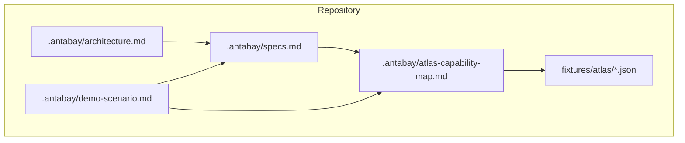
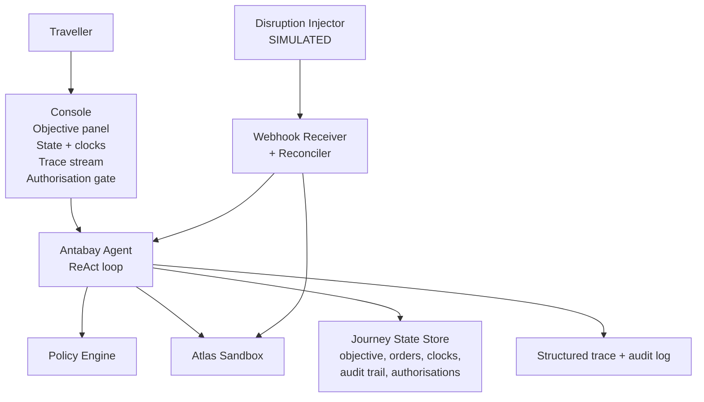
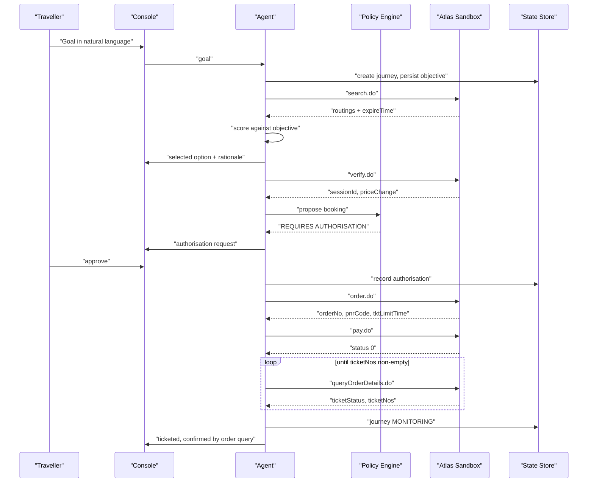
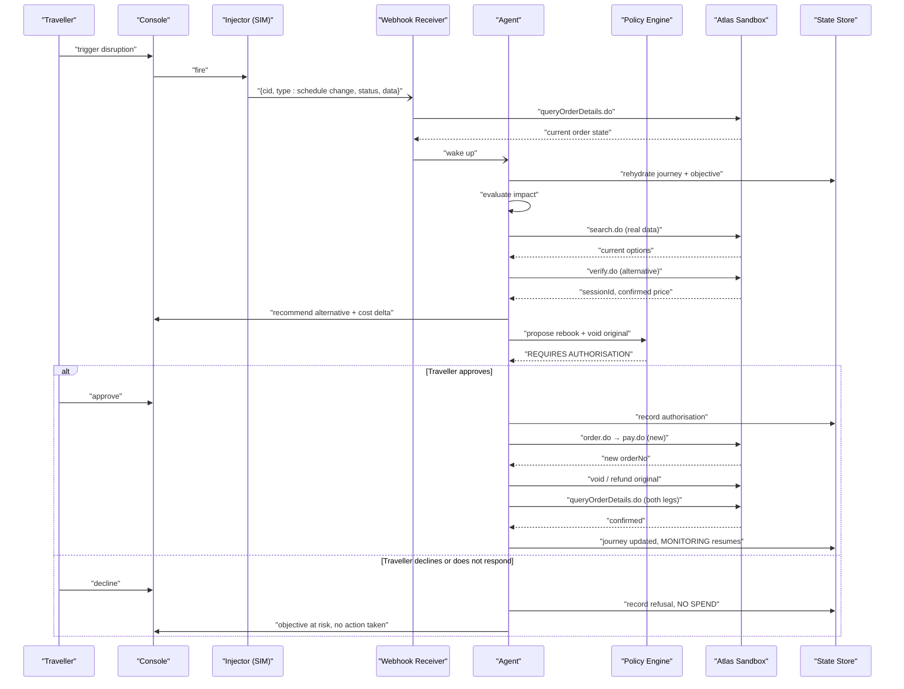
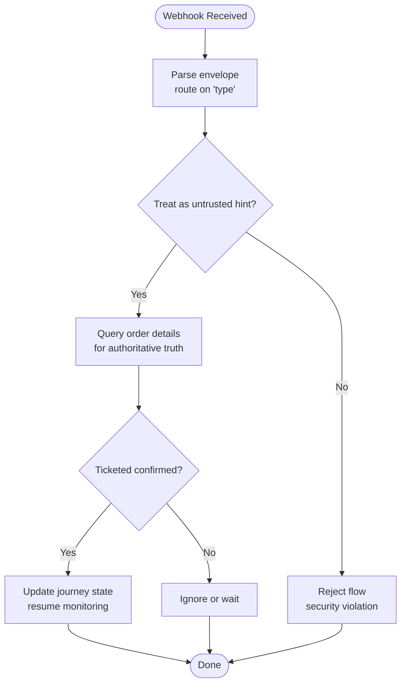
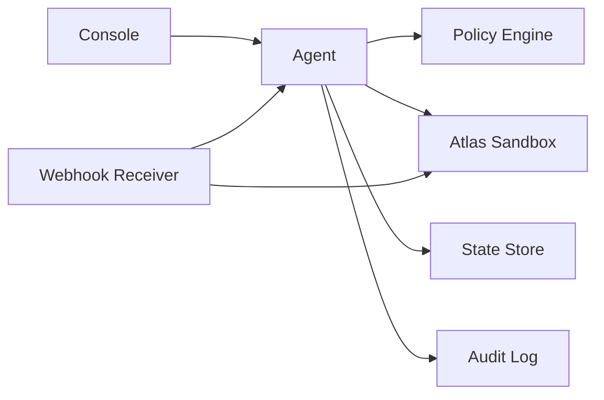

# End-to-End Testing

<cite>
**Referenced Files in This Document**
- [architecture.md](file://.antabay/architecture.md)
- [specs.md](file://.antabay/specs.md)
- [atlas-capability-map.md](file://.antabay/atlas-capability-map.md)
- [demo-scenario.md](file://.antabay/demo-scenario.md)
- [webhook_order_ticketed.json](file://fixtures/atlas/webhook_order_ticketed.json)
- [sel_tyo_search.json](file://fixtures/atlas/sel_tyo_search.json)
- [sel_tyo_verify.json](file://fixtures/atlas/sel_tyo_verify.json)
</cite>

## Table of Contents
1. [Introduction](#introduction)
2. [Project Structure](#project-structure)
3. [Core Components](#core-components)
4. [Architecture Overview](#architecture-overview)
5. [Detailed Component Analysis](#detailed-component-analysis)
6. [Dependency Analysis](#dependency-analysis)
7. [Performance Considerations](#performance-considerations)
8. [Troubleshooting Guide](#troubleshooting-guide)
9. [Conclusion](#conclusion)
10. [Appendices](#appendices)

## Introduction
This document defines end-to-end testing strategies for Antabay focused on complete journey workflows and disruption scenarios. It covers:
- Full booking journeys from natural language input through ticket confirmation
- Multi-step recovery processes including disruption detection, impact evaluation, and authorized recovery execution
- Webhook handling with real event payloads
- Performance testing for agent reasoning loops, API call budgets, and concurrent journeys
- Reliability testing for state persistence, audit trail integrity, and recovery after failures
- Real-time event streaming between backend and console interfaces
- Simulation of various disruption scenarios and verification of appropriate recovery actions
- Mobile traveler interface responsiveness and cross-browser compatibility

The strategies are grounded in the verified Atlas contract, the architecture diagrams, and the demo scenario used for demonstration and assessment.

## Project Structure
Antabay’s repository contains:
- Architecture and sequence diagrams that define system boundaries, components, and flows
- A comprehensive specification set describing capabilities, constraints, and delivery order
- A capability map that records verified endpoints, error codes, rate limits, and data shapes
- A locked demo scenario that drives end-to-end test narratives
- Fixtures containing recorded responses and webhook envelopes used as seeds for recorded tests

**Diagram sources**
- [architecture.md:19-78](file://.antabay/architecture.md#L19-L78)
- [specs.md:273-299](file://.antabay/specs.md#L273-L299)
- [atlas-capability-map.md:393-398](file://.antabay/atlas-capability-map.md#L393-L398)
- [demo-scenario.md:1-169](file://.antabay/demo-scenario.md#L1-L169)

**Section sources**
- [architecture.md:19-78](file://.antabay/architecture.md#L19-L78)
- [specs.md:273-299](file://.antabay/specs.md#L273-L299)
- [atlas-capability-map.md:393-398](file://.antabay/atlas-capability-map.md#L393-L398)
- [demo-scenario.md:1-169](file://.antabay/demo-scenario.md#L1-L169)

## Core Components
For end-to-end testing, focus on these core components and their responsibilities:
- Journey Console (React + Vite): Objective panel, journey state and clocks, live agent trace stream, authorisation gate
- Backend FastAPI service: Antabay Agent with ReAct loop, policy engine, webhook receiver and reconciler, disruption injector (simulated), Qwen integration, durable state store, structured trace and audit log
- Atlas Tool Layer: search.do, verify.do, order.do, pay.do, queryOrderDetails.do, void/refund
- External Atlas Sandbox: source of truth for inventory, pricing, booking outcomes, and events

Testing must validate each component’s behavior under realistic conditions, including short offer lifetimes, unauthenticated webhooks, rate limits, and multi-clock expiry management.

**Section sources**
- [architecture.md:19-78](file://.antabay/architecture.md#L19-L78)
- [specs.md:273-299](file://.antabay/specs.md#L273-L299)
- [atlas-capability-map.md:25-38](file://.antabay/atlas-capability-map.md#L25-L38)

## Architecture Overview
The end-to-end journey spans traveller input, console UI, agent reasoning, policy decisions, external API calls, and persistent state updates. The following diagram maps to actual components described in the architecture.

**Diagram sources**
- [architecture.md:19-78](file://.antabay/architecture.md#L19-L78)

## Detailed Component Analysis

### Full Booking Journey: Natural Language to Ticket Confirmation
Test objectives:
- Parse a natural-language goal into a structured objective with hard vs soft constraints
- Persist the journey and display parsed objective for traveller confirmation
- Search for options using verified endpoints and record offer freshness
- Score and select an option against the objective, explaining rejections
- Verify price and proceed to booking only within session validity
- Execute order and payment; confirm ticketing via authoritative query
- Handle three clocks: offer expireTime, sessionId, tktLimitTime

Recommended test cases:
- Happy path: goal → confirmed objective → search → score → verify → order → pay → poll until ticketNos non-empty → ticketed
- Offer expiry pressure: simulate near-expiry offers and ensure re-verification before committing
- Price change during verify: if price changed, require fresh approval per spec
- Paid but not ticketed: assert that payment success is not proof; continue polling until authoritative confirmation

**Diagram sources**
- [architecture.md:89-148](file://.antabay/architecture.md#L89-L148)
- [atlas-capability-map.md:236-313](file://.antabay/atlas-capability-map.md#L236-L313)

**Section sources**
- [architecture.md:89-148](file://.antabay/architecture.md#L89-L148)
- [atlas-capability-map.md:236-313](file://.antabay/atlas-capability-map.md#L236-L313)
- [specs.md:429-531](file://.antabay/specs.md#L429-L531)

### Disruption Detection, Impact Evaluation, and Authorized Recovery
Test objectives:
- Simulate schedule change via disruption injector
- Ensure webhook receiver treats incoming events as untrusted hints
- Wake agent, rehydrate journey, evaluate impact against objective
- Search alternatives, verify, propose recovery with cost delta
- Require human authorisation for spending money and irreversible actions
- Execute recovery: new order and payment, void/refund original, verify both legs

Recommended test cases:
- Injection of schedule change pushing arrival past deadline
- Impact evaluation flags objective violation
- Recovery recommendation respects budget and constraints
- Approval gate blocks unauthorized spend
- Post-execution verification of both original and new orders

**Diagram sources**
- [architecture.md:152-208](file://.antabay/architecture.md#L152-L208)
- [atlas-capability-map.md:315-391](file://.antabay/atlas-capability-map.md#L315-L391)

**Section sources**
- [architecture.md:152-208](file://.antabay/architecture.md#L152-L208)
- [atlas-capability-map.md:315-391](file://.antabay/atlas-capability-map.md#L315-L391)
- [demo-scenario.md:81-118](file://.antabay/demo-scenario.md#L81-L118)

### Webhook Handling with Real Event Payloads
Test objectives:
- Validate ingestion of real webhook envelope shape
- Treat all inbound webhooks as untrusted hints
- Confirm claims against authoritative order query before changing state
- Normalize field types across surfaces (e.g., integer vs string orderStatus)
- Register webhook URL account-wide and handle URL changes

Recommended test cases:
- Ingest webhook_order_ticketed.json payload
- Assert event routing by type field
- Do not gate handling on webhook status value
- Query order details to confirm ticketing
- Update journey state only after authoritative confirmation

**Diagram sources**
- [atlas-capability-map.md:315-391](file://.antabay/atlas-capability-map.md#L315-L391)
- [webhook_order_ticketed.json:1-53](file://fixtures/atlas/webhook_order_ticketed.json#L1-L53)

**Section sources**
- [atlas-capability-map.md:315-391](file://.antabay/atlas-capability-map.md#L315-L391)
- [webhook_order_ticketed.json:1-53](file://fixtures/atlas/webhook_order_ticketed.json#L1-L53)

### Real-Time Event Streaming Between Backend and Console
Test objectives:
- Validate SSE-based live event stream from agent to console
- Ensure trace includes endpoint names, identifiers, timings, and rule citations
- Verify clocks remain visible with time remaining and depleting bars
- Confirm authorisation gate appears when required

Recommended test cases:
- Stream presence and ordering of events during search, scoring, verify, order, pay, and ticketing
- Clocks update correctly and reflect expiries
- Authorisation gate triggers and persists decision

**Section sources**
- [architecture.md:19-78](file://.antabay/architecture.md#L19-L78)
- [specs.md:171-231](file://.antabay/specs.md#L171-L231)

### Mobile Traveler Interface Responsiveness and Cross-Browser Compatibility
Test objectives:
- Validate responsive layout collapse below threshold width
- Ensure legibility at video scale and readability of key elements
- Test cross-browser rendering consistency

Recommended test cases:
- Viewport resizing to single-column layout
- Readability checks for trace, clocks, and authorisation gate
- Cross-browser matrix testing for console and mobile view

**Section sources**
- [specs.md:171-231](file://.antabay/specs.md#L171-L231)

### Performance Testing Strategies
Focus areas:
- Agent reasoning loops: measure latency per step and total journey duration
- API call budgets: enforce per-journey budgets for rate-limited endpoints
- Concurrent journey processing: validate isolation and resource usage under load
- Rate limit compliance: respect provider QPS/QPM and retry-after instructions

Recommended test cases:
- Record and assert call counts per journey against declared budgets
- Inject rate-limit responses and verify backoff and wait adherence
- Run multiple journeys concurrently and monitor CPU/memory/DB contention
- Measure SSE throughput and console render performance under load

**Section sources**
- [specs.md:303-398](file://.antabay/specs.md#L303-L398)
- [atlas-capability-map.md:107-129](file://.antabay/atlas-capability-map.md#L107-L129)

### Reliability Testing: State Persistence, Audit Trail Integrity, Recovery After Failures
Focus areas:
- Journey state durability across process restarts
- Append-only audit trail integrity
- Recovery paths for duplicate bookings, auth failures, and unknown orders
- Clock tracking and expiry handling

Recommended test cases:
- Kill backend mid-journey and resume; assert state reconstruction
- Verify audit entries for every observation, decision, external call, and authorisation
- On duplicate booking rejection, reconcile against returned order and resume
- On auth failure, do not retry; surface actionable error
- On “order not exists,” treat as internal bug and halt retries

**Section sources**
- [specs.md:429-531](file://.antabay/specs.md#L429-L531)
- [atlas-capability-map.md:400-416](file://.antabay/atlas-capability-map.md#L400-L416)

### Simulating Various Disruption Scenarios
Focus areas:
- Schedule changes that violate deadlines
- Price increases that break budgets
- Seat scarcity and sell-out signals
- Multi-leg connection issues (overnight layovers)

Recommended test cases:
- Inject schedule change pushing arrival beyond deadline
- Simulate price change requiring fresh approval
- Present connecting itineraries with excessive layovers and reject based on constraints
- Validate recovery recommendations respect objective and budget

**Section sources**
- [demo-scenario.md:29-66](file://.antabay/demo-scenario.md#L29-L66)
- [demo-scenario.md:81-118](file://.antabay/demo-scenario.md#L81-L118)

## Dependency Analysis
Key dependencies and contracts:
- Console depends on SSE stream and state store for live updates
- Agent depends on Qwen for reasoning and policy engine for authority decisions
- Webhook receiver depends on Atlas for authoritative order state
- All external calls depend on verified Atlas contract and rate limits

**Diagram sources**
- [architecture.md:19-78](file://.antabay/architecture.md#L19-L78)

**Section sources**
- [architecture.md:19-78](file://.antabay/architecture.md#L19-L78)
- [specs.md:303-398](file://.antabay/specs.md#L303-L398)

## Performance Considerations
- Offer expiry windows are short and variable; tests must assert freshness checks before committing
- Rate limits are strict; tests must enforce budgets and honor retry-after
- Payment success is not ticketing; tests must poll until authoritative confirmation
- Currency mixing hazards exist; tests must avoid combining values in different currencies without conversion
- Identifier TTLs vary; tests must trust per-offer expireTime over documented maximums

[No sources needed since this section provides general guidance]

## Troubleshooting Guide
Common issues and resolutions:
- Duplicate booking: read duplicateOrders, reconcile against existing order, never retry
- Auth failure: credentials or account problem; do not retry
- Order not exists: internal state bug; halt retries and investigate
- Webhook misinterpretation: do not gate handling on webhook status; always confirm via order query
- Stale offers: re-verify before committing; surface remaining window in trace

**Section sources**
- [atlas-capability-map.md:400-416](file://.antabay/atlas-capability-map.md#L400-L416)
- [atlas-capability-map.md:315-391](file://.antabay/atlas-capability-map.md#L315-L391)

## Conclusion
End-to-end testing for Antabay must validate the full journey from natural language goals to ticketed confirmations, robust disruption handling with authorized recovery, resilient webhook processing, and reliable state persistence. Tests should be grounded in verified fixtures and the Atlas capability map, enforce call budgets and rate limits, and demonstrate clear traceability and auditability. The demo scenario provides a locked narrative for consistent testing and demonstration.

[No sources needed since this section summarizes without analyzing specific files]

## Appendices

### Appendix A: Fixture-Based Recorded Tests
Use fixtures as seeds for Tier 1 recorded end-to-end tests:
- sel_tyo_search.json: search response used to drive option discovery and scoring
- sel_tyo_verify.json: verify response used to drive session-based booking
- webhook_order_ticketed.json: real webhook envelope used to test receiver and reconciliation

**Section sources**
- [atlas-capability-map.md:393-398](file://.antabay/atlas-capability-map.md#L393-L398)
- [webhook_order_ticketed.json:1-53](file://fixtures/atlas/webhook_order_ticketed.json#L1-L53)
- [sel_tyo_search.json:1-800](file://fixtures/atlas/sel_tyo_search.json#L1-L800)
- [sel_tyo_verify.json:1-393](file://fixtures/atlas/sel_tyo_verify.json#L1-L393)

### Appendix B: Demo Scenario as Test Narrative
The locked demo scenario defines the traveller goal, option set, selection rationale, freshness pressure, booking steps, disruption injection, recovery recommendation, approval gate, and execution verification. Use it to structure test scripts and video demonstrations.

**Section sources**
- [demo-scenario.md:1-169](file://.antabay/demo-scenario.md#L1-L169)

### Appendix C: State Machine and Clocks
Validate transitions and clock behaviors:
- Offer expireTime governs pre-verify phase
- SessionId governs post-verify phase
- tktLimitTime governs post-order phase
- Each expiry returns journey to search

**Section sources**
- [architecture.md:212-279](file://.antabay/architecture.md#L212-L279)
- [atlas-capability-map.md:304-313](file://.antabay/atlas-capability-map.md#L304-L313)