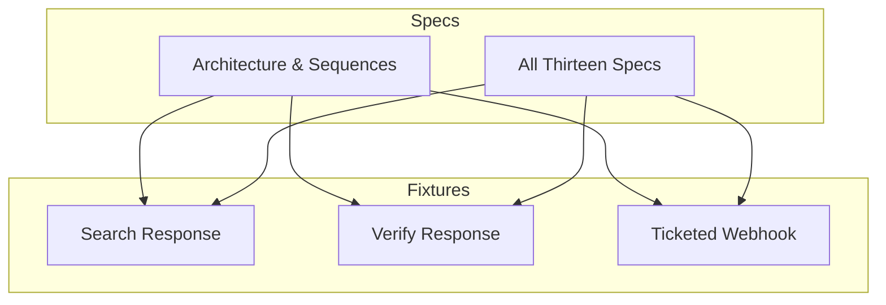
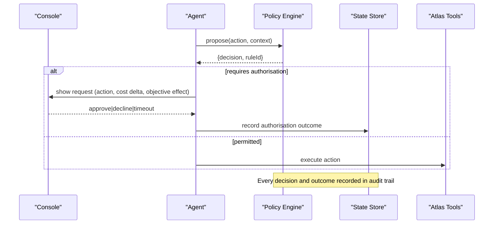
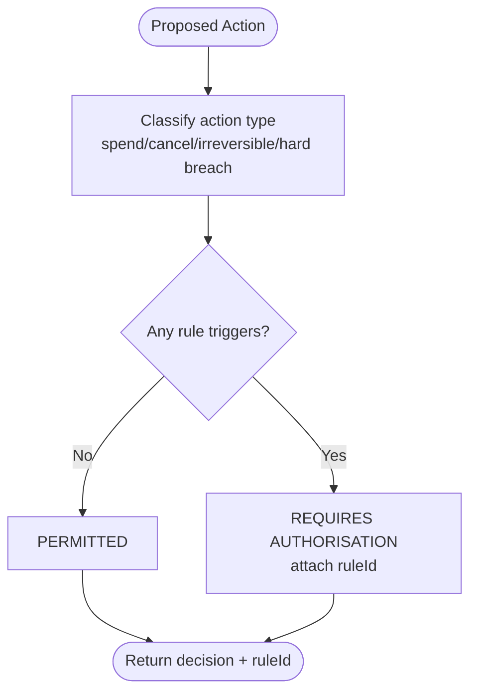
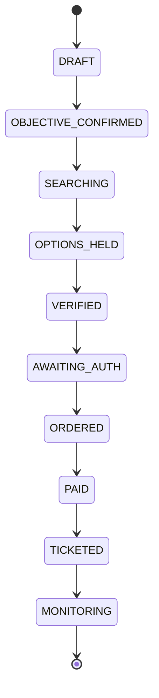
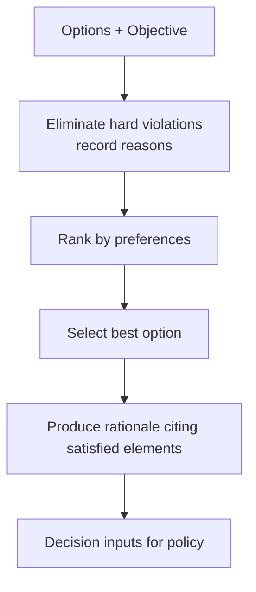
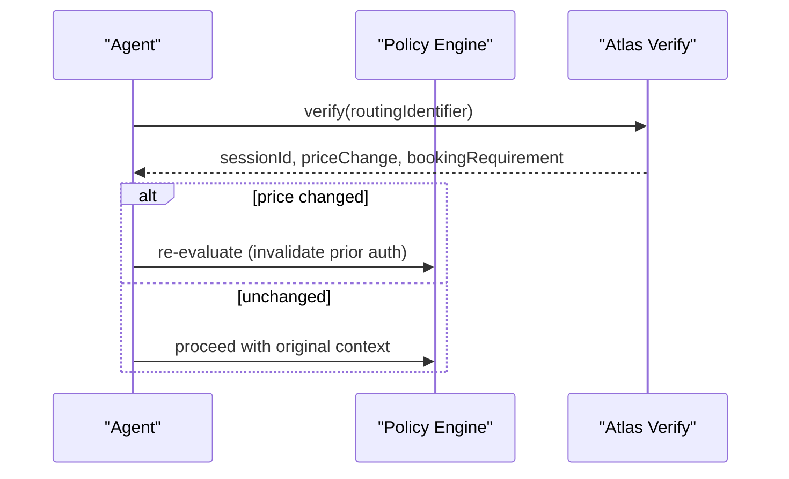
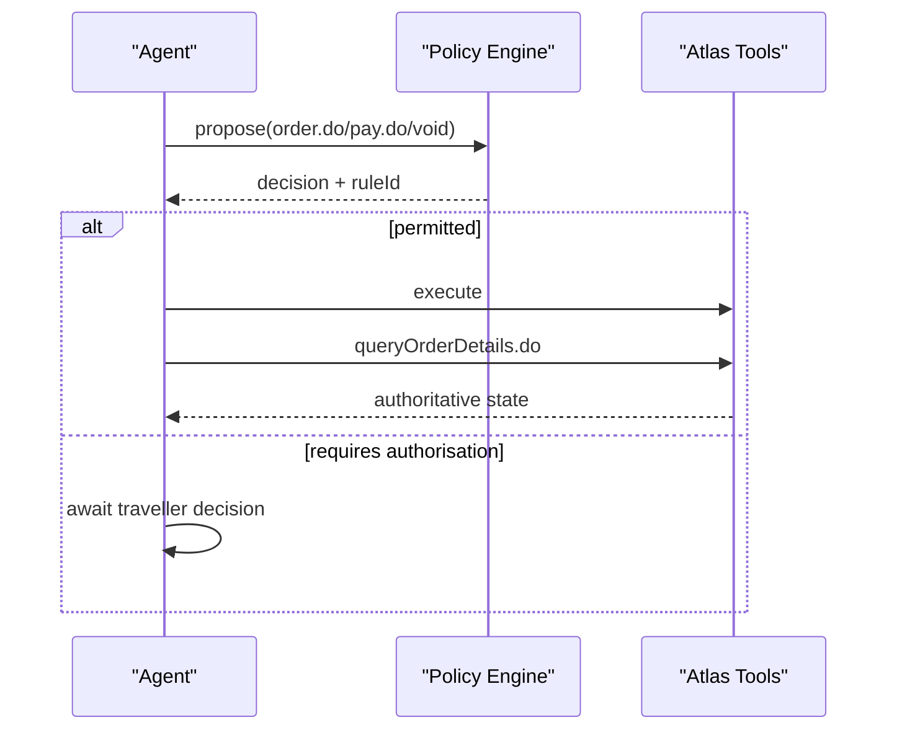
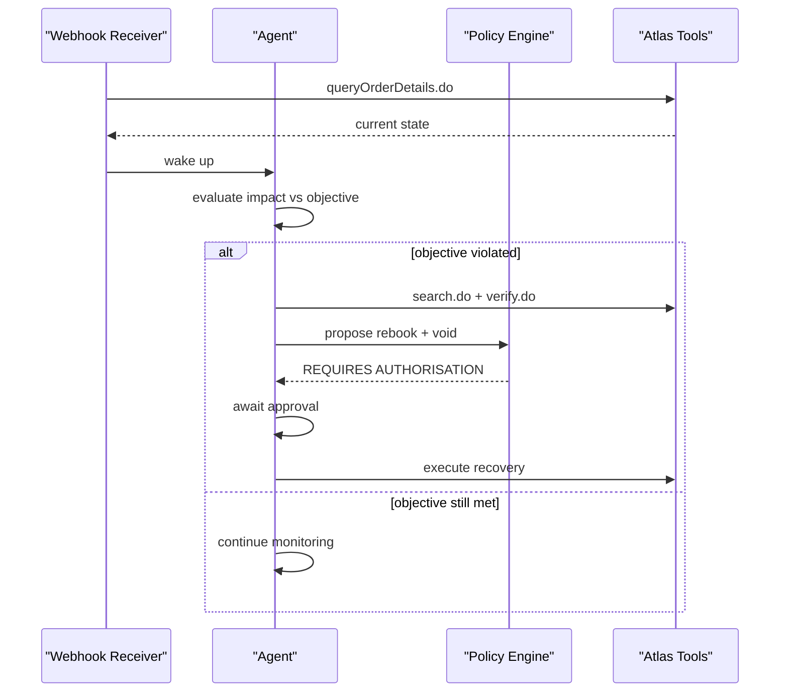
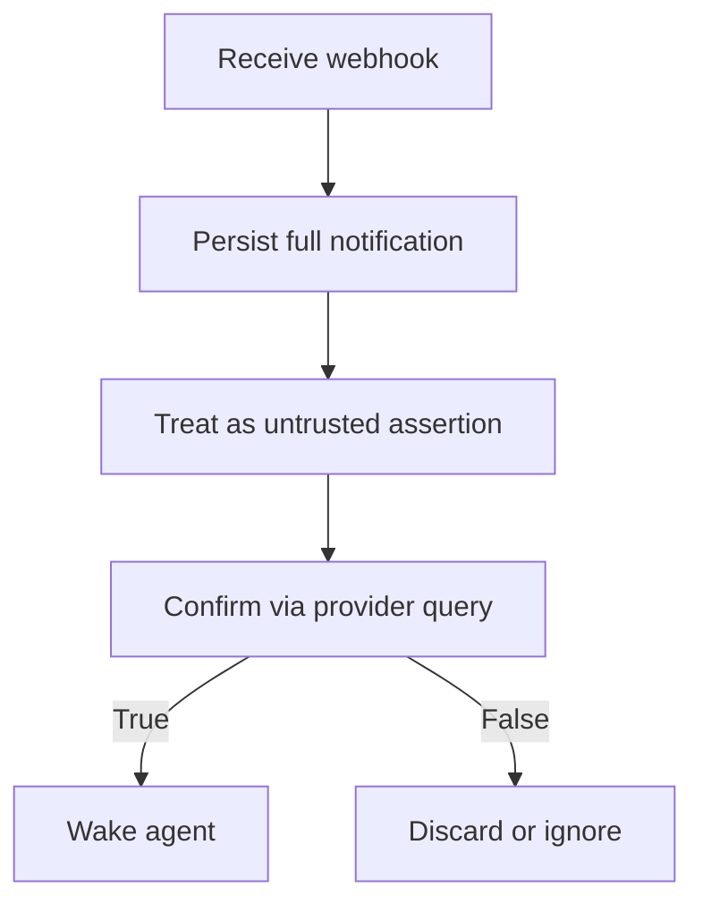
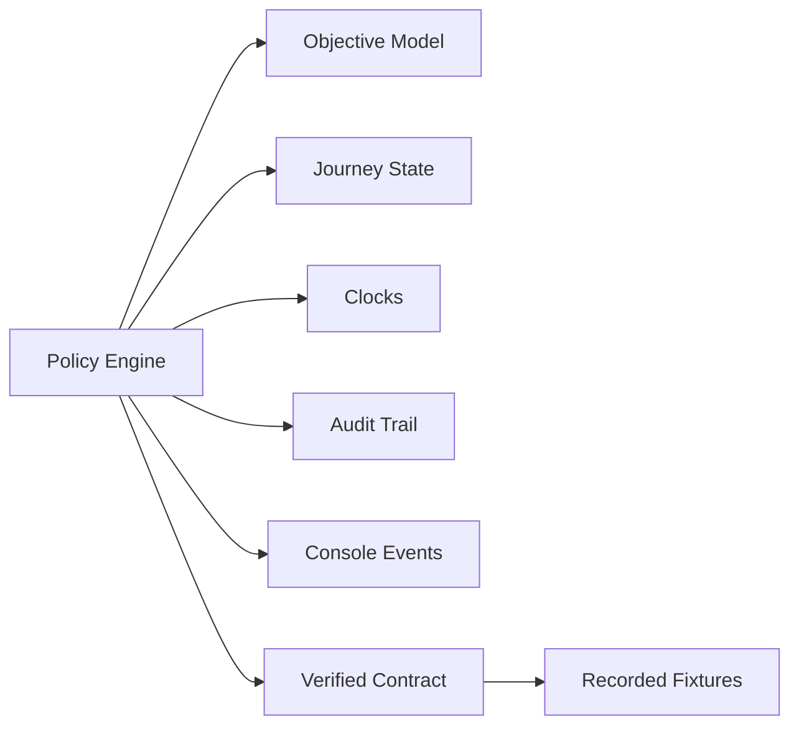

# Policy Testing

<cite>
**Referenced Files in This Document**
- [architecture.md](file://.antabay/architecture.md)
- [specs.md](file://.antabay/specs.md)
- [sel_tyo_search.json](file://fixtures/atlas/sel_tyo_search.json)
- [sel_tyo_verify.json](file://fixtures/atlas/sel_tyo_verify.json)
- [webhook_order_ticketed.json](file://fixtures/atlas/webhook_order_ticketed.json)
</cite>

## Table of Contents
1. [Introduction](#introduction)
2. [Project Structure](#project-structure)
3. [Core Components](#core-components)
4. [Architecture Overview](#architecture-overview)
5. [Detailed Component Analysis](#detailed-component-analysis)
6. [Dependency Analysis](#dependency-analysis)
7. [Performance Considerations](#performance-considerations)
8. [Troubleshooting Guide](#troubleshooting-guide)
9. [Conclusion](#conclusion)
10. [Appendices](#appendices)

## Introduction
This document defines a comprehensive policy testing strategy for Antabay’s deterministic authorization engine. It focuses on verifying that every proposed action is classified correctly as permitted or requiring human authorisation, and that decisions are reproducible, explainable, and auditable. The guidance covers:
- Deterministic rule evaluation across journey states, objective configurations, and cost scenarios
- Human authorization gate decisions and fallback behaviors
- Policy violation detection and audit trail validation
- Budget constraints, deadline violations, and preference-based authorizations
- Rule combinations, conflict resolution, and edge cases
- Test fixtures and assertion patterns grounded in live Atlas responses

The approach aligns with the system’s architecture and specifications, ensuring tests validate only what the specs require and never assume behavior beyond the verified contract.

## Project Structure
Antabay’s repository contains:
- Architectural diagrams and sequence flows describing how the agent, policy engine, state store, and external tool layer interact
- A complete set of feature specifications defining functional requirements, non-functional requirements, and acceptance criteria
- Recorded fixtures from live Atlas sandbox runs used to seed deterministic tests

**Diagram sources**
- [architecture.md:19-78](file://.antabay/architecture.md#L19-L78)
- [specs.md:1-100](file://.antabay/specs.md#L1-L100)

**Section sources**
- [architecture.md:19-78](file://.antabay/architecture.md#L19-L78)
- [specs.md:1-100](file://.antabay/specs.md#L1-L100)

## Core Components
The authorization policy engine is a deterministic decision boundary between the agent and irreversible actions. Key responsibilities include:
- Evaluating every proposed action before execution
- Classifying actions as permitted autonomously or requiring human authorisation
- Requiring authorisation for spending money, cancelling/voiding bookings, irreversible actions, and hard constraint breaches
- Producing a specific rule identifier with each decision
- Presenting an authorisation request with action details, cost impact, and objective effect
- Treating absence of response as refusal
- Recording all authorisation outcomes in the audit trail
- Preventing execution without required authorisation
- Voiding prior authorisations when costs change
- Ensuring authorisations apply to one specific action only

These responsibilities define the test surface for policy testing.

**Section sources**
- [specs.md:1272-1366](file://.antabay/specs.md#L1272-L1366)

## Architecture Overview
The policy engine sits between the agent and external tools. It receives proposed actions and returns a deterministic classification. The console surfaces outstanding authorisation requests and outcomes. The state store persists journeys, objectives, clocks, audit trails, and authorisations.

**Diagram sources**
- [architecture.md:19-78](file://.antabay/architecture.md#L19-L78)
- [specs.md:1272-1366](file://.antabay/specs.md#L1272-L1366)

**Section sources**
- [architecture.md:19-78](file://.antabay/architecture.md#L19-L78)
- [specs.md:1272-1366](file://.antabay/specs.md#L1272-L1366)

## Detailed Component Analysis

### Policy Decision Surface
Test the policy engine against a canonical set of inputs derived from the journey state, objective, and proposed action. Inputs should include:
- Action type (e.g., order creation, payment, void/refund, rebook)
- Current position (existing booking, price, deadlines)
- Objective constraints (hard vs soft), budget, currency, deadline
- Clocks (offer/session/ticketing expiry)
- External signals (price change flags, availability)

Expected outputs:
- Decision: PERMITTED or REQUIRES_AUTHORISATION
- Rule identifier cited by the policy engine
- For authorisation requests: action description, cost delta, objective effect

**Diagram sources**
- [specs.md:1272-1366](file://.antabay/specs.md#L1272-L1366)

**Section sources**
- [specs.md:1272-1366](file://.antabay/specs.md#L1272-L1366)

### Journey State and Clocks
Policy decisions depend on journey state and clock status. Tests must cover transitions through:
- DRAFT → OBJECTIVE_CONFIRMED → SEARCHING → OPTIONS_HELD → VERIFIED → AWAITING_AUTH → ORDERED → PAID → TICKETED → MONITORING
- Expired offer/session/ticketing clocks forcing search or failure
- Duplicate orders reconciled to existing orders
- Recovery paths after disruptions

**Diagram sources**
- [architecture.md:212-257](file://.antabay/architecture.md#L212-L257)

**Section sources**
- [architecture.md:212-257](file://.antabay/architecture.md#L212-L257)

### Option Scoring and Objective Evaluation
While scoring is separate from policy, it influences policy-relevant inputs such as cost and deadline compliance. Tests should verify:
- Hard constraint elimination and recording of violated constraints
- Ranking by preferences
- Deadline margin computation
- Canonical total-price calculation
- Connection handling and exclusions
- Determinism and explainability

**Diagram sources**
- [specs.md:675-766](file://.antabay/specs.md#L675-L766)

**Section sources**
- [specs.md:675-766](file://.antabay/specs.md#L675-L766)

### Price Verification and Staleness
Verification affects policy because price changes invalidate prior authorisations. Tests must assert:
- Provider’s price-change indicator is used
- Session identifiers preserved
- Offer session replacement and tracking
- Passenger requirement capture
- Re-verification near expiry
- Return to search if unavailable

**Diagram sources**
- [specs.md:949-1030](file://.antabay/specs.md#L949-L1030)

**Section sources**
- [specs.md:949-1030](file://.antabay/specs.md#L949-L1030)

### Booking Path and Post-Action Verification
Policy gates irreversible actions. Tests must ensure:
- Order creation uses verification session
- Payment only after successful order
- Ticketing confirmed by independent query
- Duplicate-order reconciliation
- No repetition on uncertain outcomes
- Audit trail records every verification attempt

**Diagram sources**
- [specs.md:1059-1169](file://.antabay/specs.md#L1059-L1169)
- [specs.md:1173-1244](file://.antabay/specs.md#L1173-L1244)

**Section sources**
- [specs.md:1059-1169](file://.antabay/specs.md#L1059-L1169)
- [specs.md:1173-1244](file://.antabay/specs.md#L1173-L1244)

### Disruption Impact and Recovery
Disruptions can violate objectives and trigger recovery actions that require authorisation. Tests must cover:
- Objective impact evaluation
- Alternative discovery and verification
- Cost expressed relative to current position
- Explicit statements when alternatives breach constraints
- Recovery execution ordering: secure replacement before releasing original
- Independent verification of both steps

**Diagram sources**
- [architecture.md:152-208](file://.antabay/architecture.md#L152-L208)
- [specs.md:1610-1690](file://.antabay/specs.md#L1610-L1690)
- [specs.md:1720-1806](file://.antabay/specs.md#L1720-L1806)

**Section sources**
- [architecture.md:152-208](file://.antabay/architecture.md#L152-L208)
- [specs.md:1610-1690](file://.antabay/specs.md#L1610-L1690)
- [specs.md:1720-1806](file://.antabay/specs.md#L1720-L1806)

### Webhooks and Reconciliation
Webhooks are untrusted hints; policy-related state changes must be reconciled via provider queries. Tests must assert:
- Acknowledgement before verification
- Persistence of inbound notifications
- Normalization of field types
- Association by order reference
- Deduplication tolerance
- Periodic reconciliation
- Agent wake-up only after confirmation

**Diagram sources**
- [specs.md:1396-1478](file://.antabay/specs.md#L1396-L1478)

**Section sources**
- [specs.md:1396-1478](file://.antabay/specs.md#L1396-L1478)

## Dependency Analysis
Policy testing depends on:
- Verified external contract and endpoints
- Recorded fixtures from live runs
- Journey state and objective model
- Console event stream for authorisation presentation
- Audit trail for outcomes and rule citations

**Diagram sources**
- [specs.md:1-100](file://.antabay/specs.md#L1-L100)
- [specs.md:1272-1366](file://.antabay/specs.md#L1272-L1366)

**Section sources**
- [specs.md:1-100](file://.antabay/specs.md#L1-L100)
- [specs.md:1272-1366](file://.antabay/specs.md#L1272-L1366)

## Performance Considerations
- Keep policy evaluations deterministic and fast; avoid heavy computations in hot paths
- Use fixtures to avoid network latency during unit tests
- Batch assertions where possible but keep per-rule isolation for clarity
- Ensure audit logging does not block decision flow
- Prefer precomputed context objects for repeated evaluations

[No sources needed since this section provides general guidance]

## Troubleshooting Guide
Common issues and how to detect them:
- Non-deterministic decisions: verify inputs are fully specified and stable; assert ruleId consistency
- Missing rule citations: assert that every decision includes a rule identifier
- Silent refusals: assert that absence of response is treated as refusal and recorded
- Unverified state changes: assert post-action verification results match authoritative state
- Incorrect cost deltas: assert canonical price calculation and currency normalization
- Stale offers/sessions: assert re-verification near expiry and return-to-search on expiration
- Duplicate webhooks: assert idempotent processing and no duplicate actions

**Section sources**
- [specs.md:1272-1366](file://.antabay/specs.md#L1272-L1366)
- [specs.md:1173-1244](file://.antabay/specs.md#L1173-L1244)
- [specs.md:1396-1478](file://.antabay/specs.md#L1396-L1478)

## Conclusion
Policy testing for Antabay centers on deterministic, explainable, and auditable decisions at the boundary between autonomous operation and human authority. By grounding tests in verified contracts, recorded fixtures, and specification-driven requirements, teams can confidently validate authorization rules across diverse journey states, objectives, and cost scenarios. Assertions should consistently check decision outcomes, rule citations, audit entries, and downstream effects, ensuring safety and reproducibility.

[No sources needed since this section summarizes without analyzing specific files]

## Appendices

### Test Strategy Matrix
Coverage areas and strategies:
- Deterministic rule evaluation: same inputs yield same decision and ruleId
- Decision verification: assert PERMITTED or REQUIRES_AUTHORISATION with rule citation
- Edge case coverage: expired clocks, zero options, duplicate orders, price changes, missing fields
- Human authorization gates: approve, decline, timeout; assert outcomes and audit entries
- Policy violation detection: hard constraint breaches trigger authorisation
- Audit trail validation: every decision and outcome recorded with timestamps
- Budget constraints: test over-budget proposals and savings scenarios
- Deadline violations: test arrival margins and late arrivals
- Preference-based authorizations: test soft preference impacts on recommendations and policy relevance
- Rule combinations and conflicts: test overlapping rules and precedence
- Fallback behaviors: return to search on expiration or unavailability

[No sources needed since this section provides general guidance]

### Test Case Catalogue
Representative test cases aligned with specifications:
- Spending money: order creation and payment require authorisation
- Cancelling or voiding bookings: require authorisation
- Irreversible actions: require authorisation
- Hard constraint breach: require authorisation
- Price change invalidates prior authorisation: re-evaluate and present new request
- Absence of response treated as refusal: record refusal and no spend
- One-time authorisation scope: do not carry forward to subsequent actions
- Duplicate order reconciliation: adopt existing order and resume
- Post-action verification: update state only from authoritative query
- Webhook reconciliation: confirm via provider before waking agent
- Recovery execution: secure replacement before releasing original; independent verification

**Section sources**
- [specs.md:1272-1366](file://.antabay/specs.md#L1272-L1366)
- [specs.md:1059-1169](file://.antabay/specs.md#L1059-L1169)
- [specs.md:1173-1244](file://.antabay/specs.md#L1173-L1244)
- [specs.md:1396-1478](file://.antabay/specs.md#L1396-L1478)
- [specs.md:1720-1806](file://.antabay/specs.md#L1720-L1806)

### Fixtures and Data Sources
Use recorded fixtures to seed deterministic tests:
- Search response fixture: multiple routings with prices, taxes, segments, baggage, ancillaries, expireTime
- Verify response fixture: sessionId, routing, bookingRequirement, priceChange flag, status
- Ticketed webhook fixture: order.ticketed envelope with orderNo, ticketNos, metadata

Fixture usage guidelines:
- Redact sensitive fields as done in captured fixtures
- Preserve identifiers exactly as returned
- Use expireTime and refreshTime to simulate aging and staleness
- Drive scenario variations by altering objective and clocks while keeping provider data constant

**Section sources**
- [sel_tyo_search.json:1-800](file://fixtures/atlas/sel_tyo_search.json#L1-L800)
- [sel_tyo_verify.json:1-393](file://fixtures/atlas/sel_tyo_verify.json#L1-L393)
- [webhook_order_ticketed.json:1-53](file://fixtures/atlas/webhook_order_ticketed.json#L1-L53)

### Assertion Patterns
Recommended assertions for policy tests:
- Decision equals expected classification
- Rule identifier is present and matches the triggering rule
- Audit entry exists with timestamp, decision, and ruleId
- For authorisation requests: action description, cost delta, objective effect included
- For permitted actions: no spend occurs unless explicitly approved
- For declined or timed-out requests: no state change and refusal recorded
- For price changes: prior authorisation voided and new request presented
- For recovery: replacement secured before original released; both steps independently verified

[No sources needed since this section provides general guidance]

### Reproducibility and Explainability
Ensure every policy decision is:
- Reproducible: same inputs produce same decision and ruleId
- Explainable: ruleId cited alongside decision in console and audit trail
- Verifiable: assertions check rule citations and outcomes
- Auditable: append-only trail records all decisions and authorisation outcomes

**Section sources**
- [specs.md:1272-1366](file://.antabay/specs.md#L1272-L1366)