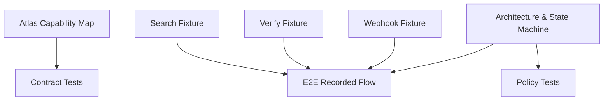
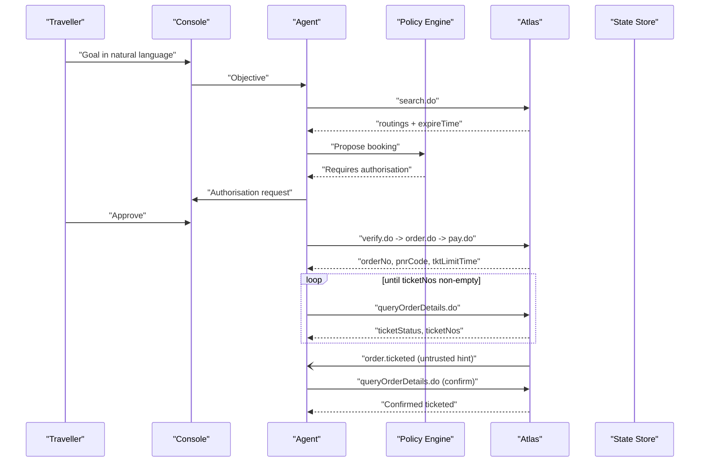
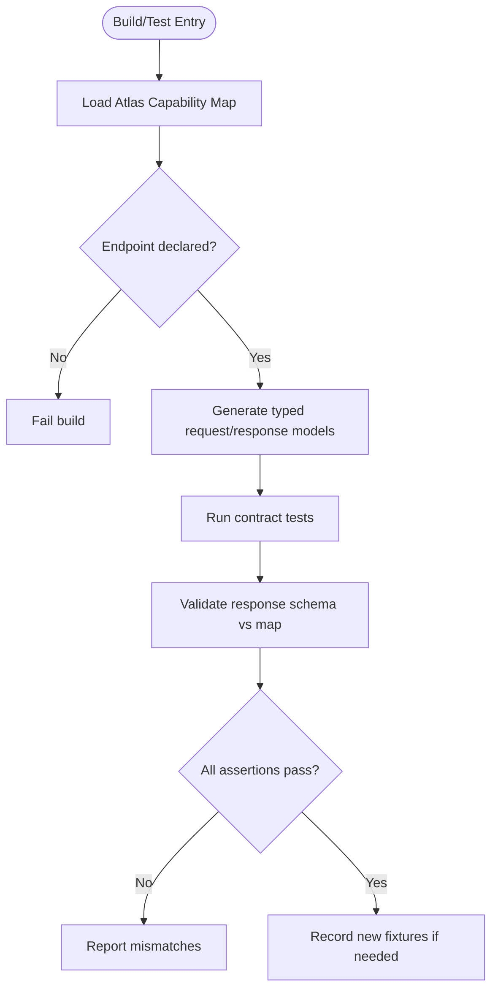
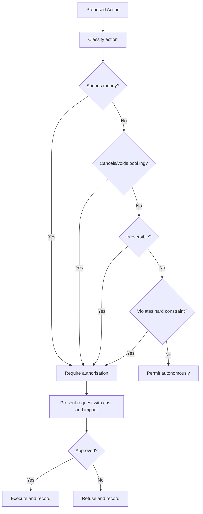
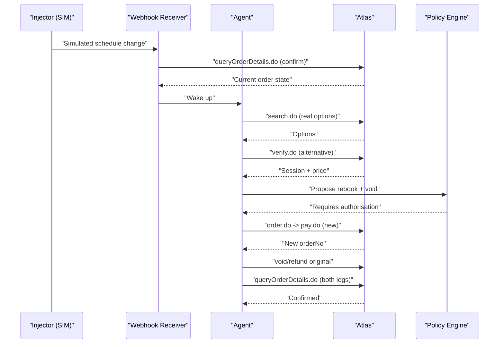
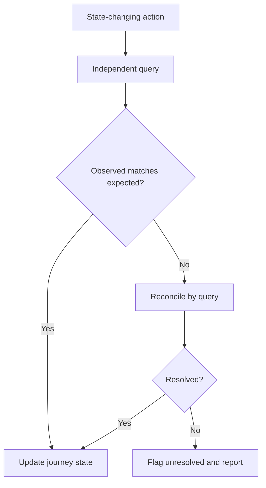
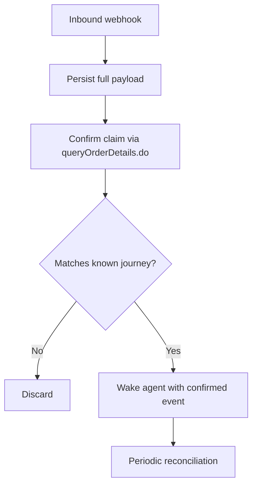
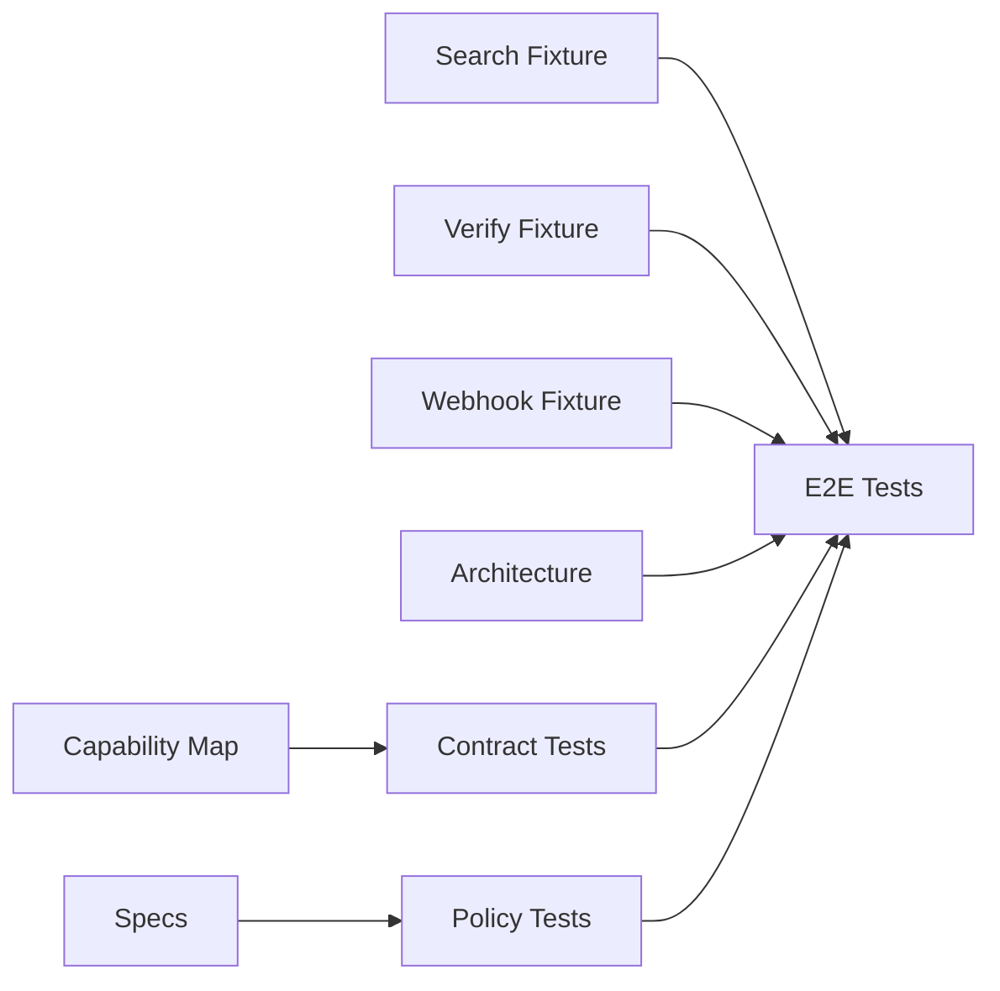

# Testing Strategy

<cite>
**Referenced Files in This Document**
- [atlas-capability-map.md](file://.antabay/atlas-capability-map.md)
- [architecture.md](file://.antabay/architecture.md)
- [specs.md](file://.antabay/specs.md)
- [sel_tyo_search.json](file://fixtures/atlas/sel_tyo_search.json)
- [sel_tyo_verify.json](file://fixtures/atlas/sel_tyo_verify.json)
- [webhook_order_ticketed.json](file://fixtures/atlas/webhook_order_ticketed.json)
</cite>

## Table of Contents
1. [Introduction](#introduction)
2. [Project Structure](#project-structure)
3. [Core Components](#core-components)
4. [Architecture Overview](#architecture-overview)
5. [Detailed Component Analysis](#detailed-component-analysis)
6. [Dependency Analysis](#dependency-analysis)
7. [Performance Considerations](#performance-considerations)
8. [Troubleshooting Guide](#troubleshooting-guide)
9. [Conclusion](#conclusion)
10. [Appendices](#appendices)

## Introduction
This document defines the testing strategy for Antabay across three layers:
- Contract testing against the verified Atlas API capability map
- Policy testing for deterministic authorisation decisions
- End-to-end testing for complete journeys, disruption scenarios, and recovery workflows

The strategy is grounded in real sandbox responses captured as fixtures and enforced by build-time contract validation. It is designed to be accessible to QA engineers while providing sufficient technical depth for developers writing tests.

## Project Structure
Antabay’s test-relevant assets are organised around a single source of truth for the external contract and a small set of recorded fixtures:
- The Atlas capability map documents verified endpoints, request/response shapes, error codes, rate limits, and clocks that govern offer/session/ticketing lifetimes.
- Fixtures under `fixtures/atlas/` contain redacted, live sandbox responses used as seeds for recorded end-to-end tests.
- Architecture and specs define the system boundaries, state machine, and feature-level requirements that drive test design.

**Diagram sources**
- [atlas-capability-map.md:25-39](file://.antabay/atlas-capability-map.md#L25-L39)
- [architecture.md:19-78](file://.antabay/architecture.md#L19-L78)

**Section sources**
- [atlas-capability-map.md:1-424](file://.antabay/atlas-capability-map.md#L1-L424)
- [architecture.md:1-279](file://.antabay/architecture.md#L1-L279)
- [specs.md:303-398](file://.antabay/specs.md#L303-L398)

## Core Components
- Verified contract surface: search.do, verify.do, order.do, pay.do, queryOrderDetails.do, plus documented but not yet exercised endpoints.
- Three clocks: offer expireTime (pre-verify), sessionId (post-verify), tktLimitTime (post-order).
- Error classification: success, duplicate booking reconciliation, terminal auth failures, and unknown states.
- Webhook ingestion: unauthenticated events treated as hints; authoritative state comes from queryOrderDetails.do.

These components directly shape contract, policy, and end-to-end tests.

**Section sources**
- [atlas-capability-map.md:25-39](file://.antabay/atlas-capability-map.md#L25-L39)
- [atlas-capability-map.md:107-130](file://.antabay/atlas-capability-map.md#L107-L130)
- [atlas-capability-map.md:304-313](file://.antabay/atlas-capability-map.md#L304-L313)
- [atlas-capability-map.md:400-416](file://.antabay/atlas-capability-map.md#L400-L416)

## Architecture Overview
The system composes an agent, a deterministic policy engine, a webhook receiver/reconciler, and a tool layer over the Atlas API. The journey state machine enforces transitions and clock management.

**Diagram sources**
- [architecture.md:89-148](file://.antabay/architecture.md#L89-L148)
- [atlas-capability-map.md:236-313](file://.antabay/atlas-capability-map.md#L236-L313)

## Detailed Component Analysis

### Contract Testing Against Atlas
Contract tests enforce that every call and response adheres to the verified capability map. They validate:
- Endpoint existence and allowed fields
- Identifier preservation without modification
- Canonical total price calculation
- Normalisation of types that differ between surfaces
- Error code classification and handling
- Rate limit compliance and wait instructions
- Offer/session/ticketing clock tracking

**Diagram sources**
- [specs.md:303-398](file://.antabay/specs.md#L303-L398)
- [atlas-capability-map.md:25-39](file://.antabay/atlas-capability-map.md#L25-L39)

Concrete fixture-based validations:
- Search response envelope and routing fields: use `sel_tyo_search.json` to assert presence and types of routings, segments, pricing, baggage rules, ancillaries, refresh/expire times, and support flags.
- Verify response envelope and booking requirements: use `sel_tyo_verify.json` to assert sessionId, maxSeats, routing shape, priceChange object, and passenger field schema returned at verification time.
- Webhook event envelope: use `webhook_order_ticketed.json` to assert event type, status semantics, data structure, and content-type headers.

How fixtures are used:
- Seed recorded end-to-end tests so they can replay a full journey without live network calls.
- Drive schema validation tests that compare live or recorded payloads against the capability map.
- Provide stable inputs for policy and workflow tests that depend on known identifiers and prices.

**Section sources**
- [atlas-capability-map.md:393-398](file://.antabay/atlas-capability-map.md#L393-L398)
- [sel_tyo_search.json:1-800](file://fixtures/atlas/sel_tyo_search.json#L1-L800)
- [sel_tyo_verify.json:1-393](file://fixtures/atlas/sel_tyo_verify.json#L1-L393)
- [webhook_order_ticketed.json:1-53](file://fixtures/atlas/webhook_order_ticketed.json#L1-L53)

### Policy Testing for Authorisation Rules
Policy tests ensure deterministic decisions about whether actions require human authorisation. Focus areas:
- Spending money requires approval
- Cancelling or voiding bookings requires approval
- Irreversible actions require approval
- Actions violating hard constraints require approval
- Decisions must be rule-driven, not model-driven
- Each decision cites the specific rule identifier
- Silence is refusal
- Prior authorisations are voided when costs change

**Diagram sources**
- [specs.md:1272-1366](file://.antabay/specs.md#L1272-L1366)

Edge cases to cover:
- Zero-cost cancellation requiring approval
- Saving money but still requiring approval due to irreversibility
- Price change after approval invalidating prior authorisation
- Multiple concurrent authorisation requests
- Unauthorised action blocked even if previously suggested by reasoning

**Section sources**
- [specs.md:1272-1366](file://.antabay/specs.md#L1272-L1366)

### End-to-End Testing Strategies
E2E tests validate complete journeys and recovery flows using recorded fixtures and replayable streams.

Happy path to ticketed:
- Goal parsing, objective confirmation, search, scoring, verification, authorisation, ordering, payment, polling until ticketed, and webhook reconciliation.

Disruption and recovery:
- Inject a schedule-change notification (simulated), evaluate impact against objectives, search alternatives, verify, propose recovery requiring authorisation, execute replacement booking, confirm ticketing, then cancel original.

**Diagram sources**
- [architecture.md:152-208](file://.antabay/architecture.md#L152-L208)
- [specs.md:1508-1582](file://.antabay/specs.md#L1508-L1582)
- [specs.md:1720-1806](file://.antabay/specs.md#L1720-L1806)

Recovery execution specifics:
- Replacement secured before releasing original
- Independent verification of each step
- Clear reporting when partial failure occurs
- Return to monitoring once recovery completes

**Section sources**
- [specs.md:1720-1806](file://.antabay/specs.md#L1720-L1806)

### Post-Action Verification
After every state-changing action, tests assert independent reconciliation:
- Follow write with read
- Update state only from query results
- Define per-action success conditions
- Treat absence of ticket numbers as not ticketed
- Reconcile unresolved outcomes by query, never by retry

**Diagram sources**
- [specs.md:1173-1244](file://.antabay/specs.md#L1173-L1244)

**Section sources**
- [specs.md:1173-1244](file://.antabay/specs.md#L1173-L1244)

### Webhook Handling Tests
Webhook tests validate ingestion and safe handling:
- Accept inbound notifications and acknowledge promptly
- Persist full payload before acting
- Treat all webhooks as untrusted hints
- Confirm claims via queryOrderDetails.do before changing state
- Route on event type and normalise differing field types
- Associate notifications with journeys and tolerate duplicates
- Periodically reconcile active journeys independently

**Diagram sources**
- [specs.md:1396-1478](file://.antabay/specs.md#L1396-L1478)

**Section sources**
- [specs.md:1396-1478](file://.antabay/specs.md#L1396-L1478)

## Dependency Analysis
Testing dependencies align with the architecture and capability map:
- Contract tests depend on the capability map and generated typed models
- E2E tests depend on fixtures and replayable event streams
- Policy tests depend on rule definitions and deterministic evaluation logic
- Webhook tests depend on the receiver and reconciler, plus queryOrderDetails.do

**Diagram sources**
- [specs.md:303-398](file://.antabay/specs.md#L303-L398)
- [architecture.md:19-78](file://.antabay/architecture.md#L19-L78)

**Section sources**
- [specs.md:303-398](file://.antabay/specs.md#L303-L398)
- [architecture.md:19-78](file://.antabay/architecture.md#L19-L78)

## Performance Considerations
- Respect provider rate limits: search.do 10 QPS; verify.do + getOffers.do share 60 QPM; seatAvailability.do + getLuggage.do share 60 QPM. Do not retry loops; honour retry-after.
- Track call budgets per journey to avoid exhausting rate-limited endpoints mid-decision.
- Use fixtures for most tests to reduce network latency and flakiness; reserve live runs for contract drift detection.
- Keep E2E suites fast by replaying recorded streams where possible.

[No sources needed since this section provides general guidance]

## Troubleshooting Guide
Common issues and how to diagnose them:
- Duplicate booking rejection: treat as reconcilable; read existing order reference and resume from actual state.
- Auth failures: terminal; do not retry.
- Unknown error codes: classify and fail fast; add coverage to error classification.
- Stale offers: check expireTime before acting; return to search if expired.
- Session expiry: re-verify before order creation if close to expiry.
- Ticketing delay: poll queryOrderDetails.do until ticketNos populated or deadline passes.
- Webhook misclassification: do not gate on webhook status; always confirm via query.

**Section sources**
- [atlas-capability-map.md:107-130](file://.antabay/atlas-capability-map.md#L107-L130)
- [atlas-capability-map.md:304-313](file://.antabay/atlas-capability-map.md#L304-L313)
- [atlas-capability-map.md:400-416](file://.antabay/atlas-capability-map.md#L400-L416)

## Conclusion
Antabay’s testing strategy combines strict contract enforcement, deterministic policy validation, and robust end-to-end coverage using real fixtures. Build-time checks prevent invented endpoints or fields, while recorded fixtures enable reliable replay of complete journeys and recovery scenarios. The approach balances speed, reliability, and correctness, ensuring that critical financial and operational actions are always verified against authoritative state.

[No sources needed since this section summarizes without analyzing specific files]

## Appendices

### Appendix A: Fixture Reference
- Search fixture: validates routing arrays, segment details, pricing breakdowns, baggage and ancillary structures, freshness timestamps, and support flags.
- Verify fixture: validates session lifecycle, booking requirement schema, price change indicators, and post-verify freshness behavior.
- Webhook fixture: validates event envelope, headers, and payload structure for order.ticketed events.

**Section sources**
- [sel_tyo_search.json:1-800](file://fixtures/atlas/sel_tyo_search.json#L1-L800)
- [sel_tyo_verify.json:1-393](file://fixtures/atlas/sel_tyo_verify.json#L1-L393)
- [webhook_order_ticketed.json:1-53](file://fixtures/atlas/webhook_order_ticketed.json#L1-L53)

### Appendix B: Continuous Integration Setup
- Enforce build-time endpoint validation against the capability map; fail on any undeclared endpoint usage.
- Run contract tests on every change; block merges if schemas diverge from the map.
- Include fixture-based E2E replay tests in CI to validate full journeys without live dependencies.
- Add periodic live contract drift checks against the sandbox to detect changes early.

**Section sources**
- [specs.md:303-398](file://.antabay/specs.md#L303-L398)

### Appendix C: Test Result Interpretation
- Contract failures indicate drift in provider responses or implementation misuse; update models and tests accordingly.
- Policy failures indicate rule misconfiguration or non-deterministic behaviour; audit rule evaluation paths.
- E2E failures should be triaged by layer: contract, policy, workflow, or infrastructure; prefer replaying fixtures first to isolate environment issues.

**Section sources**
- [specs.md:303-398](file://.antabay/specs.md#L303-L398)
- [specs.md:1272-1366](file://.antabay/specs.md#L1272-L1366)