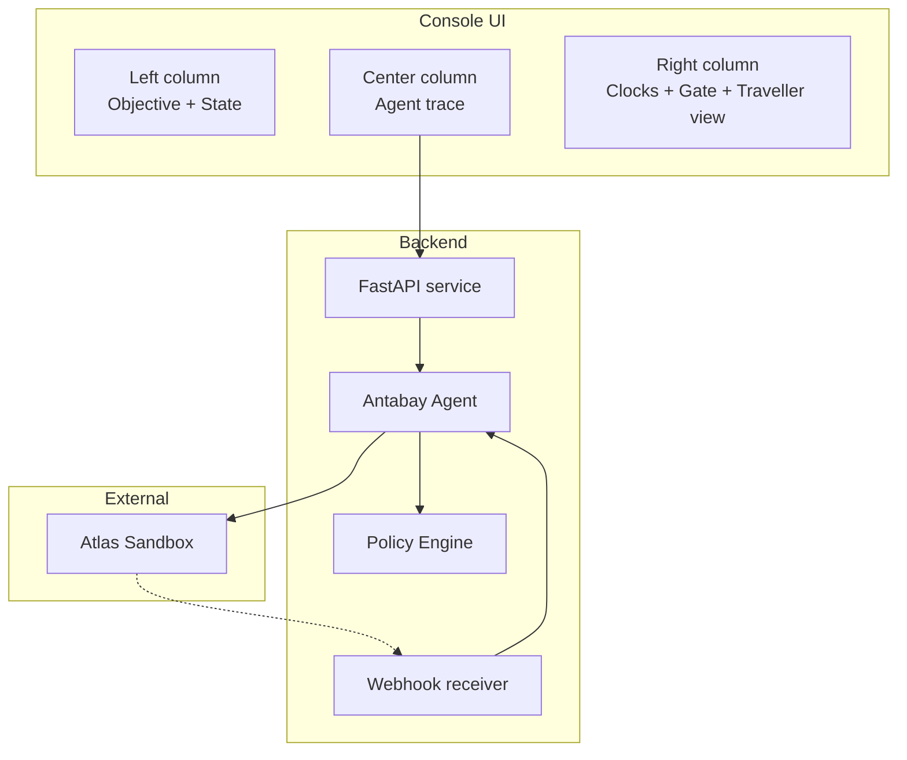
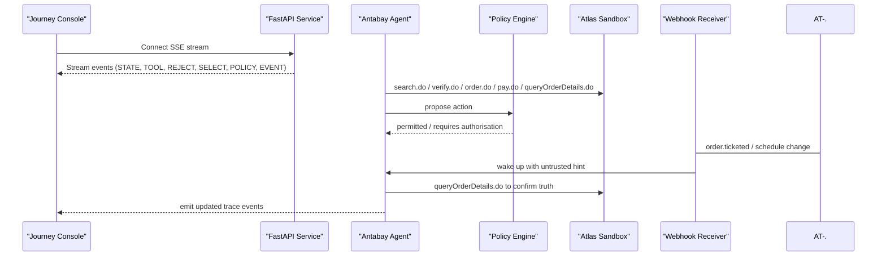
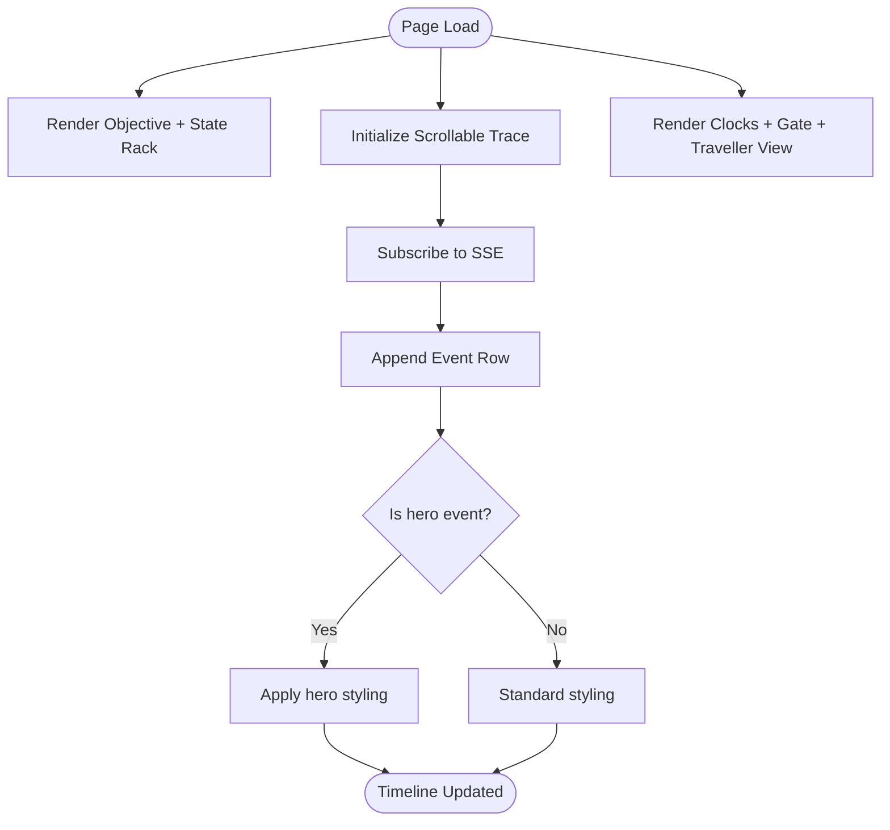
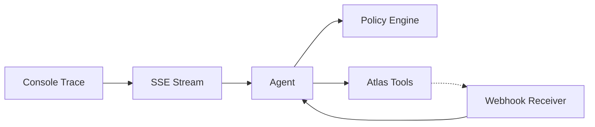

# Agent Trace Display

<cite>
**Referenced Files in This Document**
- [console-mockup.html](file://.antabay/console-mockup.html)
- [architecture.md](file://.antabay/architecture.md)
- [specs.md](file://.antabay/specs.md)
- [demo-scenario.md](file://.antabay/demo-scenario.md)
- [demo-sequence.md](file://.antabay/demo-sequence.md)
- [sel_tyo_search.json](file://fixtures/atlas/sel_tyo_search.json)
- [sel_tyo_verify.json](file://fixtures/atlas/sel_tyo_verify.json)
- [webhook_order_ticketed.json](file://fixtures/atlas/webhook_order_ticketed.json)
</cite>

## Table of Contents
1. [Introduction](#introduction)
2. [Project Structure](#project-structure)
3. [Core Components](#core-components)
4. [Architecture Overview](#architecture-overview)
5. [Detailed Component Analysis](#detailed-component-analysis)
6. [Dependency Analysis](#dependency-analysis)
7. [Performance Considerations](#performance-considerations)
8. [Troubleshooting Guide](#troubleshooting-guide)
9. [Conclusion](#conclusion)
10. [Appendices](#appendices)

## Introduction
This document explains the Agent Trace Display component that visualizes real-time agent reasoning and event streaming for a travel journey console. It focuses on:
- The three-column layout with timestamps, event types, and detailed descriptions
- The color-coded event system used to communicate tool calls, rejections, selections, policy decisions, external events, and state changes
- Hero event highlighting for critical decisions such as objective violations and authorization requirements
- Examples covering search results, verification steps, order creation, payment processing, and disruption handling
- Real-time Server-Sent Events (SSE) integration for live updates
- A scrollable timeline interface for reviewing agent decision-making processes

The design is grounded in a verified Atlas sandbox contract and demonstrates a complete flow from goal parsing through booking, monitoring, disruption, recovery, and human authorization.

## Project Structure
The repository contains design and specification artifacts plus a console mockup that defines the target UI behavior and visual language. Key files include:
- A console mockup HTML file that implements the three-column layout, trace styling, clocks, and authorisation gate
- Architecture and sequence diagrams describing the backend agent, policy engine, webhook receiver, and Atlas tool layer
- Specifications defining the design language, palette, layout rules, and delivery milestones
- Demo scenario and sequence documents describing the end-to-end flow and video beats
- Fixtures capturing real Atlas responses for search, verification, and ticketing webhooks

**Diagram sources**
- [architecture.md:19-78](file://.antabay/architecture.md#L19-L78)
- [console-mockup.html:63-139](file://.antabay/console-mockup.html#L63-L139)

**Section sources**
- [console-mockup.html:63-139](file://.antabay/console-mockup.html#L63-L139)
- [architecture.md:19-78](file://.antabay/architecture.md#L19-L78)
- [specs.md:171-231](file://.antabay/specs.md#L171-L231)

## Core Components
The Agent Trace Display centers around a three-column console:
- Left column: Objective panel and journey state rack showing completed, current, and upcoming steps
- Center column: Agent trace timeline with timestamped events, type labels, and rich descriptions
- Right column: Expiry clocks, authorisation gate, and traveller-facing summary

Event types displayed in the trace include:
- STATE: Journey lifecycle transitions
- TOOL: External tool calls (search, verify, order, pay, query)
- REJECT: Option or action rejected due to constraints or policy
- SELECT: Chosen option presented to the user
- POLICY: Deterministic policy decisions requiring human authority
- EVENT: External events (e.g., schedule change, ticketed webhook)

Color coding:
- Green for tool calls
- Red for rejections
- Black for selections
- Orange for policy decisions
- Purple for external events
- Gray for state changes

Hero events:
- Critical decisions are visually elevated with a colored left border and additional spacing to draw attention to objective violations and authorization gates

Real-time updates:
- The console receives an SSE event stream from the backend and appends new events to the scrollable timeline

Examples demonstrated in the mockup:
- Search results via a tool call
- Rejection of options violating budget or overnight connection constraints
- Selection of a compliant flight
- Verification step replacing offer clock with session clock
- Order creation and payment processing
- Webhook-based ticketing confirmation treated as a hint and verified by querying the provider
- Simulated schedule change event leading to objective violation evaluation and recovery recommendation
- Authorization gate requiring approval before spending money and voiding bookings

**Section sources**
- [console-mockup.html:117-139](file://.antabay/console-mockup.html#L117-L139)
- [console-mockup.html:264-321](file://.antabay/console-mockup.html#L264-L321)
- [specs.md:171-231](file://.antabay/specs.md#L171-L231)

## Architecture Overview
The console displays an SSE-driven event stream produced by the backend agent. The agent reasons with a model, consults a deterministic policy engine for authority decisions, interacts with Atlas tools, persists journey state, and emits structured events to the UI.

**Diagram sources**
- [architecture.md:19-78](file://.antabay/architecture.md#L19-L78)
- [architecture.md:89-148](file://.antabay/architecture.md#L89-L148)
- [architecture.md:152-208](file://.antabay/architecture.md#L152-L208)

**Section sources**
- [architecture.md:19-78](file://.antabay/architecture.md#L19-L78)
- [architecture.md:89-148](file://.antabay/architecture.md#L89-L148)
- [architecture.md:152-208](file://.antabay/architecture.md#L152-L208)

## Detailed Component Analysis

### Three-Column Event Layout
- Left column shows the parsed objective and hard/soft constraints, journey state rack with done/current/upcoming steps, and a call budget indicator
- Center column renders the agent trace timeline with consistent row structure: timestamp, event type label, and description including endpoint names, identifiers, timings, and rule citations
- Right column displays expiry clocks with depleting bars, an authorisation gate with cost delta and objective impact, and a traveller-facing summary card

**Diagram sources**
- [console-mockup.html:63-139](file://.antabay/console-mockup.html#L63-L139)
- [console-mockup.html:213-321](file://.antabay/console-mockup.html#L213-L321)

**Section sources**
- [console-mockup.html:63-139](file://.antabay/console-mockup.html#L63-L139)
- [console-mockup.html:213-321](file://.antabay/console-mockup.html#L213-L321)

### Color-Coded Event System
- Tool calls: green label indicating external API interactions
- Rejections: red label indicating constraint or policy violations
- Selections: black label indicating chosen option
- Policy decisions: orange label indicating deterministic authority checks
- External events: purple label indicating provider or simulated events
- State changes: gray label indicating journey lifecycle transitions

These colors carry meaning consistently across the trace to help operators quickly identify the nature of each event.

**Section sources**
- [console-mockup.html:117-139](file://.antabay/console-mockup.html#L117-L139)
- [specs.md:171-231](file://.antabay/specs.md#L171-L231)

### Hero Event Highlighting
Hero events are used sparingly to emphasize critical moments:
- Rejection of an option that arrives in time and is within budget but violates a hard constraint (e.g., overnight connection)
- Statement that the objective is violated by a disruption
- Authorisation gate requiring human approval before spending money and voiding bookings

Hero styling includes a colored left border, extra padding, and larger text to ensure these decisions stand out in the timeline.

**Section sources**
- [console-mockup.html:117-139](file://.antabay/console-mockup.html#L117-L139)
- [console-mockup.html:272-319](file://.antabay/console-mockup.html#L272-L319)
- [specs.md:208-215](file://.antabay/specs.md#L208-L215)

### Real-Time SSE Integration
The console subscribes to a server-sent events stream from the backend. Each event emitted by the agent is appended to the center trace column with:
- Timestamp
- Event type label
- Description including endpoint names, identifiers, timings, and rule citations

The stream supports live updates during:
- Search and scoring
- Verification and booking
- Webhook reception and reconciliation
- Disruption detection and recovery recommendations

**Section sources**
- [architecture.md:19-78](file://.antabay/architecture.md#L19-L78)
- [console-mockup.html:264-321](file://.antabay/console-mockup.html#L264-L321)

### Scrollable Timeline Interface
The center column provides a scrollable timeline where each event row includes:
- Monospace timestamp
- Event type label with color coding
- Rich description with details such as endpoint calls, status codes, durations, identifiers, and rule citations

Operators can review the full decision history, including:
- Initial state creation
- Tool calls and their outcomes
- Rejections with constraint explanations
- Selections with rationale
- Policy decisions citing rule identifiers
- External events and verification steps

**Section sources**
- [console-mockup.html:117-139](file://.antabay/console-mockup.html#L117-L139)
- [console-mockup.html:264-321](file://.antabay/console-mockup.html#L264-L321)

### Example Event Types and Scenarios
- Search results: TOOL event showing search.do with response size, carriers, and connections
- Verification: TOOL event showing verify.do with price change status and session issuance
- Order creation: TOOL event showing order.do with PNR and ticketing deadline
- Payment processing: TOOL event showing pay.do with status and clarification that payment success is not proof of ticketing
- Ticketing confirmation: EVENT event showing webhook received and treated as a hint; followed by queryOrderDetails.do to confirm authoritative truth
- Disruption handling: EVENT event showing schedule change; EVALUATE event stating objective violation; OPTIONS event listing alternatives; POLICY event requiring authorisation

These examples demonstrate how the trace communicates both operational actions and reasoning outcomes.

**Section sources**
- [console-mockup.html:269-319](file://.antabay/console-mockup.html#L269-L319)
- [demo-scenario.md:76-117](file://.antabay/demo-scenario.md#L76-L117)
- [demo-sequence.md:48-109](file://.antabay/demo-sequence.md#L48-L109)

### Data Models and Fixtures
The fixtures provide verified data shapes used by the agent and console:
- Search response includes routings with pricing, segments, refresh/expire times, and ancillary products
- Verify response includes session information, routing details, booking requirements, and price change indicators
- Webhook payload includes order status and ticket numbers, which are treated as untrusted hints and verified via API queries

These structures inform how the console displays identifiers, prices, deadlines, and statuses in the trace.

**Section sources**
- [sel_tyo_search.json:1-334](file://fixtures/atlas/sel_tyo_search.json#L1-L334)
- [sel_tyo_verify.json:1-393](file://fixtures/atlas/sel_tyo_verify.json#L1-L393)
- [webhook_order_ticketed.json:1-53](file://fixtures/atlas/webhook_order_ticketed.json#L1-L53)

## Dependency Analysis
The Agent Trace Display depends on:
- Backend SSE stream for live events
- Policy engine for deterministic authority decisions
- Atlas tool layer for search, verification, ordering, payment, and order details
- Webhook receiver for external events, which are treated as hints and reconciled against authoritative queries

**Diagram sources**
- [architecture.md:19-78](file://.antabay/architecture.md#L19-L78)

**Section sources**
- [architecture.md:19-78](file://.antabay/architecture.md#L19-L78)

## Performance Considerations
- Keep event rows lightweight to maintain smooth scrolling during high-frequency updates
- Use monospace fonts only for data values to improve readability without impacting performance
- Limit hero events to critical decisions to avoid visual noise
- Ensure SSE messages are concise and structured to minimize rendering overhead
- Debounce rapid updates if needed to prevent layout thrashing during dense event bursts

[No sources needed since this section provides general guidance]

## Troubleshooting Guide
Common issues and resolutions:
- Missing events in the trace: Check SSE connection and backend event emission
- Incorrect color coding: Verify event type mapping and CSS classes
- Hero events not highlighted: Ensure hero class is applied to critical decision rows
- Clocks not updating: Confirm timer logic and DOM element IDs
- Webhook events not reflected: Validate webhook receiver and reconciliation with authoritative queries

**Section sources**
- [console-mockup.html:400-425](file://.antabay/console-mockup.html#L400-L425)
- [architecture.md:152-208](file://.antabay/architecture.md#L152-L208)

## Conclusion
The Agent Trace Display provides a clear, color-coded, and hero-highlighted timeline of agent reasoning and actions. It integrates real-time SSE updates, enforces deterministic policy decisions, and presents both operator-focused detail and traveller-friendly summaries. The three-column layout, consistent event semantics, and verified data fixtures support reliable debugging, demonstration, and operational oversight throughout the journey lifecycle.

[No sources needed since this section summarizes without analyzing specific files]

## Appendices

### Appendix A: Event Type Reference
- STATE: Journey lifecycle transitions
- TOOL: External tool calls (search, verify, order, pay, query)
- REJECT: Constraint or policy-based rejection
- SELECT: Chosen option with rationale
- POLICY: Deterministic authority decision requiring approval
- EVENT: External events (provider or simulated), treated as hints and verified

**Section sources**
- [console-mockup.html:117-139](file://.antabay/console-mockup.html#L117-L139)
- [console-mockup.html:264-321](file://.antabay/console-mockup.html#L264-L321)

### Appendix B: Design Language Summary
- Palette tokens define ground, strip, ink, rule, hold amber, violation red, confirmation blue, and simulation violet
- Typography uses a sans-serif font for interface text and monospace for all data values
- Layout collapses to a single column below a breakpoint to accommodate mobile views
- Signature elements include expiry clocks with depleting bars and always-visible status

**Section sources**
- [specs.md:171-231](file://.antabay/specs.md#L171-L231)