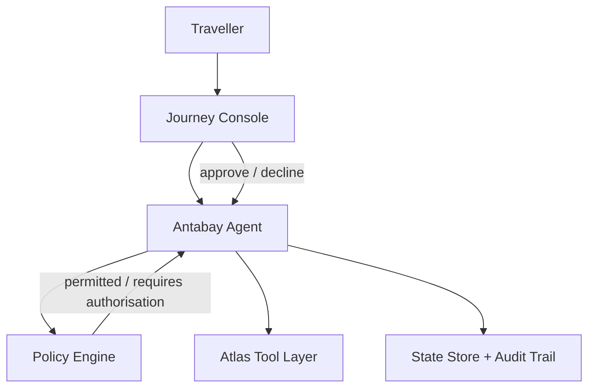
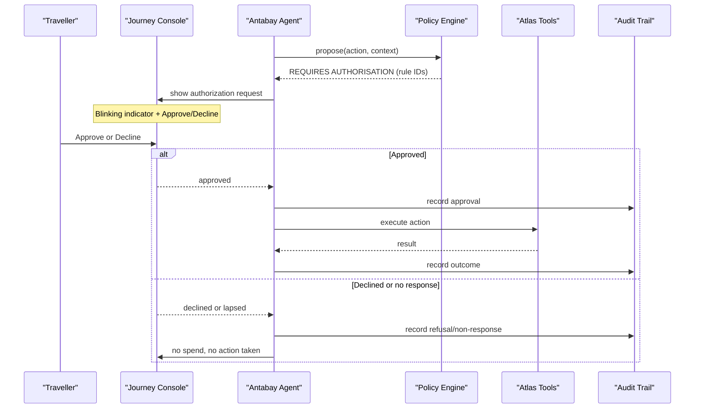
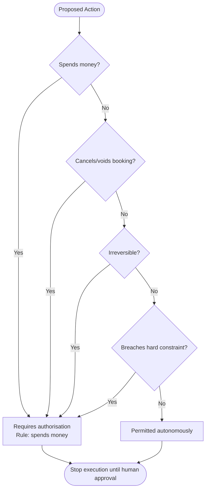
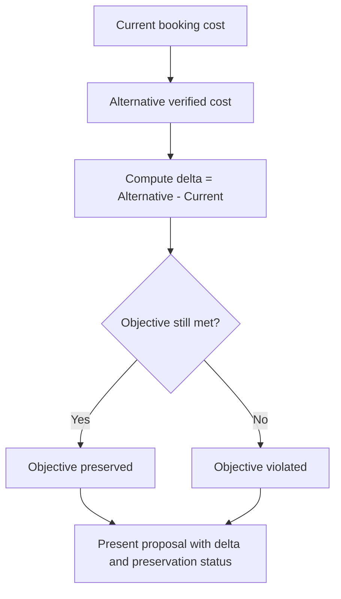
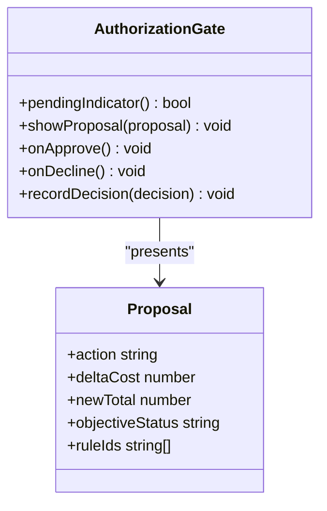
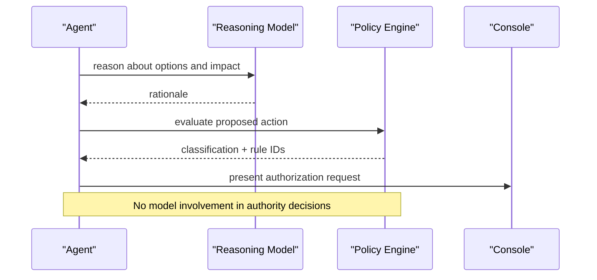
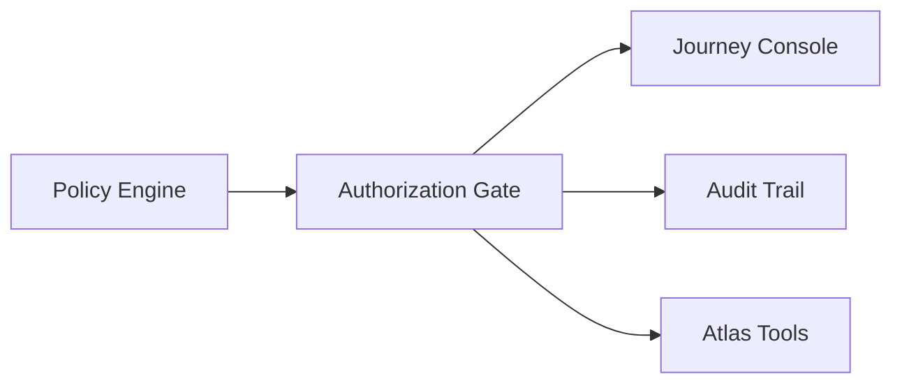

# Authorization Gate

<cite>
**Referenced Files in This Document**
- [architecture.md](file://.antabay/architecture.md)
- [specs.md](file://.antabay/specs.md)
- [demo-scenario.md](file://.antabay/demo-scenario.md)
- [demo-sequence.md](file://.antabay/demo-sequence.md)
- [console-mockup.html](file://.antabay/console-mockup.html)
</cite>

## Table of Contents
1. [Introduction](#introduction)
2. [Project Structure](#project-structure)
3. [Core Components](#core-components)
4. [Architecture Overview](#architecture-overview)
5. [Detailed Component Analysis](#detailed-component-analysis)
6. [Dependency Analysis](#dependency-analysis)
7. [Performance Considerations](#performance-considerations)
8. [Troubleshooting Guide](#troubleshooting-guide)
9. [Conclusion](#conclusion)

## Introduction
This document explains the Authorization Gate component that enforces human-in-the-loop control over financial and irreversible actions during automated travel journeys. It covers how policy engine decisions trigger authorization requests, how cost deltas are calculated and presented, how objective preservation is evaluated, and how the console displays pending authorizations with a blinking indicator and an Approve/Decline workflow. It also documents the separation between AI reasoning and deterministic policy enforcement, and the audit trail that records every authorization decision.

## Project Structure
The Authorization Gate is part of the broader Antabay system defined by specifications and architecture diagrams. The key artifacts relevant to this component are:
- Architecture overview showing the Policy Engine and Authorisation Gate as distinct from the Agent and external tools.
- Specification 010 defining the deterministic policy rules for requiring human authorization.
- Console mockup showing the visual gate interface, including the blinking indicator and two-button approval flow.
- Demo scenario and sequence illustrating real-world authorization scenarios such as rebooking due to disruptions and price increases exceeding budgets.

**Diagram sources**
- [architecture.md:21-78](file://.antabay/architecture.md#L21-L78)

**Section sources**
- [architecture.md:21-78](file://.antabay/architecture.md#L21-L78)
- [specs.md:1272-1366](file://.antabay/specs.md#L1272-L1366)

## Core Components
- Policy Engine: A deterministic rule-based component that classifies proposed actions as permitted or requiring human authorization. It never consults a language model and always cites the specific rule that determined the outcome.
- Authorization Gate (UI): The console surface that presents action proposals with cost impact analysis, objective preservation status, and rule citations. It shows a blinking indicator while an authorization is pending and provides Approve and Decline buttons.
- Audit Trail: Append-only record of all authorization decisions, including approvals, refusals, and non-responses.

Key responsibilities:
- Evaluate each proposed action before execution.
- Require authorization for spending money, voiding/canceling bookings, irreversible actions, and any action that would breach a hard constraint.
- Present clear cost delta and objective impact to the traveller.
- Treat absence of response as refusal and prevent execution without explicit approval.

**Section sources**
- [specs.md:1272-1366](file://.antabay/specs.md#L1272-L1366)
- [specs.md:800-918](file://.antabay/specs.md#L800-L918)
- [console-mockup.html:140-161](file://.antabay/console-mockup.html#L140-L161)

## Architecture Overview
The Authorization Gate sits between the Agent and the Policy Engine. When the Agent proposes an action, the Policy Engine evaluates it deterministically. If authorization is required, the Agent surfaces a request in the console with cost delta, objective impact, and rule citations. The traveller approves or declines; only upon approval does the Agent proceed with execution. All decisions are recorded in the audit trail.

**Diagram sources**
- [architecture.md:91-148](file://.antabay/architecture.md#L91-L148)
- [demo-sequence.md:118-142](file://.antabay/demo-sequence.md#L118-L142)
- [specs.md:1272-1366](file://.antabay/specs.md#L1272-L1366)

**Section sources**
- [architecture.md:91-148](file://.antabay/architecture.md#L91-L148)
- [demo-sequence.md:118-142](file://.antabay/demo-sequence.md#L118-L142)
- [specs.md:1272-1366](file://.antabay/specs.md#L1272-L1366)

## Detailed Component Analysis

### Policy Engine Rules and Citations
The policy engine enforces deterministic rules that require human authorization for:
- Actions that spend money.
- Actions that cancel or void a booking.
- Actions that cannot be reversed.
- Actions that would breach a stated hard constraint.

Each decision includes the specific rule identifier(s) that triggered the requirement for authorization. In the demo sequence, these are referenced as AUTH-01, AUTH-02, and AUTH-03.

**Diagram sources**
- [specs.md:1272-1366](file://.antabay/specs.md#L1272-L1366)

**Section sources**
- [specs.md:1272-1366](file://.antabay/specs.md#L1272-L1366)
- [demo-sequence.md:52-55](file://.antabay/demo-sequence.md#L52-L55)
- [demo-sequence.md:93-99](file://.antabay/demo-sequence.md#L93-L99)

### Cost Delta Calculation and Objective Preservation
Cost delta is computed relative to the current position (the existing booking). For example, when a disruption forces rebooking, the system compares the alternative’s total cost against the original and presents the additional cost. Objective preservation is explicitly shown: if the alternative meets the deadline and constraints, the objective is preserved; otherwise, it is violated.

In the demo scenario:
- Rebooking LJ201 costs +USD 6.24 and preserves the objective.
- TW237 costs +USD 51.55 and breaches the stated budget.

**Diagram sources**
- [demo-scenario.md:92-111](file://.antabay/demo-scenario.md#L92-L111)
- [specs.md:1610-1689](file://.antabay/specs.md#L1610-L1689)

**Section sources**
- [demo-scenario.md:92-111](file://.antabay/demo-scenario.md#L92-L111)
- [specs.md:1610-1689](file://.antabay/specs.md#L1610-L1689)

### Console Interface: Blinking Indicator and Two-Button Workflow
The console displays an authorization gate with:
- A blinking indicator while an authorization is pending.
- A summary of the proposed action, additional cost, new total, and objective status.
- An explanation of why the action is recommended.
- Two buttons: Approve and Decline.
- A note that silence is recorded as a refusal and nothing is spent.

**Diagram sources**
- [console-mockup.html:140-161](file://.antabay/console-mockup.html#L140-L161)
- [console-mockup.html:349-361](file://.antabay/console-mockup.html#L349-L361)

**Section sources**
- [console-mockup.html:140-161](file://.antabay/console-mockup.html#L140-L161)
- [console-mockup.html:349-361](file://.antabay/console-mockup.html#L349-L361)
- [specs.md:800-918](file://.antabay/specs.md#L800-L918)

### Authorization Scenarios
- Rebooking due to disruptions: After a schedule change violates the objective, the agent searches alternatives, verifies them, and proposes a replacement. The policy engine flags spending money, voiding the original booking, and irreversibility, requiring authorization.
- Price increases exceeding budgets: If the only compliant alternative exceeds the stated budget, the recommendation must explicitly state the constraint breach and still require authorization.
- Irreversible booking modifications: Any action that cannot be reversed triggers authorization regardless of cost.

These scenarios are illustrated in the demo scenario and sequence, where recovery execution depends on explicit human approval and subsequent independent verification.

**Section sources**
- [demo-scenario.md:81-118](file://.antabay/demo-scenario.md#L81-L118)
- [demo-sequence.md:71-109](file://.antabay/demo-sequence.md#L71-L109)
- [specs.md:1720-1806](file://.antabay/specs.md#L1720-L1806)

### Integration with Policy Engine and Separation from AI Reasoning
- The Agent reasons about options and impacts but never decides authority.
- The Policy Engine makes deterministic decisions based on declared rules and cites rule identifiers.
- The line between reasoning and authority is enforced: the model is not consulted for authorization decisions.

**Diagram sources**
- [architecture.md:21-78](file://.antabay/architecture.md#L21-L78)
- [specs.md:1272-1366](file://.antabay/specs.md#L1272-L1366)

**Section sources**
- [architecture.md:21-78](file://.antabay/architecture.md#L21-L78)
- [specs.md:1272-1366](file://.antabay/specs.md#L1272-L1366)

### Audit Trail Recording
Every authorization decision is recorded in the journey audit trail, including approvals, refusals, and non-responses. Post-action verification ensures outcomes are independently confirmed and discrepancies are recorded.

**Section sources**
- [specs.md:1272-1366](file://.antabay/specs.md#L1272-L1366)
- [specs.md:1173-1244](file://.antabay/specs.md#L1173-L1244)

## Dependency Analysis
The Authorization Gate depends on:
- Policy Engine for deterministic classification and rule citations.
- Journey Console for presenting pending authorizations and capturing user decisions.
- Audit Trail for recording all decisions and outcomes.
- External tools (Atlas) for executing authorized actions and verifying results.

**Diagram sources**
- [architecture.md:21-78](file://.antabay/architecture.md#L21-L78)
- [specs.md:1272-1366](file://.antabay/specs.md#L1272-L1366)

**Section sources**
- [architecture.md:21-78](file://.antabay/architecture.md#L21-L78)
- [specs.md:1272-1366](file://.antabay/specs.md#L1272-L1366)

## Performance Considerations
- Deterministic policy evaluation avoids model latency and ensures consistent decisions.
- Presentation of authorization requests should be lightweight and responsive to maintain user engagement.
- Audit logging should be append-only and efficient to avoid blocking critical paths.
- Cost delta calculations should use verified prices to prevent stale computations.

[No sources needed since this section provides general guidance]

## Troubleshooting Guide
Common issues and resolutions:
- Authorization request lapsed: If no response is received before deadlines, treat as refusal and record non-response.
- Price changed after approval: Void prior authorization and re-present the updated proposal with revised cost delta.
- Webhook untrusted: Always verify claims via provider queries before acting; do not rely solely on events.
- Duplicate notifications: Tolerate duplicates without duplicating actions; reconcile by querying authoritative state.

**Section sources**
- [specs.md:1272-1366](file://.antabay/specs.md#L1272-L1366)
- [specs.md:1396-1504](file://.antabay/specs.md#L1396-L1504)
- [specs.md:1173-1244](file://.antabay/specs.md#L1173-L1244)

## Conclusion
The Authorization Gate ensures safe, transparent, and auditable control over financial and irreversible actions in automated travel workflows. By separating AI reasoning from deterministic policy enforcement, citing specific rules, calculating and presenting cost deltas, and preserving objective integrity, the system maintains trust and compliance. The console’s blinking indicator and two-button approval workflow provide clear human oversight, while the audit trail guarantees accountability and traceability for every decision.

[No sources needed since this section summarizes without analyzing specific files]