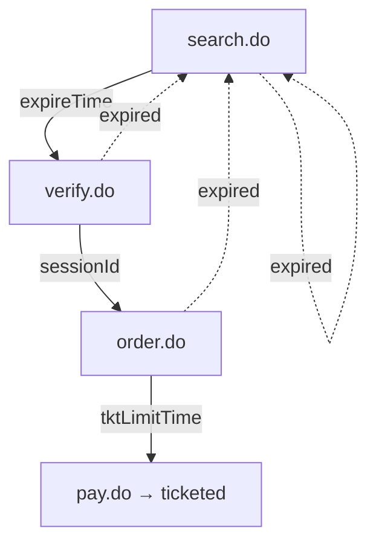
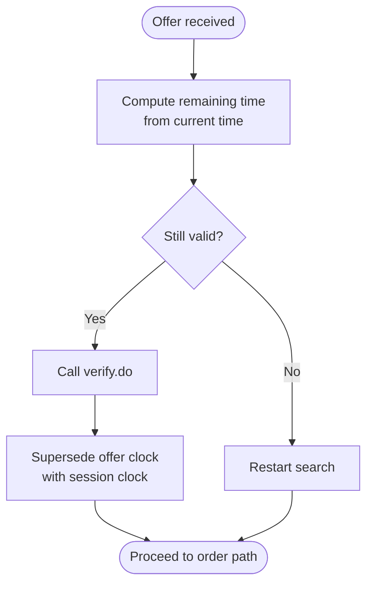
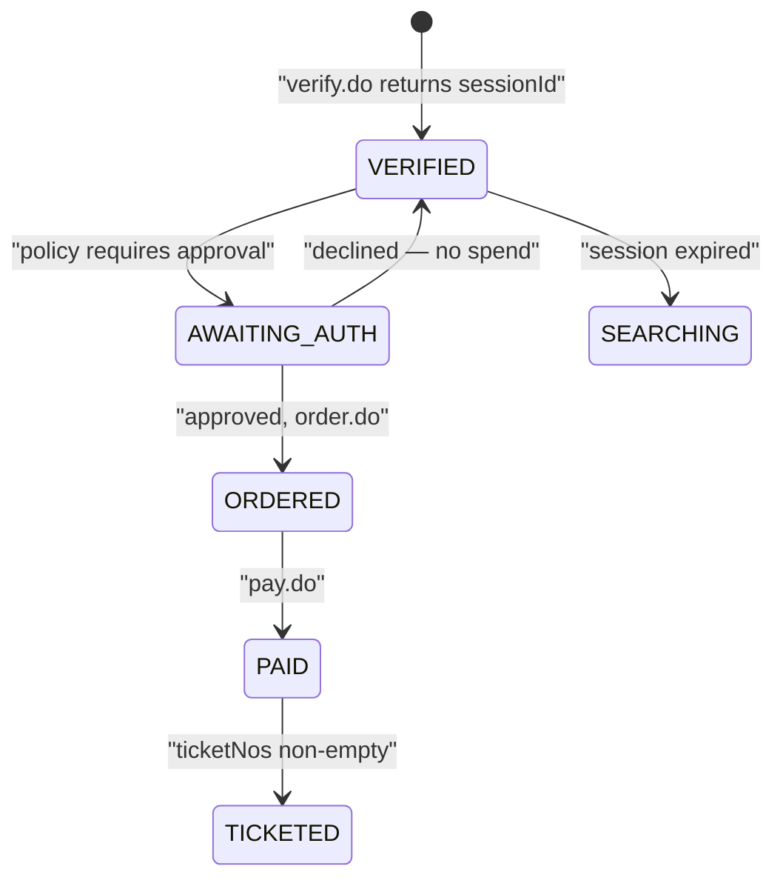
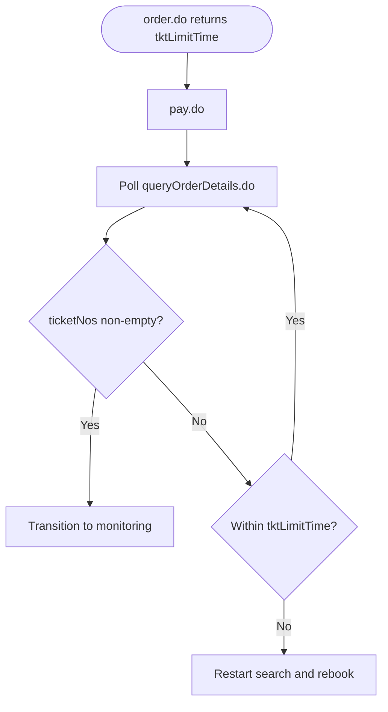
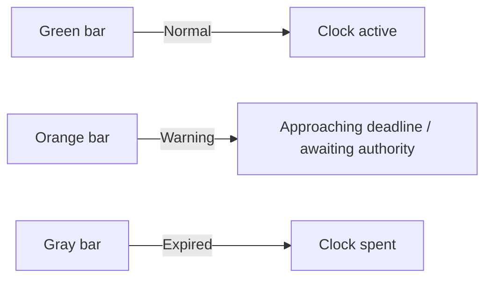
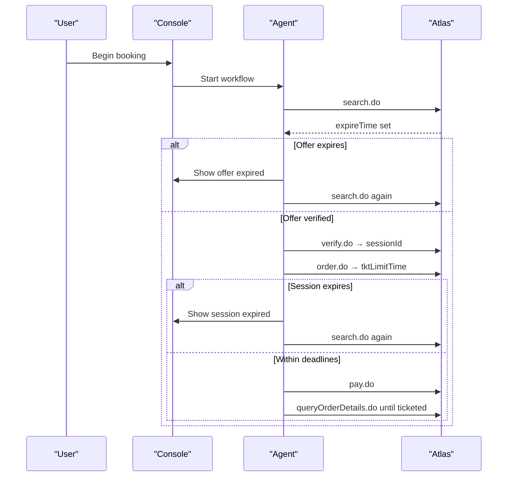
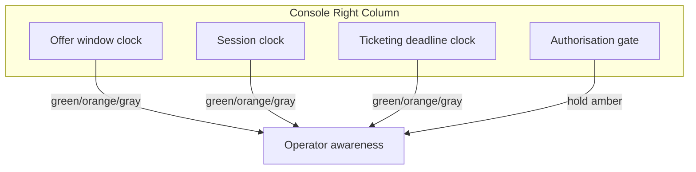
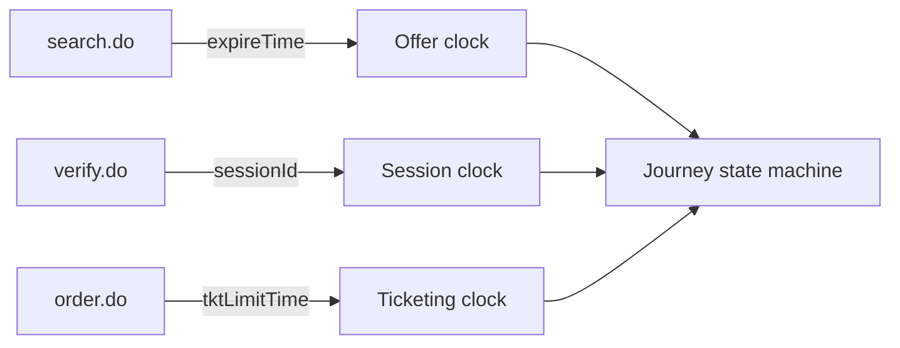
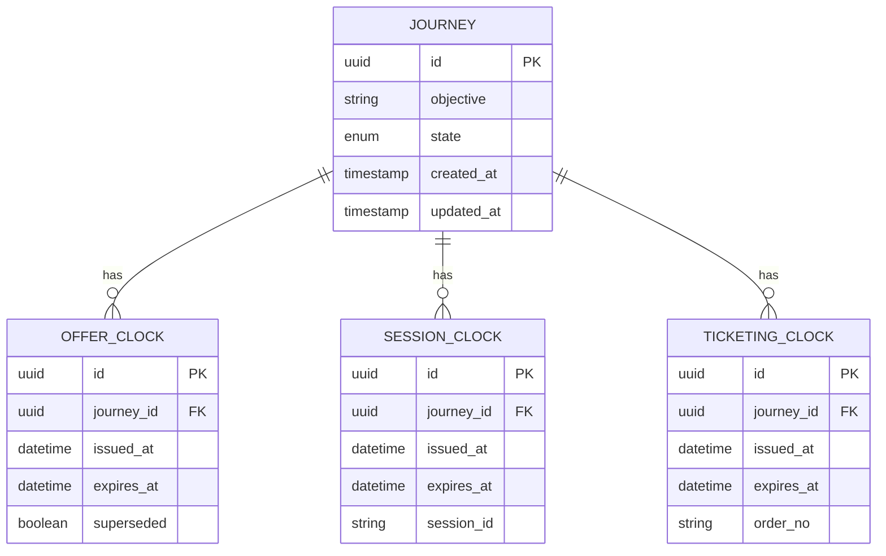

# Expiry Clocks System

<cite>
**Referenced Files in This Document**
- [architecture.md](file://.antabay/architecture.md)
- [specs.md](file://.antabay/specs.md)
- [atlas-capability-map.md](file://.antabay/atlas-capability-map.md)
- [console-mockup.html](file://.antabay/console-mockup.html)
- [sel_tyo_search.json](file://fixtures/atlas/sel_tyo_search.json)
- [sel_tyo_verify.json](file://fixtures/atlas/sel_tyo_verify.json)
</cite>

## Table of Contents
1. [Introduction](#introduction)
2. [Project Structure](#project-structure)
3. [Core Components](#core-components)
4. [Architecture Overview](#architecture-overview)
5. [Detailed Component Analysis](#detailed-component-analysis)
6. [Dependency Analysis](#dependency-analysis)
7. [Performance Considerations](#performance-considerations)
8. [Troubleshooting Guide](#troubleshooting-guide)
9. [Conclusion](#conclusion)
10. [Appendices](#appendices)

## Introduction
This document explains the Expiry Clocks System that manages time-sensitive operational windows across a flight booking journey. It focuses on three coordinated clocks:
- Offer window clock for flight availability
- Session clock for API session validity
- Ticketing deadline clock for booking completion

It also documents the visual progress bars with color coding, lifecycle management including supersession and automatic state transitions, and how these clocks drive real-time operator visibility and user actions during booking workflows.

## Project Structure
The Expiry Clocks System is defined by verified Atlas API timing constraints and surfaced through the Journey Console UI. The key sources are:
- Architecture and sequence diagrams describing the three-clock flow
- Specs defining how offer freshness, sessions, and ticket limits are tracked
- Verified Atlas capability map enumerating expireTime, sessionId, and tktLimitTime
- Console mockup showing the signature expiry clocks with live countdowns and color-coded bars



**Diagram sources**
- [architecture.md:261-278](file://.antabay/architecture.md#L261-L278)
- [atlas-capability-map.md:304-313](file://.antabay/atlas-capability-map.md#L304-L313)

**Section sources**
- [architecture.md:19-86](file://.antabay/architecture.md#L19-L86)
- [specs.md:171-231](file://.antabay/specs.md#L171-L231)
- [atlas-capability-map.md:107-125](file://.antabay/atlas-capability-map.md#L107-L125)

## Core Components
- Offer window clock: Driven by search response expireTime; short and variable, sometimes already partially aged when returned.
- Session clock: Issued by verify.do as sessionId; replaces the offer window after verification.
- Ticketing deadline clock: Issued by order.do as tktLimitTime; enforces payment and ticketing completion.

These clocks are persisted per journey and displayed in the console with remaining time and depleting bars. Each expired clock forces a transition back to search or triggers recovery logic.

**Section sources**
- [atlas-capability-map.md:107-125](file://.antabay/atlas-capability-map.md#L107-L125)
- [atlas-capability-map.md:304-313](file://.antabay/atlas-capability-map.md#L304-L313)
- [specs.md:171-231](file://.antabay/specs.md#L171-L231)

## Architecture Overview
The system integrates the UI, backend agent, policy engine, and Atlas tool layer. The three clocks govern transitions between states such as OPTIONS_HELD, VERIFIED, ORDERED, PAID, TICKETED, and MONITORING. Expired clocks revert the journey to SEARCHING to refresh inventory or restart the flow.

```mermaid
sequenceDiagram
participant U as "Console"
participant AG as "Agent"
participant AT as "Atlas"
participant DB as "State Store"
U->>AG : Start journey
AG->>AT : search.do
AT-->>AG : routings + expireTime
Note over AG : Offer clock starts (short, may be pre-aged)
AG->>AT : verify.do (selected routing)
AT-->>AG : sessionId, priceChange
Note over AG : Offer clock superseded by session clock
AG->>AT : order.do (sessionId)
AT-->>AG : orderNo, pnrCode, tktLimitTime
Note over AG : Ticketing deadline clock starts
AG->>AT : pay.do
AT-->>AG : status
AG->>AT : queryOrderDetails.do until ticketNos non-empty
Note over AG : Webhook is untrusted hint; confirm via API
```

**Diagram sources**
- [architecture.md:89-148](file://.antabay/architecture.md#L89-L148)
- [atlas-capability-map.md:236-303](file://.antabay/atlas-capability-map.md#L236-L303)

**Section sources**
- [architecture.md:19-86](file://.antabay/architecture.md#L19-L86)
- [architecture.md:212-257](file://.antabay/architecture.md#L212-L257)
- [atlas-capability-map.md:315-386](file://.antabay/atlas-capability-map.md#L315-L386)

## Detailed Component Analysis

### Offer Window Clock
- Source: search response field expireTime
- Behavior: Short and variable; can arrive partially aged due to caching
- Lifecycle: Active from search until verify.do; superseded by session clock upon successful verification
- Expiration consequence: Revert to search to refresh options



**Diagram sources**
- [atlas-capability-map.md:107-125](file://.antabay/atlas-capability-map.md#L107-L125)
- [atlas-capability-map.md:217-228](file://.antabay/atlas-capability-map.md#L217-L228)
- [specs.md:598-611](file://.antabay/specs.md#L598-L611)

**Section sources**
- [atlas-capability-map.md:107-125](file://.antabay/atlas-capability-map.md#L107-L125)
- [specs.md:598-611](file://.antabay/specs.md#L598-L611)

### Session Clock
- Source: verify response sessionId
- Behavior: Longer than offer window; replace offer freshness after verification
- Lifecycle: Active from verify until order.do; used to complete booking
- Expiration consequence: Revert to search if session expires before ordering



**Diagram sources**
- [architecture.md:212-257](file://.antabay/architecture.md#L212-L257)
- [atlas-capability-map.md:217-228](file://.antabay/atlas-capability-map.md#L217-L228)

**Section sources**
- [atlas-capability-map.md:217-228](file://.antabay/atlas-capability-map.md#L217-L228)
- [specs.md:171-231](file://.antabay/specs.md#L171-L231)

### Ticketing Deadline Clock
- Source: order response tktLimitTime
- Behavior: Enforces payment and ticketing completion within a bounded window
- Lifecycle: Starts at order issuance; must reach ticketed state before expiration
- Expiration consequence: Revert to search to rebook if deadline passes without ticketing



**Diagram sources**
- [atlas-capability-map.md:236-303](file://.antabay/atlas-capability-map.md#L236-L303)
- [atlas-capability-map.md:304-313](file://.antabay/atlas-capability-map.md#L304-L313)

**Section sources**
- [atlas-capability-map.md:236-303](file://.antabay/atlas-capability-map.md#L236-L303)
- [atlas-capability-map.md:304-313](file://.antabay/atlas-capability-map.md#L304-L313)

### Visual Progress Bars and Color Coding
- Green bar: Normal operation (offer/session/ticketing still valid)
- Orange bar: Warning state (approaching deadline or awaiting authorisation)
- Gray bar: Expired deadline (spent clock shown, not hidden)
- Live countdown updates reflect remaining seconds and percentage width



**Diagram sources**
- [console-mockup.html:88-99](file://.antabay/console-mockup.html#L88-L99)
- [specs.md:177-206](file://.antabay/specs.md#L177-L206)

**Section sources**
- [console-mockup.html:88-99](file://.antabay/console-mockup.html#L88-L99)
- [specs.md:177-206](file://.antabay/specs.md#L177-L206)

### Booking Workflow Interactions
- Offer expiration: If expireTime elapses before verification, the system restarts search to obtain fresh options
- Session timeout: If sessionId expires before order placement, the system restarts search to re-secure an offer
- Ticketing deadline pressure: If tktLimitTime approaches or expires without ticket confirmation, the system initiates recovery search and urgent action



**Diagram sources**
- [architecture.md:89-148](file://.antabay/architecture.md#L89-L148)
- [atlas-capability-map.md:304-313](file://.antabay/atlas-capability-map.md#L304-L313)

**Section sources**
- [architecture.md:89-148](file://.antabay/architecture.md#L89-L148)
- [atlas-capability-map.md:304-313](file://.antabay/atlas-capability-map.md#L304-L313)

### Operator Visibility into Time Pressure
- Console displays all three clocks permanently with remaining time and depleting bars
- Authorisation gate highlights high-stakes decisions requiring human approval
- Trace shows endpoint calls, identifiers, timings, and rule citations for transparency



**Diagram sources**
- [console-mockup.html:327-361](file://.antabay/console-mockup.html#L327-L361)
- [specs.md:177-231](file://.antabay/specs.md#L177-L231)

**Section sources**
- [console-mockup.html:327-361](file://.antabay/console-mockup.html#L327-L361)
- [specs.md:177-231](file://.antabay/specs.md#L177-L231)

## Dependency Analysis
The clocks depend on specific Atlas fields and enforce state transitions based on their lifetimes.



**Diagram sources**
- [atlas-capability-map.md:304-313](file://.antabay/atlas-capability-map.md#L304-L313)
- [architecture.md:212-257](file://.antabay/architecture.md#L212-L257)

**Section sources**
- [atlas-capability-map.md:304-313](file://.antabay/atlas-capability-map.md#L304-L313)
- [architecture.md:212-257](file://.antabay/architecture.md#L212-L257)

## Performance Considerations
- Offer expiry is short and variable; always compute remaining time from current time because offers may arrive partially aged
- Respect rate limits and wait instructions; avoid retry loops
- Treat webhooks as untrusted hints; confirm state via authoritative queries
- Keep UI updates efficient with simple interval-based countdowns and percentage widths

[No sources needed since this section provides general guidance]

## Troubleshooting Guide
Common issues and resolutions tied to the clocks:
- Offer expired before verification: Restart search to obtain fresh options
- Session expired before ordering: Restart search to re-secure an offer
- Ticketing deadline exceeded: Initiate recovery search and rebook under new deadlines
- Duplicate booking error: Reconcile using returned duplicate order reference instead of retrying
- Payment success but not ticketed: Continue polling until ticketNos populated; do not assume payment equals ticketing

**Section sources**
- [atlas-capability-map.md:107-125](file://.antabay/atlas-capability-map.md#L107-L125)
- [atlas-capability-map.md:236-303](file://.antabay/atlas-capability-map.md#L236-L303)
- [atlas-capability-map.md:400-415](file://.antabay/atlas-capability-map.md#L400-L415)

## Conclusion
The Expiry Clocks System ensures safe, timely progression through the booking journey by enforcing three distinct time windows: offer, session, and ticketing. The console’s visible, color-coded progress bars provide clear operator awareness of time pressure, while the state machine automatically transitions when deadlines expire. Integration with Atlas API timing constraints guarantees correctness, and the design supports robust recovery paths when time runs out.

[No sources needed since this section summarizes without analyzing specific files]

## Appendices

### Appendix A: Data Model for Clocks


[No sources needed since this diagram shows conceptual data model]

### Appendix B: Example Fixture References
- Offer expireTime observed in search fixture
- SessionId and price change observed in verify fixture
- Ticketing deadline and order details observed in verified flows

**Section sources**
- [sel_tyo_search.json:323-324](file://fixtures/atlas/sel_tyo_search.json#L323-L324)
- [sel_tyo_verify.json:1-3](file://fixtures/atlas/sel_tyo_verify.json#L1-L3)
- [atlas-capability-map.md:236-303](file://.antabay/atlas-capability-map.md#L236-L303)