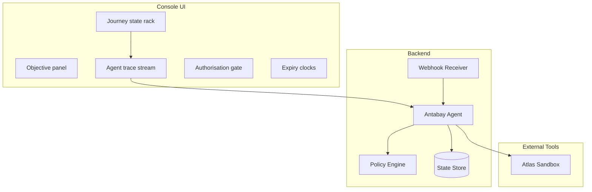
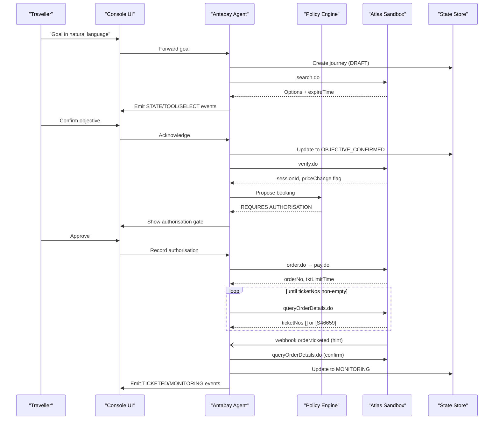
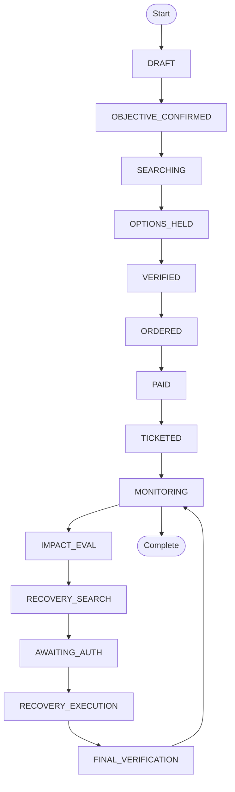
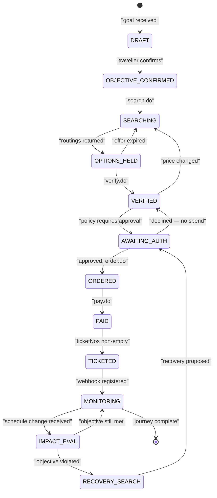
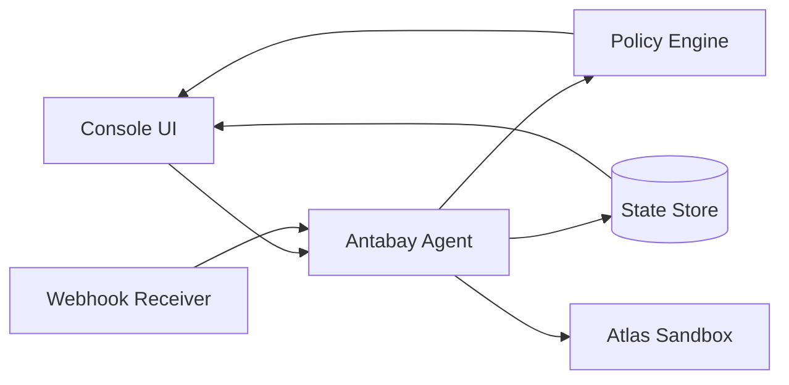

# Journey State Visualization

<cite>
**Referenced Files in This Document**
- [architecture.md](file://.antabay/architecture.md)
- [specs.md](file://.antabay/specs.md)
- [console-mockup.html](file://.antabay/console-mockup.html)
- [demo-scenario.md](file://.antabay/demo-scenario.md)
</cite>

## Table of Contents
1. [Introduction](#introduction)
2. [Project Structure](#project-structure)
3. [Core Components](#core-components)
4. [Architecture Overview](#architecture-overview)
5. [Detailed Component Analysis](#detailed-component-analysis)
6. [Dependency Analysis](#dependency-analysis)
7. [Performance Considerations](#performance-considerations)
8. [Troubleshooting Guide](#troubleshooting-guide)
9. [Conclusion](#conclusion)
10. [Appendices](#appendices)

## Introduction
This document explains the Journey State Visualization component that displays the complete lifecycle progression of travel bookings. It focuses on the state rack interface, which shows sequential journey phases from DRAFT through MONITORING and beyond, with clear visual indicators for completed, current, and future states. It also documents the underlying state machine that maps business logic to visuals, including objective confirmation, option holding, verification, ordering, ticketing, monitoring, impact evaluation, authorization, recovery execution, and final verification. The styling system uses checkmarks for completed states, play icons for the current state, and dots for future states. Examples cover normal booking flows and disruption recovery scenarios. Finally, it describes integration with the backend state management system and real-time updates as journeys progress.

## Project Structure
The project provides design and specification artifacts that define how the console renders journey state:
- Architecture diagrams define the overall system, including the console UI, agent, policy engine, webhook receiver, and external Atlas tool layer.
- Specifications define the console’s responsibilities, including presenting the journey state as an ordered sequence of completed, current, and pending states, streaming events without polling, and persistently showing expiry clocks.
- A console mockup demonstrates the visual target, including the state rack, trace, expiry clocks, authorisation gate, and traveller view.
- A demo scenario captures a locked end-to-end flow used to validate behavior and presentation.

**Diagram sources**
- [architecture.md:21-78](file://.antabay/architecture.md#L21-L78)

**Section sources**
- [architecture.md:21-78](file://.antabay/architecture.md#L21-L78)
- [specs.md:800-919](file://.antabay/specs.md#L800-L919)
- [console-mockup.html:213-262](file://.antabay/console-mockup.html#L213-L262)

## Core Components
- State rack: An ordered list of journey phases that visually communicates progress. Completed states show a checkmark, the current state shows a play icon, and future states show a dot.
- Expiry clocks: Persistent timers for offer window, session, and ticketing deadline, each with a proportional bar and time remaining.
- Agent trace: A live event stream showing external calls, decisions, rejections, selections, policy outcomes, and state changes.
- Authorisation gate: A prominent control that appears when human approval is required, showing action details, cost delta, and objective impact.
- Traveller view: A simplified mobile-friendly surface that hides internals and focuses on status and actionable items.

These components are defined by specifications and demonstrated in the console mockup.

**Section sources**
- [specs.md:832-894](file://.antabay/specs.md#L832-L894)
- [console-mockup.html:241-262](file://.antabay/console-mockup.html#L241-L262)
- [console-mockup.html:327-361](file://.antabay/console-mockup.html#L327-L361)

## Architecture Overview
The console receives a continuous event stream from the backend and renders only what the stream provides. The backend manages journey state, enforces transitions, and coordinates external tool calls. Webhooks are treated as untrusted hints; authoritative truth comes from querying the external order details.

**Diagram sources**
- [architecture.md:91-148](file://.antabay/architecture.md#L91-L148)
- [specs.md:1059-1144](file://.antabay/specs.md#L1059-L1144)

## Detailed Component Analysis

### State Rack Interface
The state rack presents the journey as a vertical strip with rows representing phases. Visual semantics:
- Completed states: checkmark symbol and subdued styling.
- Current state: play icon, highlighted background, and emphasis.
- Future states: dot symbol and neutral styling.

The mockup demonstrates a typical sequence during a full run, including objective confirmation, options held, verified, ordered, ticketed, monitoring, impact evaluated, awaiting authorisation, recovery execution, and verified & monitoring.

**Diagram sources**
- [architecture.md:214-257](file://.antabay/architecture.md#L214-L257)

**Section sources**
- [console-mockup.html:241-255](file://.antabay/console-mockup.html#L241-L255)
- [specs.md:886-888](file://.antabay/specs.md#L886-L888)

### State Machine Implementation
The state machine defines allowed transitions and associated clocks:
- Offer clock: expires after search results; observed 7m43s–31m; may arrive pre-aged.
- Session clock: issued by verification; approximately 2 hours.
- Ticketing deadline: issued by order; approximately 30 minutes.

Transitions include returning to search when offers expire, moving to verification upon selection, requiring authorisation based on policy, reconciling duplicate orders, confirming ticketing via independent query, and resuming monitoring after recovery.

**Diagram sources**
- [architecture.md:214-257](file://.antabay/architecture.md#L214-L257)

**Section sources**
- [architecture.md:261-279](file://.antabay/architecture.md#L261-L279)
- [specs.md:998-1013](file://.antabay/specs.md#L998-L1013)
- [specs.md:1120-1129](file://.antabay/specs.md#L1120-L1129)

### Visual Styling System
The styling system encodes meaning through color and symbols:
- Checkmarks for completed states.
- Play icons for the current state.
- Dots for future states.
- Color tokens carry semantic meaning: hold amber for attention, violation red for constraint broken, confirmation blue for verified, simulation violet for simulated events.
- Monospace typeface for provider-originated values to distinguish data from interface text.

The console mockup demonstrates these conventions across the state rack, trace, clocks, and authorisation gate.

**Section sources**
- [specs.md:177-231](file://.antabay/specs.md#L177-L231)
- [console-mockup.html:101-115](file://.antabay/console-mockup.html#L101-L115)
- [console-mockup.html:116-139](file://.antabay/console-mockup.html#L116-L139)

### Normal Booking Flow Example
A typical happy path includes:
- Goal parsing and confirmation.
- Search and scoring against objectives.
- Verification with freshness checks.
- Order creation and payment.
- Independent ticketing confirmation via order query.
- Transition to monitoring once ticketed.

The console emits corresponding events and updates the state rack accordingly.

**Section sources**
- [architecture.md:91-148](file://.antabay/architecture.md#L91-L148)
- [specs.md:1059-1144](file://.antabay/specs.md#L1059-L1144)
- [console-mockup.html:269-303](file://.antabay/console-mockup.html#L269-L303)

### Disruption Recovery Scenario Example
During disruption:
- A schedule change event arrives (simulated or real).
- The backend verifies the claim against the external API before acting.
- Impact evaluation determines whether the objective remains achievable.
- Alternatives are searched and verified.
- A recommendation is presented with cost delta and objective impact.
- Human authorisation is required for actions that spend money or void bookings.
- Upon approval, recovery executes and both legs are independently verified before updating state.
- Monitoring resumes.

**Section sources**
- [architecture.md:154-208](file://.antabay/architecture.md#L154-L208)
- [specs.md:437-531](file://.antabay/specs.md#L437-L531)
- [demo-scenario.md:81-118](file://.antabay/demo-scenario.md#L81-L118)
- [console-mockup.html:304-321](file://.antabay/console-mockup.html#L304-L321)

### Backend Integration and Real-Time Updates
Integration points:
- Event streaming: The console receives observable events for every external call, decision, and state change without polling.
- State persistence: Journey state is durable and reconstructible after process termination.
- Webhook handling: Inbound notifications are treated as untrusted hints; authoritative truth is obtained via order queries.
- Authorisation policy: Deterministic classification decides whether actions require human approval; outcomes are recorded.

The console holds no state of its own and renders only what the event stream provides.

**Section sources**
- [specs.md:841-875](file://.antabay/specs.md#L841-L875)
- [specs.md:869-875](file://.antabay/specs.md#L869-L875)
- [architecture.md:60-73](file://.antabay/architecture.md#L60-L73)

## Dependency Analysis
The visualization depends on:
- The backend agent for emitting events and managing state transitions.
- The policy engine for deterministic authorisation decisions.
- The webhook receiver for disruption signals.
- The external Atlas tool layer for search, verification, ordering, payment, and order queries.
- The state store for durable journey records and audit trails.

**Diagram sources**
- [architecture.md:21-78](file://.antabay/architecture.md#L21-L78)

**Section sources**
- [architecture.md:21-78](file://.antabay/architecture.md#L21-L78)
- [specs.md:800-919](file://.antabay/specs.md#L800-L919)

## Performance Considerations
- Event streaming avoids polling overhead and keeps the UI responsive.
- Expiry clocks provide persistent visibility into time-sensitive windows, reducing unnecessary retries.
- Call budget tracking prevents excessive external calls per journey.
- Independent post-action verification ensures correctness without assuming outcomes, minimizing reconciliation loops.

[No sources needed since this section provides general guidance]

## Troubleshooting Guide
Common issues and resolutions:
- Stale offers: Re-verify before committing; if price changed, return to search.
- Duplicate orders: Reconcile using existing order reference returned with rejection.
- Uncertain outcomes: Do not repeat order creation or payment; query independently until resolved.
- Expired sessions: Return to search when offer or session expires.
- Missing tickets: Continue querying until ticket numbers appear, deadline passes, or terminal error occurs.
- Simulated vs provider events: Ensure simulated events are clearly labeled and never presented as provider-originated.

**Section sources**
- [specs.md:998-1013](file://.antabay/specs.md#L998-L1013)
- [specs.md:1107-1129](file://.antabay/specs.md#L1107-L1129)
- [specs.md:463-476](file://.antabay/specs.md#L463-L476)

## Conclusion
The Journey State Visualization component provides a clear, reliable, and auditable representation of the booking lifecycle. The state rack communicates progress with consistent visual cues, while the backend state machine enforces valid transitions and integrates with external tools and policies. Real-time event streaming ensures the console reflects the true state of the journey at all times. Normal flows and disruption recovery scenarios demonstrate robustness, clarity, and user control through deterministic authorisation gates.

[No sources needed since this section summarizes without analyzing specific files]

## Appendices

### Appendix A: State Rack Rows and Meanings
- Objective confirmed: Parsed and approved by traveller.
- Options held: Search results with offer clock active.
- Verified: Price and availability confirmed; session clock active.
- Ordered: PNR issued; ticketing deadline active.
- Ticketed: Independent confirmation via order query.
- Monitoring: Post-ticketing watch for disruptions.
- Impact evaluated: Schedule change assessed against objective.
- Awaiting authorisation: Action requires human approval.
- Recovery execution: Replacement booked and original handled.
- Verified & monitoring: Post-recovery confirmation and resumed monitoring.

**Section sources**
- [console-mockup.html:241-255](file://.antabay/console-mockup.html#L241-L255)

### Appendix B: Clocks and Timers
- Offer window: From search results; superseded by session upon verification.
- Session: Issued by verification; approximately two hours.
- Ticketing deadline: Issued by order; approximately thirty minutes.

Each clock persists with time remaining and a proportional indicator, even when spent.

**Section sources**
- [architecture.md:261-279](file://.antabay/architecture.md#L261-L279)
- [console-mockup.html:327-347](file://.antabay/console-mockup.html#L327-L347)