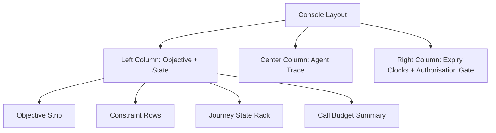
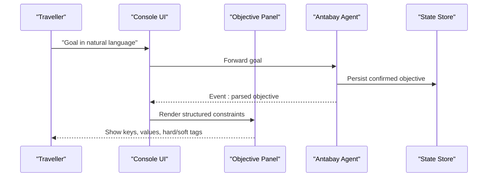
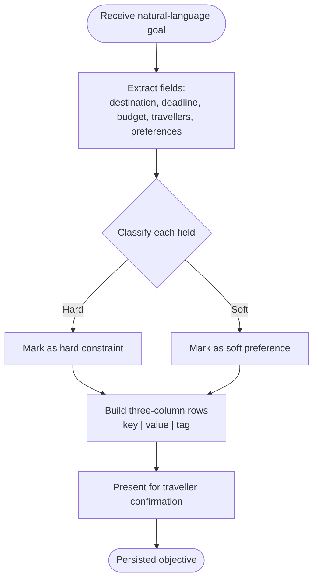
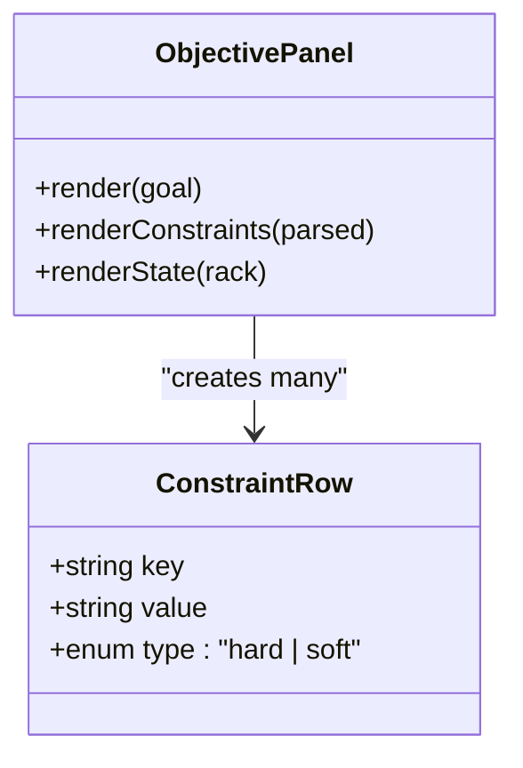
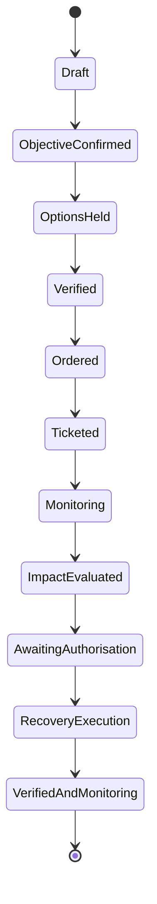
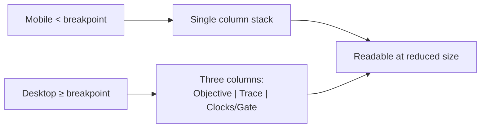
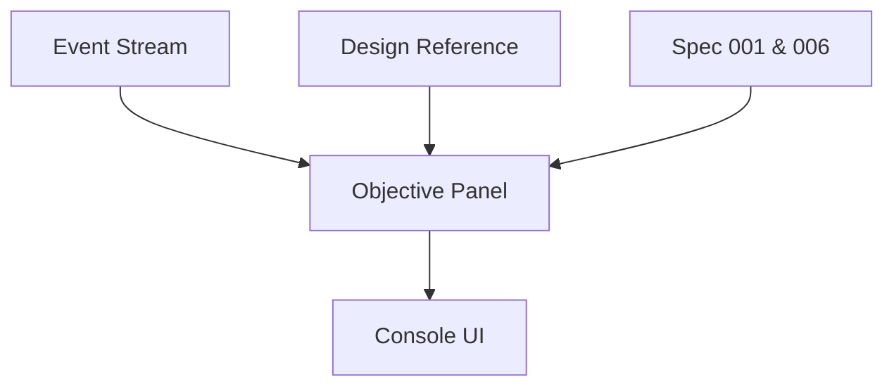

# Objective Panel

<cite>
**Referenced Files in This Document**
- [architecture.md](file://.antabay/architecture.md)
- [plan.md](file://.antabay/plan.md)
- [specs.md](file://.antabay/specs.md)
- [console-mockup.html](file://.antabay/console-mockup.html)
</cite>

## Table of Contents
1. [Introduction](#introduction)
2. [Project Structure](#project-structure)
3. [Core Components](#core-components)
4. [Architecture Overview](#architecture-overview)
5. [Detailed Component Analysis](#detailed-component-analysis)
6. [Dependency Analysis](#dependency-analysis)
7. [Performance Considerations](#performance-considerations)
8. [Troubleshooting Guide](#troubleshooting-guide)
9. [Conclusion](#conclusion)

## Introduction
This document specifies the Objective Panel, the left column of the Journey Console that displays a traveller’s goal as structured constraints and shows how those constraints are classified as hard or soft. It explains how natural-language goals are parsed into destination, arrival deadlines, budget limits, and traveller information; how each element is validated and tagged; and how the panel adapts to different screen sizes while remaining readable for operators monitoring multiple journeys.

The Objective Panel is part of a three-column console layout: objective and state on the left, agent trace in the center, and expiry clocks plus authorisation gate on the right. The panel must present parsed objectives clearly, distinguish hard constraints from preferences, and support quick scanning under time pressure.

**Section sources**
- [specs.md:800-919](file://.antabay/specs.md#L800-L919)
- [specs.md:429-531](file://.antabay/specs.md#L429-L531)
- [console-mockup.html:63-87](file://.antabay/console-mockup.html#L63-L87)

## Project Structure
The Objective Panel lives within the Journey Console UI. Its responsibilities include:
- Rendering the original natural-language goal
- Displaying parsed constraints in a three-column row per constraint (key, value, tag)
- Showing journey state progress alongside the objective
- Indicating call budget usage contextually near the objective section

**Diagram sources**
- [console-mockup.html:63-87](file://.antabay/console-mockup.html#L63-L87)
- [console-mockup.html:213-262](file://.antabay/console-mockup.html#L213-L262)

**Section sources**
- [console-mockup.html:63-87](file://.antabay/console-mockup.html#L63-L87)
- [console-mockup.html:213-262](file://.antabay/console-mockup.html#L213-L262)

## Core Components
- Natural-language goal input and confirmation before any downstream action
- Structured objective with fields: origin, destination, latest acceptable arrival, budget with currency, traveller count, stated preferences
- Hard vs soft classification per extracted element
- Three-column constraint rows: key, value, tag
- Journey state rack showing completed, current, and pending states
- Call budget summary adjacent to the objective area

These components ensure operators can quickly verify what the system is trying to achieve and whether it remains achievable.

**Section sources**
- [specs.md:429-531](file://.antabay/specs.md#L429-L531)
- [specs.md:800-919](file://.antabay/specs.md#L800-L919)
- [console-mockup.html:213-262](file://.antabay/console-mockup.html#L213-L262)

## Architecture Overview
The Objective Panel participates in the broader console architecture where the UI streams events from the backend agent. The panel renders only what the event stream provides and does not hold its own state.

**Diagram sources**
- [architecture.md:19-78](file://.antabay/architecture.md#L19-L78)
- [specs.md:800-919](file://.antabay/specs.md#L800-L919)

**Section sources**
- [architecture.md:19-78](file://.antabay/architecture.md#L19-L78)
- [specs.md:800-919](file://.antabay/specs.md#L800-L919)

## Detailed Component Analysis

### Constraint Parsing and Classification
- Input: natural-language goal containing destination, deadline, budget, and preferences
- Processing: extract structured fields and classify each as hard constraint or soft preference
- Output: list of constraints with key, value, and tag columns

**Diagram sources**
- [specs.md:429-531](file://.antabay/specs.md#L429-L531)
- [specs.md:800-919](file://.antabay/specs.md#L800-L919)

**Section sources**
- [specs.md:429-531](file://.antabay/specs.md#L429-L531)
- [specs.md:800-919](file://.antabay/specs.md#L800-L919)

### Three-Column Constraint Display
Each constraint row contains:
- Key: human-readable label such as Destination, Arrive before, Budget, Overnight connection, Travellers
- Value: data value rendered in monospace when it originates from external provider data
- Tag: hard or soft indicator; hard uses a prominent style to signal non-negotiable requirements

**Diagram sources**
- [console-mockup.html:70-87](file://.antabay/console-mockup.html#L70-L87)

**Section sources**
- [console-mockup.html:70-87](file://.antabay/console-mockup.html#L70-L87)

### Journey State Rack
The state rack shows ordered steps with completed, current, and pending states. It helps operators understand where the journey stands relative to the objective.

**Diagram sources**
- [architecture.md:212-257](file://.antabay/architecture.md#L212-L257)
- [console-mockup.html:241-255](file://.antabay/console-mockup.html#L241-L255)

**Section sources**
- [architecture.md:212-257](file://.antabay/architecture.md#L212-L257)
- [console-mockup.html:241-255](file://.antabay/console-mockup.html#L241-L255)

### Responsive Design and Accessibility
- Three-column grid collapses to a single column below a defined breakpoint, stacking sections vertically
- Monospace font for all provider-originated values improves readability and distinguishes data from interface text
- Reduced motion preference disables animations for accessibility
- High-contrast color tokens carry meaning (e.g., violation red, hold amber, confirmation blue) rather than decoration

**Diagram sources**
- [console-mockup.html:191-196](file://.antabay/console-mockup.html#L191-L196)
- [console-mockup.html:11-35](file://.antabay/console-mockup.html#L11-L35)

**Section sources**
- [console-mockup.html:191-196](file://.antabay/console-mockup.html#L191-L196)
- [console-mockup.html:11-35](file://.antabay/console-mockup.html#L11-L35)

### Examples: From Natural Language to Structured Display
- Example goal: “Get me to Tokyo before 10 AM tomorrow. Under USD 120. No overnight connections.”
- Parsed fields:
  - Destination: TYO (hard)
  - Arrive before: 10:00 JST (hard)
  - Budget: USD 120.00 (hard)
  - Overnight connection: Excluded (hard)
  - Travellers: 1 adult (hard)
- These fields render as three-column rows with hard tags, enabling quick operator verification before proceeding.

**Section sources**
- [console-mockup.html:213-239](file://.antabay/console-mockup.html#L213-L239)
- [specs.md:429-531](file://.antabay/specs.md#L429-L531)

## Dependency Analysis
The Objective Panel depends on:
- The event stream from the backend agent for parsed objectives and state updates
- The design reference mockup for visual consistency and layout behavior
- The specification requirements for objective parsing, classification, and presentation

**Diagram sources**
- [specs.md:800-919](file://.antabay/specs.md#L800-L919)
- [specs.md:429-531](file://.antabay/specs.md#L429-L531)
- [console-mockup.html:171-176](file://.antabay/console-mockup.html#L171-L176)

**Section sources**
- [specs.md:800-919](file://.antabay/specs.md#L800-L919)
- [specs.md:429-531](file://.antabay/specs.md#L429-L531)
- [console-mockup.html:171-176](file://.antabay/console-mockup.html#L171-L176)

## Performance Considerations
- The panel renders only what the event stream provides; no local state reduces rendering overhead
- Monospace rendering for provider data avoids layout shifts and improves scan speed
- Collapsing to one column on narrow screens prevents reflow-heavy multi-column layouts
- Minimal animation and reduced-motion support keep interactions smooth for operators

[No sources needed since this section provides general guidance]

## Troubleshooting Guide
Common issues and resolutions:
- Ambiguous or missing fields in the goal: request clarification rather than inferring values
- Conflicting constraints: surface conflicts to the traveller for resolution
- Stale identifiers: show spent clocks and return to search when necessary
- Objective violated by disruption: highlight violation prominently and propose recovery options requiring authorisation

**Section sources**
- [specs.md:429-531](file://.antabay/specs.md#L429-L531)
- [specs.md:800-919](file://.antabay/specs.md#L800-L919)
- [architecture.md:152-208](file://.antabay/architecture.md#L152-L208)

## Conclusion
The Objective Panel translates natural-language goals into a clear, structured view of constraints with explicit hard versus soft classifications. It supports rapid operator comprehension through consistent three-column rows, a visible state rack, and responsive design that remains legible across devices. By adhering to the specifications and design reference, the panel ensures that every displayed fact traces back to verified data and that decisions remain explainable and auditable.

[No sources needed since this section summarizes without analyzing specific files]