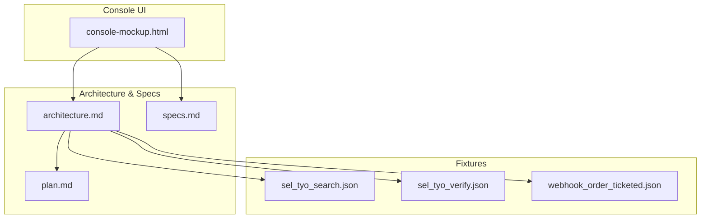
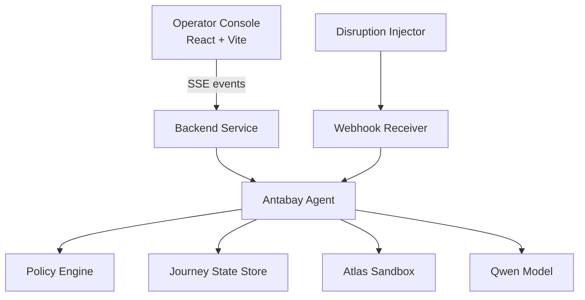
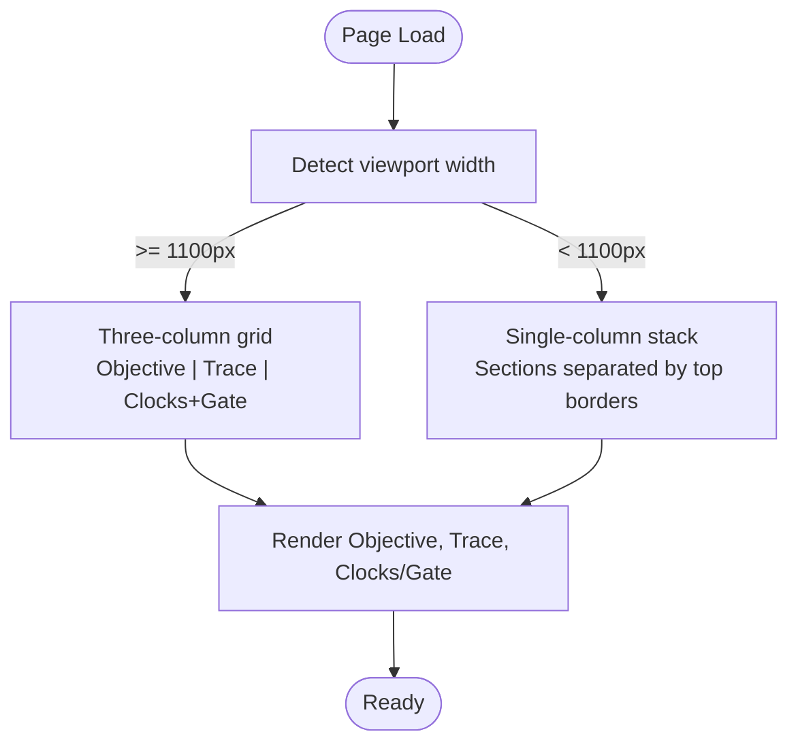
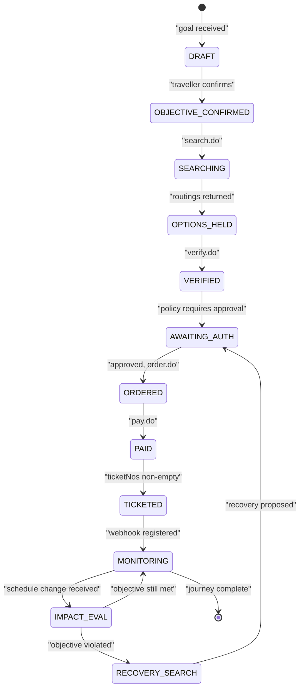
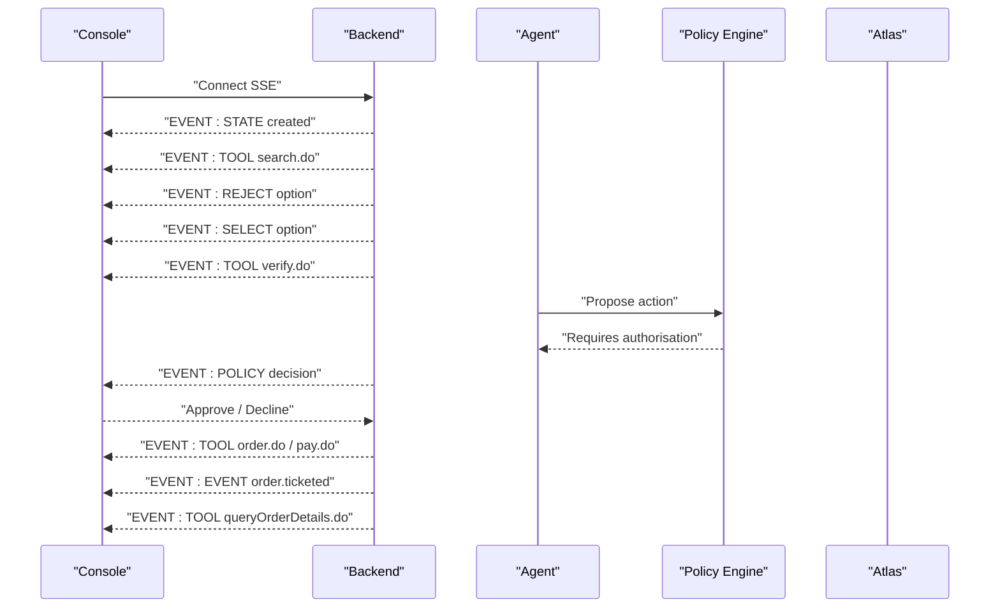
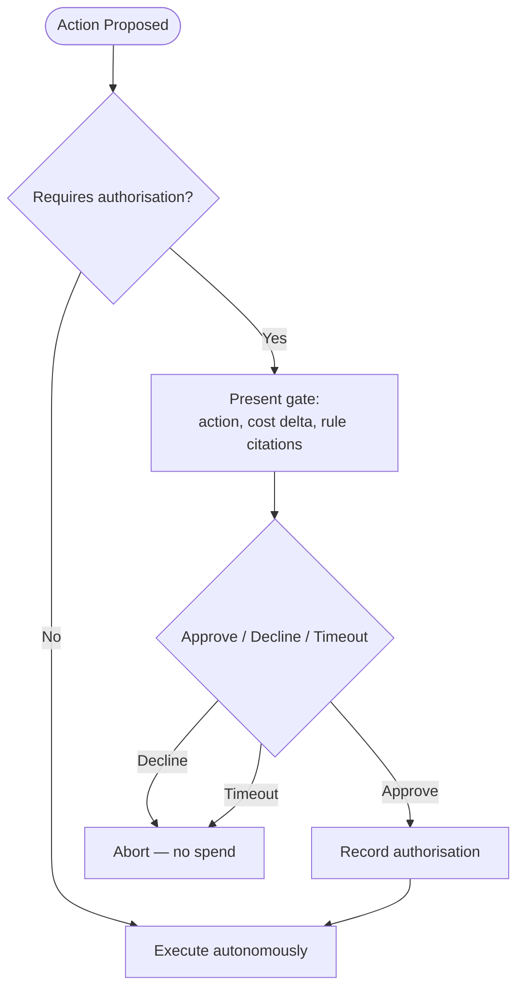
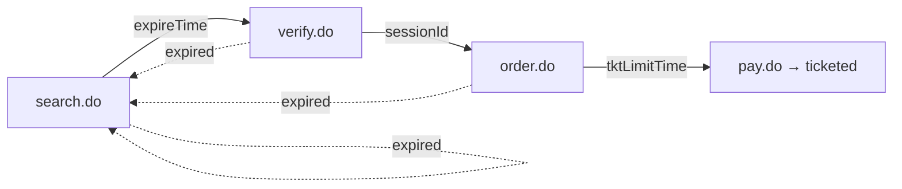
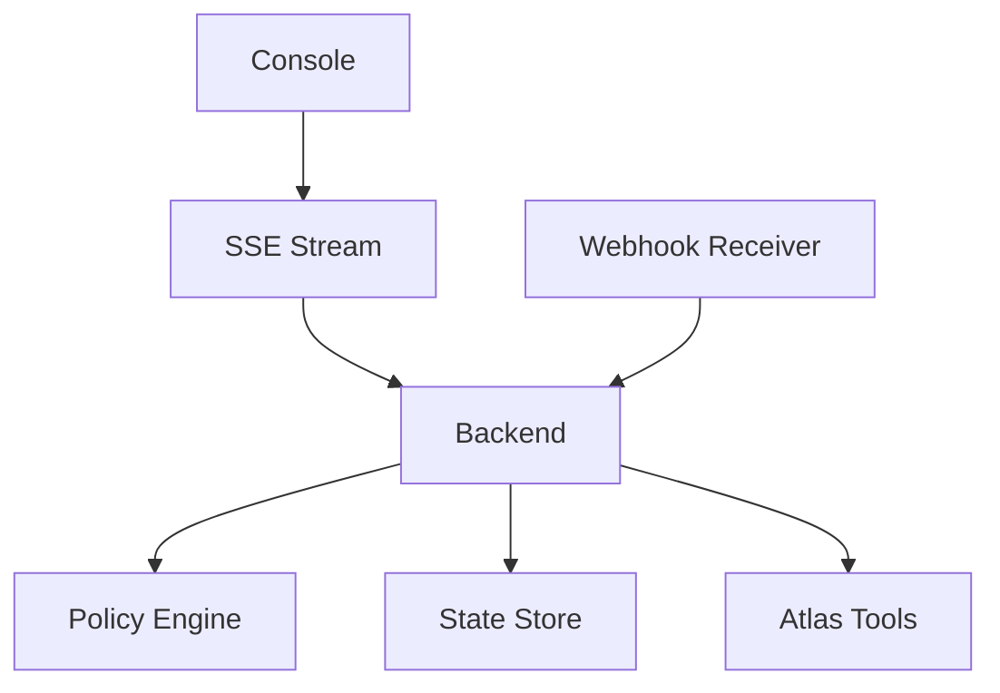

# Operator Console

<cite>
**Referenced Files in This Document**
- [console-mockup.html](file://.antabay/console-mockup.html)
- [architecture.md](file://.antabay/architecture.md)
- [plan.md](file://.antabay/plan.md)
- [specs.md](file://.antabay/specs.md)
- [sel_tyo_search.json](file://fixtures/atlas/sel_tyo_search.json)
- [sel_tyo_verify.json](file://fixtures/atlas/sel_tyo_verify.json)
- [webhook_order_ticketed.json](file://fixtures/atlas/webhook_order_ticketed.json)
</cite>

## Table of Contents
1. Introduction
2. Project Structure
3. Core Components
4. Architecture Overview
5. Detailed Component Analysis
6. Dependency Analysis
7. Performance Considerations
8. Troubleshooting Guide
9. Conclusion
10. Appendices

## Introduction
This document describes the Operator Console for Antabay, a React + Vite interface that provides real-time monitoring and authorization capabilities over an agent-driven booking journey. The console exposes:
- A three-column layout with objective panel, agent trace stream, and expiry clocks plus authorization gate.
- Journey state visualization showing lifecycle progression from DRAFT through MONITORING states.
- Real-time event streaming via Server-Sent Events (SSE) to display tool calls, reasoning steps, policy decisions, and state transitions as they occur.
- An authorization gate that presents financial decisions requiring human approval, including cost impact analysis and rule citations.
- Expiry clocks managing offer windows, session timeouts, and ticketing deadlines with visual progress indicators.
- A responsive grid layout adapting to different screen sizes and accessibility features for operator usability.
- Integration points with backend APIs for journey management, authorization requests, and real-time event consumption.

The design is grounded in verified Atlas contract data and operational “flight strip” aesthetics optimized for video recording at reduced size.

**Section sources**
- [specs.md:171-231](file://.antabay/specs.md#L171-L231)
- [architecture.md:19-78](file://.antabay/architecture.md#L19-L78)

## Project Structure
The repository contains specification and mockup artifacts that define the console’s behavior and visual target:
- Design reference and layout rules are defined in the console mockup HTML.
- System architecture, sequence flows, and state machine are documented in the architecture file.
- Execution plan and delivery order clarify when the console is built and what it demonstrates.
- Fixtures provide realistic payloads used by tests and demonstrations.

**Diagram sources**
- [console-mockup.html:199-398](file://.antabay/console-mockup.html#L199-L398)
- [architecture.md:19-78](file://.antabay/architecture.md#L19-L78)
- [specs.md:171-231](file://.antabay/specs.md#L171-L231)

**Section sources**
- [console-mockup.html:199-398](file://.antabay/console-mockup.html#L199-L398)
- [architecture.md:19-78](file://.antabay/architecture.md#L19-L78)
- [specs.md:171-231](file://.antabay/specs.md#L171-L231)
- [plan.md:151-173](file://.antabay/plan.md#L151-L173)

## Core Components
- Objective Panel: Displays parsed constraints (hard vs soft), destination, deadline, budget, and traveller count. It anchors all downstream decisions and is shown before any external call.
- Agent Trace: A live, append-only log of events emitted by the backend agent, including tool calls, selections, rejections, policy decisions, and state changes. Each event shows timestamp, type, and context.
- Expiry Clocks: Three always-visible timers—offer window, session, and ticketing deadline—with depleting bars and spent states. They drive recovery loops when expired.
- Authorization Gate: Presents actions that require human approval with cost delta, new total, objective impact, and cited rules. Silence counts as refusal; nothing is spent until approved.
- Traveller View: A phone-sized, simplified view of the same journey, suitable for mobile and video capture.

These components render only what the event stream provides and hold no independent state.

**Section sources**
- [specs.md:377-423](file://.antabay/specs.md#L377-L423)
- [console-mockup.html:213-389](file://.antabay/console-mockup.html#L213-L389)

## Architecture Overview
The console connects to a long-lived backend service that runs the Antabay agent, policy engine, webhook receiver, and disruption injector. The agent reasons with a model, interacts with the Atlas tool layer, persists journey state, and emits SSE events to the console. Webhooks are treated as untrusted hints and reconciled against authoritative queries.

**Diagram sources**
- [architecture.md:19-78](file://.antabay/architecture.md#L19-L78)

**Section sources**
- [architecture.md:19-78](file://.antabay/architecture.md#L19-L78)

## Detailed Component Analysis

### Three-Column Layout and Responsive Grid
- Left column: Objective and journey state rack with call budget indicator.
- Center column: Agent trace with color-coded event types and hero events for critical moments.
- Right column: Expiry clocks, authorization gate, and traveller view.
- Below 1100px, columns collapse into a single scrollable column; borders shift to top separators.

**Diagram sources**
- [console-mockup.html:63-65](file://.antabay/console-mockup.html#L63-L65)
- [console-mockup.html:191-195](file://.antabay/console-mockup.html#L191-L195)

**Section sources**
- [console-mockup.html:63-65](file://.antabay/console-mockup.html#L63-L65)
- [console-mockup.html:191-195](file://.antabay/console-mockup.html#L191-L195)

### Journey State Visualization
The state rack shows completed steps, current step, and upcoming steps. The underlying state machine enforces valid transitions and tracks held identifiers with expiry times.

**Diagram sources**
- [architecture.md:212-257](file://.antabay/architecture.md#L212-L257)

**Section sources**
- [architecture.md:212-257](file://.antabay/architecture.md#L212-L257)

### Real-Time Event Streaming (SSE)
- The console consumes a server-sent event stream and renders each event immediately without polling.
- Events include tool calls (search, verify, order, pay, query), selections, rejections, policy decisions, and state transitions.
- Simulated events are visually distinguished from provider-originated events.
- The backend emits events as they occur; the UI holds no state beyond rendering.

**Diagram sources**
- [architecture.md:89-148](file://.antabay/architecture.md#L89-L148)
- [specs.md:377-423](file://.antabay/specs.md#L377-L423)

**Section sources**
- [specs.md:377-423](file://.antabay/specs.md#L377-L423)
- [architecture.md:89-148](file://.antabay/architecture.md#L89-L148)

### Authorization Gate
- Presents actions that spend money, cancel/void bookings, or are irreversible.
- Shows action details, additional cost, new total, objective impact, and cites specific rules.
- No response is recorded as a refusal; nothing is spent until explicitly approved.
- Policy classification is deterministic and not overridden by configuration or prompts.

**Diagram sources**
- [specs.md:491-513](file://.antabay/specs.md#L491-L513)
- [console-mockup.html:349-361](file://.antabay/console-mockup.html#L349-L361)

**Section sources**
- [specs.md:491-513](file://.antabay/specs.md#L491-L513)
- [console-mockup.html:349-361](file://.antabay/console-mockup.html#L349-L361)

### Expiry Clocks System
- Offer window: expires after search results; may arrive pre-aged; replaced by session clock on verification.
- Session: issued by verification; approximately two hours.
- Ticketing deadline: issued upon order creation; thirty minutes to pay and confirm tickets.
- All clocks are tracked in state and displayed with time remaining and progress bars; spent clocks remain visible.

**Diagram sources**
- [architecture.md:261-278](file://.antabay/architecture.md#L261-L278)
- [console-mockup.html:327-347](file://.antabay/console-mockup.html#L327-L347)

**Section sources**
- [architecture.md:261-278](file://.antabay/architecture.md#L261-L278)
- [console-mockup.html:327-347](file://.antabay/console-mockup.html#L327-L347)

### Accessibility and Usability
- Color carries meaning; monospace fonts for data; high-contrast status pills; focus-visible outlines for keyboard navigation.
- Reduced motion respected; blinking elements disabled when motion reduction is preferred.
- Legibility at video scale is required; dense console and simplified traveller view share one event stream.

**Section sources**
- [console-mockup.html:155-160](file://.antabay/console-mockup.html#L155-L160)
- [console-mockup.html:196-196](file://.antabay/console-mockup.html#L196-L196)
- [specs.md:221-230](file://.antabay/specs.md#L221-L230)

### Backend API Integration Points
- Journey management: create journey, persist objective, update state, record audit trail.
- Authorization: propose action, receive policy decision, record outcome (approve/decline).
- Real-time events: emit SSE events for tool calls, decisions, state transitions, and webhooks.
- External tools: search, verify, order, pay, query order details; rate-limited endpoints honor wait instructions and call budgets.

**Section sources**
- [architecture.md:19-78](file://.antabay/architecture.md#L19-L78)
- [specs.md:377-423](file://.antabay/specs.md#L377-L423)

## Dependency Analysis
The console depends on the backend’s SSE stream for all state and trace updates. The backend depends on:
- Policy engine for deterministic authorization decisions.
- Journey state store for durable persistence and rehydration.
- Atlas tool layer for inventory, pricing, ordering, payment, and confirmation.
- Webhook receiver for schedule-change notifications, reconciled against authoritative queries.

**Diagram sources**
- [architecture.md:19-78](file://.antabay/architecture.md#L19-L78)

**Section sources**
- [architecture.md:19-78](file://.antabay/architecture.md#L19-L78)

## Performance Considerations
- The console renders only what the event stream provides; avoid storing large histories in memory.
- Use virtualization or pagination if traces grow very long during replay.
- Respect rate limits and wait instructions from the provider; track call budget per journey.
- Prefer lightweight DOM updates for SSE events; batch where appropriate.
- Keep the traveller view minimal to ensure legibility at small sizes.

[No sources needed since this section provides general guidance]

## Troubleshooting Guide
Common issues and resolutions:
- SSE connection drops: Reconnect automatically; preserve last known state; resume from last event ID if supported.
- Expired offers/session/ticketing deadline: Return to search or prompt for renewal; show spent clocks clearly.
- Unauthorized actions blocked: Show policy rule citations and explain why approval is required.
- Webhook arrives but not confirmed: Treat as hint; reconcile via order query before updating state.
- Rate limiting: Honor wait instructions; back off retries; display remaining budget.

**Section sources**
- [specs.md:377-423](file://.antabay/specs.md#L377-L423)
- [architecture.md:89-148](file://.antabay/architecture.md#L89-L148)

## Conclusion
The Operator Console provides a clear, real-time view of agent-driven travel bookings with strong governance around authorization and expiry management. Its three-column layout, SSE-driven trace, and explicit clocks make complex journeys observable and auditable. The authorization gate ensures financial actions are controlled and explained, while the responsive design and accessibility features support operators across devices and recording scenarios.

[No sources needed since this section summarizes without analyzing specific files]

## Appendices

### Common Operator Workflows
- Monitor active journeys: Open console, observe SSE trace, check state rack and clocks.
- Review agent reasoning: Read selection rationale, rejection reasons, and policy citations in the trace.
- Make authorization decisions: Approve or decline gates; note that silence is refusal and nothing is spent until approved.
- Handle disruptions: Watch for schedule-change events, evaluate objective impact, approve recovery proposals, and verify outcomes.

**Section sources**
- [specs.md:377-423](file://.antabay/specs.md#L377-L423)
- [architecture.md:152-208](file://.antabay/architecture.md#L152-L208)

### Data Models and Fixtures
- Search and verification fixtures demonstrate typical payloads used by the agent and console.
- Webhook fixture illustrates schedule-change notifications consumed by the backend.

**Section sources**
- [sel_tyo_search.json](file://fixtures/atlas/sel_tyo_search.json)
- [sel_tyo_verify.json](file://fixtures/atlas/sel_tyo_verify.json)
- [webhook_order_ticketed.json](file://fixtures/atlas/webhook_order_ticketed.json)