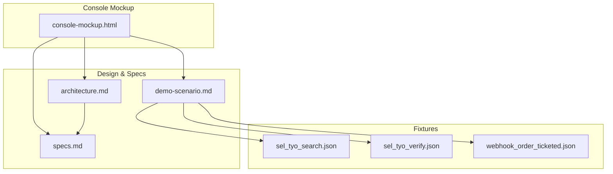
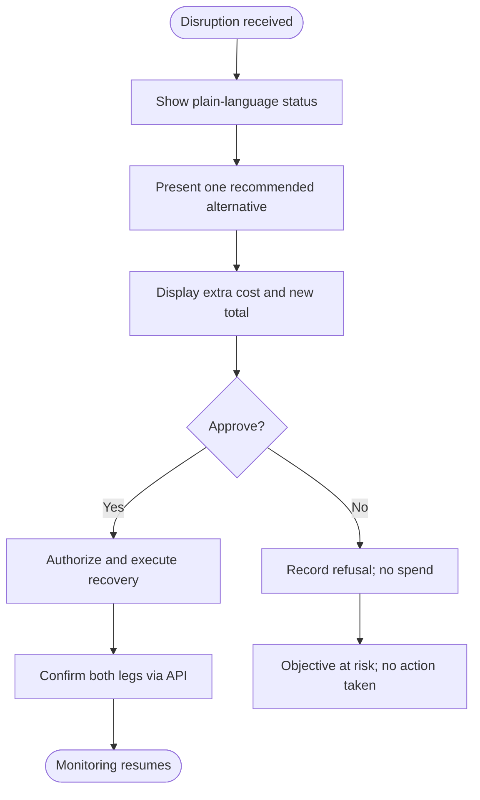
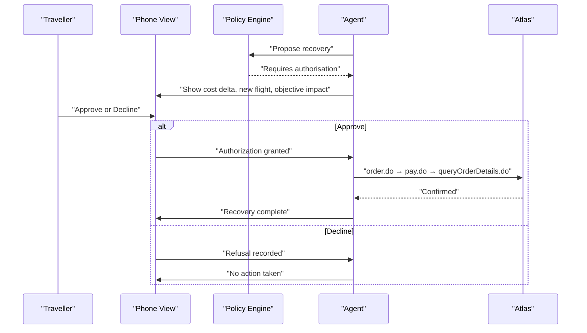
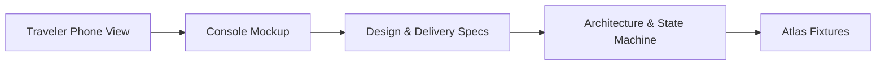

# Traveler Interface

<cite>
**Referenced Files in This Document**
- [architecture.md](file://.antabay/architecture.md)
- [specs.md](file://.antabay/specs.md)
- [console-mockup.html](file://.antabay/console-mockup.html)
- [demo-scenario.md](file://.antabay/demo-scenario.md)
- [sel_tyo_search.json](file://fixtures/atlas/sel_tyo_search.json)
- [sel_tyo_verify.json](file://fixtures/atlas/sel_tyo_verify.json)
- [webhook_order_ticketed.json](file://fixtures/atlas/webhook_order_ticketed.json)
</cite>

## Table of Contents
1. Introduction
2. Project Structure
3. Core Components
4. Architecture Overview
5. Detailed Component Analysis
6. Dependency Analysis
7. Performance Considerations
8. Troubleshooting Guide
9. Conclusion
10. Appendices

## Introduction
This document explains the mobile-responsive traveler interface for end-users experiencing travel disruptions. It focuses on a simplified phone-optimized view that communicates disruption status, alternative flight options, and authorization requests in plain language. The documentation covers the user experience flow from receiving disruption notifications to approving recovery actions with clear cost implications. It also details responsive design patterns for mobile devices, error handling for network issues and failed authorizations, integration points with backend services, accessibility considerations, and examples of common scenarios such as schedule changes, cancellations, and upgrade opportunities.

## Project Structure
The project includes:
- A console mockup that defines the visual target and contains an embedded traveler phone view
- Architecture and sequence diagrams describing system components and flows
- Specifications defining design language, delivery order, and constraints
- Real fixtures from the Atlas sandbox used to ground behavior and data



**Diagram sources**
- [console-mockup.html:167-387](file://.antabay/console-mockup.html#L167-L387)
- [architecture.md:19-78](file://.antabay/architecture.md#L19-L78)
- [specs.md:171-231](file://.antabay/specs.md#L171-L231)
- [demo-scenario.md:81-117](file://.antabay/demo-scenario.md#L81-L117)

**Section sources**
- [console-mockup.html:167-387](file://.antabay/console-mockup.html#L167-L387)
- [specs.md:171-231](file://.antabay/specs.md#L171-L231)
- [architecture.md:19-78](file://.antabay/architecture.md#L19-L78)
- [demo-scenario.md:81-117](file://.antabay/demo-scenario.md#L81-L117)

## Core Components
- Mobile traveler surface: A compact, touch-friendly view showing disruption status, recommended alternatives, and simple approve/decline actions with explicit cost deltas.
- Authorization gate: A deterministic policy-driven approval step that requires human consent before any spend or irreversible action.
- Backend agent and policy engine: Reasoning and decision boundaries; the agent proposes actions while the policy engine decides whether human authorization is required.
- Webhook receiver and reconciler: Receives untrusted hints (e.g., schedule change, ticketed), verifies authoritative state via API, and wakes the agent.
- Expiry clocks: Persistent timers for offer window, session, and ticketing deadline, displayed prominently to guide time-sensitive decisions.

Key behaviors grounded in the repository:
- Disruption triggers re-search and verification of alternatives, then presents a recommendation with cost delta and objective impact.
- Any action that spends money or voids a booking requires authorization.
- Webhooks are treated as hints; authoritative truth comes from querying the provider API.
- The traveler view uses plain language and minimal cognitive load.

**Section sources**
- [architecture.md:152-208](file://.antabay/architecture.md#L152-L208)
- [specs.md:171-231](file://.antabay/specs.md#L171-L231)
- [console-mockup.html:349-361](file://.antabay/console-mockup.html#L349-L361)
- [console-mockup.html:363-387](file://.antabay/console-mockup.html#L363-L387)

## Architecture Overview
The traveler interface sits atop a backend that orchestrates search, verification, booking, payment, monitoring, and recovery. During disruptions, the system evaluates impact against the traveler’s objective, proposes compliant alternatives, and gates execution behind authorization.

```mermaid
sequenceDiagram
participant T as "Traveller"
participant UI as "Console / Phone View"
participant AG as "Antabay Agent"
participant POL as "Policy Engine"
participant RX as "Webhook Receiver"
participant AT as "Atlas Sandbox"
T->>UI : "Receive disruption notification"
UI->>RX : "Event arrives (schedule change)"
RX->>AT : "queryOrderDetails.do (truth)"
AT-->>RX : "Current order state"
RX->>AG : "Wake up"
AG->>AG : "Evaluate impact vs objective"
AG->>AT : "search.do + verify.do (alternatives)"
AG->>POL : "Propose recovery (spends money, voids original)"
POL-->>AG : "REQUIRES AUTHORISATION"
AG->>UI : "Show recommendation + cost delta"
T->>UI : "Approve or Decline"
alt Approve
UI->>AG : "Authorization granted"
AG->>AT : "order.do → pay.do → queryOrderDetails.do"
AT-->>AG : "Confirmed replacement"
AG->>UI : "Recovery complete"
else Decline or no response
UI->>AG : "Refusal recorded"
AG->>UI : "No action taken; objective at risk"
end
```

**Diagram sources**
- [architecture.md:152-208](file://.antabay/architecture.md#L152-L208)
- [specs.md:273-291](file://.antabay/specs.md#L273-L291)

**Section sources**
- [architecture.md:152-208](file://.antabay/architecture.md#L152-L208)
- [specs.md:273-291](file://.antabay/specs.md#L273-L291)

## Detailed Component Analysis

### Mobile Traveler View
- Purpose: Provide a simplified, phone-optimized view focused on what matters during a disruption: current status, a single recommended alternative, and a clear cost delta.
- Content:
  - Plain-language status message indicating risk to the traveler’s goal (e.g., meeting).
  - One recommended option with key details (flight number, route, arrival time).
  - Prominent display of additional cost and total if applicable.
  - Two primary actions: Approve or Not now (decline).
- Interaction:
  - Large, tappable buttons with concise labels.
  - Clear reassurance that nothing is charged until approval.
  - Minimal text to reduce cognitive load under stress.



**Diagram sources**
- [console-mockup.html:363-387](file://.antabay/console-mockup.html#L363-L387)
- [architecture.md:152-208](file://.antabay/architecture.md#L152-L208)

**Section sources**
- [console-mockup.html:363-387](file://.antabay/console-mockup.html#L363-L387)
- [specs.md:171-231](file://.antabay/specs.md#L171-L231)

### Responsive Design Patterns
- Layout: Collapses to a single column below a threshold width, ensuring the traveler view remains readable and usable on phones.
- Typography: Uses a clean sans-serif for interface text and monospace for data values (times, prices, identifiers) to improve scanability.
- Visual hierarchy: Exactly three moments carry visual weight—rejection of an option, objective violation statement, and the authorization gate.
- Color semantics: Fixed palette where color carries meaning (attention, violation, confirmation, simulation) rather than decoration.
- Touch targets: Buttons sized for easy tapping; spacing prevents accidental taps.
- Motion: Reduced motion respected when requested by the device.

**Section sources**
- [specs.md:171-231](file://.antabay/specs.md#L171-L231)
- [console-mockup.html:191-197](file://.antabay/console-mockup.html#L191-L197)

### Authorization Request Presentation
- When recovery involves spending money or voiding a booking, the system requires explicit human authorization.
- The authorization gate shows:
  - What will happen (e.g., rebook onto a specific flight)
  - Additional cost and new total
  - Impact on the traveler’s objective (preserved or not)
  - Why authorization is needed (policy rule references)
- Actions:
  - Approve: Executes recovery after confirming both legs via API.
  - Decline: Records refusal; no spend occurs.
  - Silence: No response is recorded as a refusal; nothing is spent.



**Diagram sources**
- [architecture.md:152-208](file://.antabay/architecture.md#L152-L208)
- [console-mockup.html:349-361](file://.antabay/console-mockup.html#L349-L361)

**Section sources**
- [architecture.md:152-208](file://.antabay/architecture.md#L152-L208)
- [console-mockup.html:349-361](file://.antabay/console-mockup.html#L349-L361)

### Error Handling Approach
- Network issues:
  - Treat webhooks as untrusted hints; always reconcile with authoritative API responses.
  - If queries fail or return unexpected states, pause and retry according to rate limits and wait instructions.
- Failed authorization attempts:
  - Record refusals explicitly; ensure no spend occurs.
  - Surface clear messaging that no action was taken and the objective may be at risk.
- Expiry management:
  - Offer, session, and ticketing deadlines are tracked and shown; expired items revert to search.
- Reconciliation:
  - After payment, confirm ticketing through order details; do not rely solely on payment success or webhook signals.

**Section sources**
- [architecture.md:19-78](file://.antabay/architecture.md#L19-L78)
- [architecture.md:212-257](file://.antabay/architecture.md#L212-L257)
- [specs.md:273-291](file://.antabay/specs.md#L273-L291)

### Integration with Backend Authorization API and Notifications
- Webhook receiver:
  - Accepts events (e.g., schedule change, order.ticketed) and treats them as hints.
  - Verifies current state via authoritative API calls before acting.
- Policy engine:
  - Determines whether an action requires authorization based on rules (e.g., spending money, voiding bookings, irreversibility).
- Agent:
  - Reasons about objectives and constraints, proposes actions, and persists journey state.
- Real-time updates:
  - Console streams agent events to the UI; traveler view surfaces only essential information.

**Section sources**
- [architecture.md:19-78](file://.antabay/architecture.md#L19-L78)
- [architecture.md:152-208](file://.antabay/architecture.md#L152-L208)
- [specs.md:273-291](file://.antabay/specs.md#L273-L291)

### Accessibility Considerations
- Cognitive load:
  - Use plain language and avoid jargon in traveler-facing messages.
  - Present one clear recommendation with transparent cost implications.
- Readability:
  - Monospace for data values improves scanning of times, prices, and identifiers.
  - High contrast and consistent typography aid readability in stressful situations.
- Interaction:
  - Large, clearly labeled buttons reduce mis-taps.
  - Avoid animations that could distract; respect reduced motion preferences.
- Clarity of consequences:
  - Explicitly state that charges occur only after approval.
  - Show objective impact so travelers understand trade-offs.

**Section sources**
- [specs.md:171-231](file://.antabay/specs.md#L171-L231)
- [console-mockup.html:363-387](file://.antabay/console-mockup.html#L363-L387)

### Common Traveler Scenarios and UI Responses
- Schedule change:
  - System detects impact against the objective, searches alternatives, verifies compliance, and presents a recommendation with cost delta.
  - UI shows a simple status message, recommended flight, extra cost, and approve/decline actions.
- Cancellation:
  - Similar to schedule change: re-search, verify, propose replacement, require authorization if spending occurs.
  - UI emphasizes objective preservation and cost transparency.
- Upgrade opportunity:
  - If an upgrade satisfies constraints and stays within budget, present it as an optional improvement with clear cost delta and objective impact.
  - Authorization required if it involves spending or irreversible changes.

These scenarios align with the demo scenario and architecture flows, which describe disruption injection, impact evaluation, alternative search, and authorization gating.

**Section sources**
- [demo-scenario.md:81-117](file://.antabay/demo-scenario.md#L81-L117)
- [architecture.md:152-208](file://.antabay/architecture.md#L152-L208)

## Dependency Analysis
The traveler interface depends on:
- The console mockup for visual reference and embedded phone view
- Architecture and specs for behavioral contracts and design language
- Fixtures for realistic data grounding (search results, verified offers, webhook shapes)



**Diagram sources**
- [console-mockup.html:167-387](file://.antabay/console-mockup.html#L167-L387)
- [specs.md:171-231](file://.antabay/specs.md#L171-L231)
- [architecture.md:19-78](file://.antabay/architecture.md#L19-L78)

**Section sources**
- [console-mockup.html:167-387](file://.antabay/console-mockup.html#L167-L387)
- [specs.md:171-231](file://.antabay/specs.md#L171-L231)
- [architecture.md:19-78](file://.antabay/architecture.md#L19-L78)

## Performance Considerations
- Minimize cognitive load: Present a single recommendation with clear cost delta to reduce decision fatigue.
- Keep interactions fast: Use large tap targets and concise copy to speed approvals.
- Respect device capabilities: Honor reduced motion and ensure legible typography at small sizes.
- Avoid unnecessary network calls: Rely on authoritative reconciliation only when needed; cache short-lived state like expiry windows.

[No sources needed since this section provides general guidance]

## Troubleshooting Guide
- If the traveler does not see an authorization request:
  - Verify that the proposed action meets policy conditions requiring authorization (spending money, voiding bookings, irreversible actions).
  - Check that the agent has completed impact evaluation and alternative verification before presenting the gate.
- If approvals have no effect:
  - Ensure the backend executed order and payment steps and confirmed ticketing via order details.
  - Confirm that both legs were verified post-execution before updating journey state.
- If notifications are delayed:
  - Remember webhooks are hints; reconciliation via API is required to confirm state.
  - Check rate limits and wait instructions for external endpoints.

**Section sources**
- [architecture.md:152-208](file://.antabay/architecture.md#L152-L208)
- [architecture.md:212-257](file://.antabay/architecture.md#L212-L257)
- [specs.md:273-291](file://.antabay/specs.md#L273-L291)

## Conclusion
The mobile-responsive traveler interface delivers a calm, clear experience during disruptions by focusing on one actionable recommendation, transparent cost implications, and simple approve/decline choices. It integrates tightly with backend services that reason about objectives, enforce policy-driven authorization, and reconcile state through authoritative APIs. The design prioritizes readability, touch-friendliness, and accessibility, ensuring stressed travelers can make informed decisions quickly.

[No sources needed since this section summarizes without analyzing specific files]

## Appendices

### Appendix A: Data Grounding Examples
- Search results include multiple routings with pricing, segments, and availability indicators.
- Verified offers provide session-based pricing and booking requirements.
- Webhooks indicate outcomes (e.g., ticketed) but must be reconciled with API queries.

**Section sources**
- [sel_tyo_search.json:1-120](file://fixtures/atlas/sel_tyo_search.json#L1-L120)
- [sel_tyo_verify.json:1-120](file://fixtures/atlas/sel_tyo_verify.json#L1-L120)
- [webhook_order_ticketed.json:1-53](file://fixtures/atlas/webhook_order_ticketed.json#L1-L53)