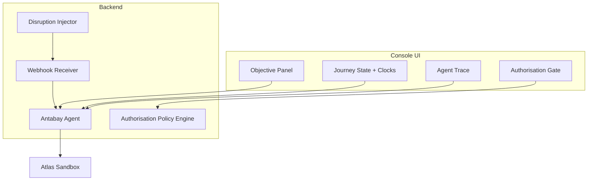
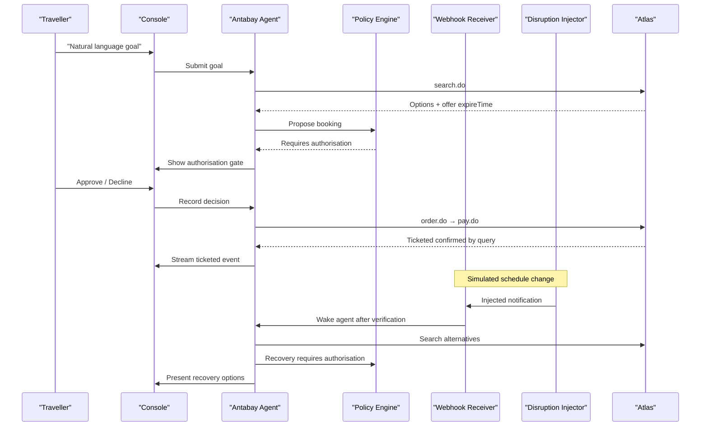
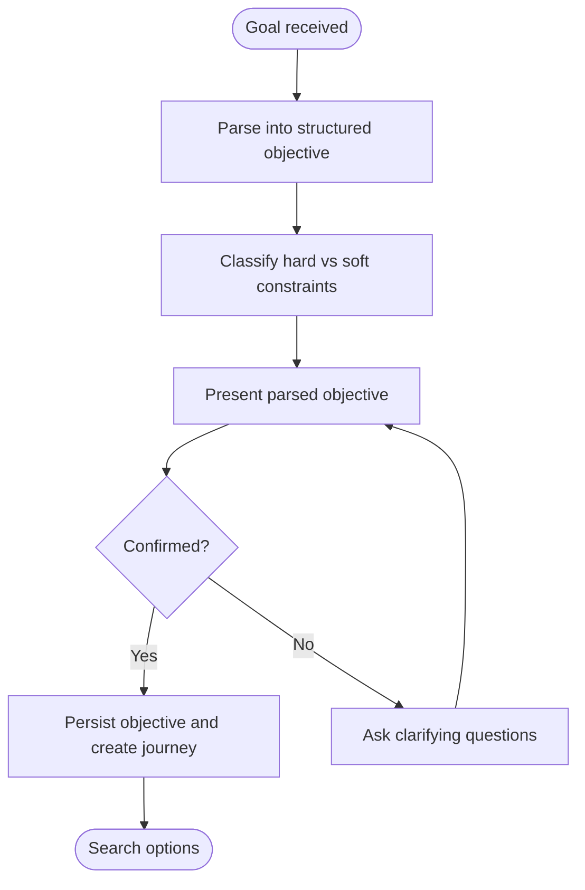
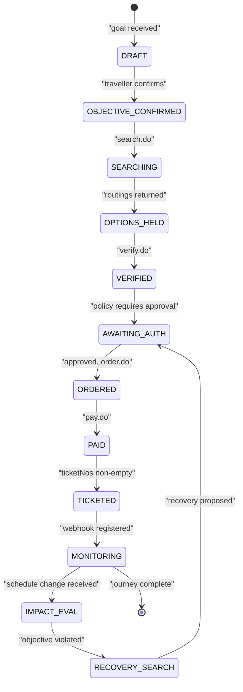
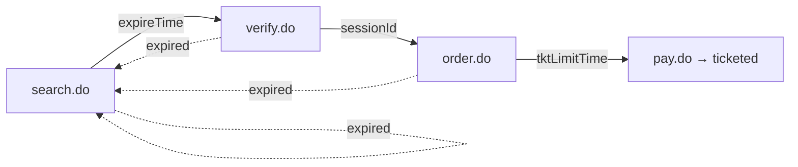
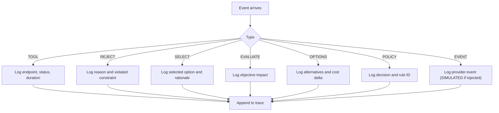
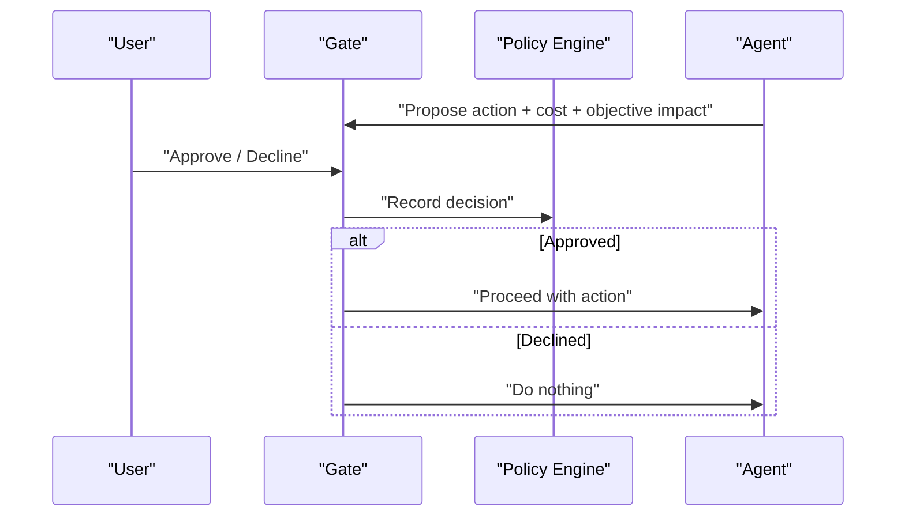
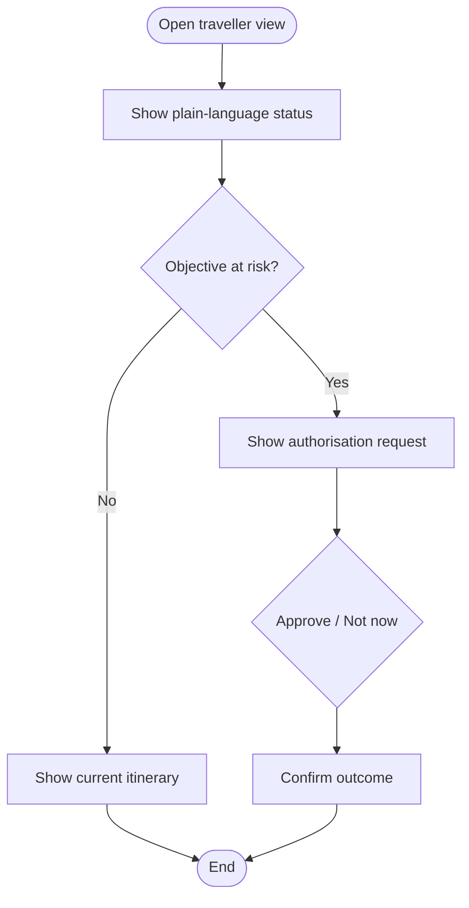
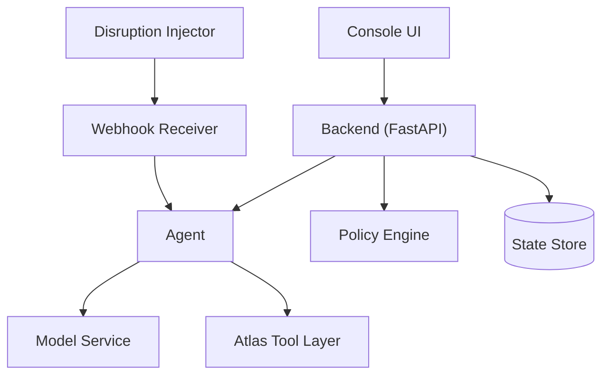

# User Interfaces

<cite>
**Referenced Files in This Document**
- [console-mockup.html](file://.antabay/console-mockup.html)
- [architecture.md](file://.antabay/architecture.md)
- [specs.md](file://.antabay/specs.md)
</cite>

## Table of Contents
1. Introduction
2. Project Structure
3. Core Components
4. Architecture Overview
5. Detailed Component Analysis
6. Dependency Analysis
7. Performance Considerations
8. Troubleshooting Guide
9. Conclusion
10. Appendices

## Introduction
This document describes the user interfaces for Antabay, focusing on two surfaces:
- Operator console: a React + Vite application that streams agent events in real time via Server-Sent Events (SSE), showing objectives, journey state, an agent trace, expiry clocks, and an authorisation gate.
- Traveller-facing mobile view: a simplified, responsive surface that communicates status and collects approvals with minimal interaction.

The design is grounded in a fixed visual language and three-column layout that collapses to a single column on smaller screens. The signature element is the expiry clocks, which remain visible at all times with remaining time and proportional bars. Exactly three event types carry visual weight: option rejection despite numeric compliance, objective violation, and outstanding authorisation requests. Every decision is shown with its reason, and provenance information is always visible.

## Project Structure
The UI specification and reference are defined by:
- A visual mockup that defines layout, palette, typography, and the traveller panel.
- An architecture diagram that maps the console components to backend services and external tools.
- Feature specifications that define functional requirements for the console and traveller experience.

**Diagram sources**
- [architecture.md:21-78](file://.antabay/architecture.md#L21-L78)

**Section sources**
- [console-mockup.html:1-428](file://.antabay/console-mockup.html#L1-L428)
- [architecture.md:21-78](file://.antabay/architecture.md#L21-L78)
- [specs.md:171-231](file://.antabay/specs.md#L171-L231)

## Core Components
- Objective panel: Displays parsed natural-language goals as structured elements, distinguishing hard constraints from preferences, and allows confirmation before downstream action.
- Journey state visualization: Shows completed, current, and pending states; tracks held identifiers and their expiry windows.
- Expiry clocks: Three persistent timers (offer window, session, ticketing deadline) with time remaining and depleting bars; spent clocks remain visible.
- Agent trace: Live stream of events including tool calls, rejections, selections, policy decisions, and provider events; simulated events are visually distinct.
- Authorisation gate: Presents proposed actions, cost deltas, objective impact, and rule citations; supports approve/decline and records outcomes.
- Traveller view: Mobile-friendly summary with plain-language status, itinerary highlights, and a concise approval request.

Key design rules:
- Palette carries meaning; colour is not decorative.
- Monospace font for data values from Atlas; interface text uses a readable sans-serif.
- Three-column layout collapses to one column below a threshold width.
- Provenance footer shows environment, reasoning model, and simulation status.

**Section sources**
- [specs.md:171-231](file://.antabay/specs.md#L171-L231)
- [specs.md:832-894](file://.antabay/specs.md#L832-L894)
- [console-mockup.html:11-197](file://.antabay/console-mockup.html#L11-L197)
- [console-mockup.html:213-387](file://.antabay/console-mockup.html#L213-L387)

## Architecture Overview
The console connects to a long-lived backend process that runs the Antabay Agent, Policy Engine, webhook receiver, and disruption injector. The agent reasons with a model service, interacts with the Atlas Tool Layer, persists state, and emits events to the console. Webhooks are untrusted hints reconciled against authoritative queries.

**Diagram sources**
- [architecture.md:91-208](file://.antabay/architecture.md#L91-L208)

**Section sources**
- [architecture.md:21-78](file://.antabay/architecture.md#L21-L78)
- [architecture.md:91-208](file://.antabay/architecture.md#L91-L208)

## Detailed Component Analysis

### Operator Console: Objective Panel
- Purpose: Capture and confirm a structured objective derived from natural language input.
- Behavior:
  - Parse goal into destination, deadline, budget, travellers, and preferences.
  - Classify each element as hard or soft constraint.
  - Present parsed objective for confirmation before any downstream action.
  - Persist confirmed objective and create a journey record.
- UI mapping: Left column header “Objective” with goal text and constraint rows; tags indicate hard constraints.

**Diagram sources**
- [specs.md:459-520](file://.antabay/specs.md#L459-L520)
- [console-mockup.html:213-239](file://.antabay/console-mockup.html#L213-L239)

**Section sources**
- [specs.md:459-520](file://.antabay/specs.md#L459-L520)
- [console-mockup.html:213-239](file://.antabay/console-mockup.html#L213-L239)

### Operator Console: Journey State Visualization
- Purpose: Show the current position in the journey lifecycle and held identifiers.
- Behavior:
  - Display ordered sequence of states with completed, current, and pending markers.
  - Track identifiers issued by external systems and their staleness windows.
  - Update when transitions occur due to external events or internal actions.
- UI mapping: Left column “Journey state” rack with checkmarks, current highlight, and pending items.

**Diagram sources**
- [architecture.md:214-257](file://.antabay/architecture.md#L214-L257)

**Section sources**
- [specs.md:835-839](file://.antabay/specs.md#L835-L839)
- [console-mockup.html:241-255](file://.antabay/console-mockup.html#L241-L255)
- [architecture.md:214-257](file://.antabay/architecture.md#L214-L257)

### Operator Console: Expiry Clocks
- Purpose: Keep the three critical timers visible at all times with remaining time and proportional bars.
- Timers:
  - Offer window from search results.
  - Session window from verification.
  - Ticketing deadline from order creation.
- Behavior:
  - All three are tracked in state and displayed persistently.
  - Expired clocks remain visible as spent rather than hidden.
  - Bars reflect proportion of remaining time.

**Diagram sources**
- [architecture.md:263-275](file://.antabay/architecture.md#L263-L275)

**Section sources**
- [specs.md:872-874](file://.antabay/specs.md#L872-L874)
- [console-mockup.html:327-347](file://.antabay/console-mockup.html#L327-L347)
- [architecture.md:263-275](file://.antabay/architecture.md#L263-L275)

### Operator Console: Agent Trace
- Purpose: Provide a live, ordered log of every external call, decision, and outcome.
- Event types:
  - TOOL: provider calls with endpoint, status, duration, and payload summaries.
  - REJECT: option rejected with violated constraint cited.
  - SELECT: chosen option with rationale.
  - EVALUATE: objective impact assessment.
  - OPTIONS: alternative recommendations with cost delta.
  - POLICY: authorisation decisions citing rule identifiers.
  - EVENT: provider notifications (real or simulated).
- Visual emphasis:
  - Rejection of compliant options.
  - Objective violation statements.
  - Outstanding authorisation requests.
- Simulation distinction:
  - Simulated events are visually distinct and labelled.

**Diagram sources**
- [specs.md:841-884](file://.antabay/specs.md#L841-L884)
- [console-mockup.html:264-321](file://.antabay/console-mockup.html#L264-L321)

**Section sources**
- [specs.md:841-884](file://.antabay/specs.md#L841-L884)
- [console-mockup.html:264-321](file://.antabay/console-mockup.html#L264-L321)

### Operator Console: Authorisation Gate
- Purpose: Present human-in-the-loop decisions for actions that spend money, void bookings, or are irreversible.
- Content:
  - Proposed action details.
  - Cost delta relative to current position.
  - Effect on objective (preserved or violated).
  - Rule citation for deterministic decisions.
- Interaction:
  - Approve or decline.
  - Silence treated as refusal.
  - Outcomes recorded in audit trail.

**Diagram sources**
- [specs.md:1304-1344](file://.antabay/specs.md#L1304-L1344)
- [console-mockup.html:349-361](file://.antabay/console-mockup.html#L349-L361)

**Section sources**
- [specs.md:1304-1344](file://.antabay/specs.md#L1304-L1344)
- [console-mockup.html:349-361](file://.antabay/console-mockup.html#L349-L361)

### Traveller-Facing Mobile View
- Purpose: Provide a phone-sized, low-density surface for understanding status and approving responses.
- Content:
  - Plain-language statement of whether the objective is on track, at risk, or no longer achievable.
  - Itinerary highlights: carrier, departure, arrival, margin against deadline.
  - Outstanding authorisation request with cost difference and effect on objective.
- Interaction:
  - Approval reachable in no more than two interactions.
  - No agent internals exposed.
  - Simulated events indicated.
- Responsiveness:
  - Shares visual language and palette with the console but at lower density.
  - Collapses gracefully on small screens.

**Diagram sources**
- [specs.md:1871-1924](file://.antabay/specs.md#L1871-L1924)
- [console-mockup.html:363-387](file://.antabay/console-mockup.html#L363-L387)

**Section sources**
- [specs.md:1871-1924](file://.antabay/specs.md#L1871-L1924)
- [console-mockup.html:363-387](file://.antabay/console-mockup.html#L363-L387)

## Dependency Analysis
The console depends on the backend’s event stream and policy decisions. The backend depends on the Atlas Tool Layer for inventory and booking operations, and on a model service for reasoning. Webhooks are untrusted and must be reconciled.

**Diagram sources**
- [architecture.md:21-78](file://.antabay/architecture.md#L21-L78)

**Section sources**
- [architecture.md:21-78](file://.antabay/architecture.md#L21-L78)

## Performance Considerations
- Streaming efficiency:
  - Use SSE to push events without polling; render only what the stream provides.
  - Debounce rapid events to maintain readability while preserving ordering.
- Rendering performance:
  - Virtualize long traces to avoid layout thrash.
  - Keep expiry clock updates lightweight; update DOM nodes directly.
- Network resilience:
  - Handle disconnects and reconnects transparently; resume from last known state.
  - Replay recorded streams indistinguishably from live operation when needed.
- Budget visibility:
  - Show remaining call budget per journey to inform operators of rate limits.

[No sources needed since this section provides general guidance]

## Troubleshooting Guide
Common issues and remedies:
- Event stream disconnects:
  - Detect connection loss; attempt reconnect; fall back to replay mode if available.
- Fast event bursts:
  - Group or throttle rendering; ensure critical events (violations, authorisation) are immediately visible.
- Stale identifiers:
  - When an offer/session/ticketing deadline expires, return to search and refresh UI accordingly.
- Unverified outcomes:
  - Do not present outcomes until independently verified; show unresolved state clearly.
- Simulated vs real events:
  - Ensure simulated events are consistently marked across console and traveller views.

**Section sources**
- [specs.md:832-894](file://.antabay/specs.md#L832-L894)
- [specs.md:1871-1924](file://.antabay/specs.md#L1871-L1924)

## Conclusion
The operator console and traveller view together provide a complete, observable, and safe interface for autonomous travel management. The console exposes rich detail and control, while the traveller view distills essential status and decisions. Real-time streaming via SSE ensures responsiveness, and deterministic authorisation gates keep spending and irreversible actions under human control. The fixed visual language and responsive layout ensure clarity across devices and recording scenarios.

[No sources needed since this section summarizes without analyzing specific files]

## Appendices

### Real-Time Communication Patterns
- Backend emits events for:
  - External calls (endpoint, outcome, elapsed time).
  - Decisions (what was decided and why).
  - Authorisation requests (action, cost, objective impact).
  - Provider notifications (real or simulated).
- Frontend consumes these events to:
  - Append to the agent trace.
  - Update journey state and clocks.
  - Surface authorisation gates.
  - Reflect changes on the traveller view.

**Section sources**
- [specs.md:841-867](file://.antabay/specs.md#L841-L867)
- [specs.md:1882-1897](file://.antabay/specs.md#L1882-L1897)

### Accessibility and UX Patterns
- Legibility at video scale:
  - Ensure all text remains readable when viewed small; remove unnecessary decoration.
- Reduced motion:
  - Respect reduced-motion preferences for animations like blinking indicators.
- Keyboard navigation:
  - Ensure buttons and controls are focusable and operable via keyboard.
- Color semantics:
  - Use color to convey meaning (hold, violation, confirmation, simulation) consistently.

**Section sources**
- [specs.md:897-908](file://.antabay/specs.md#L897-L908)
- [console-mockup.html:191-197](file://.antabay/console-mockup.html#L191-L197)

### Customization and Theming
- Fixed palette tokens:
  - Paper, strip, ink, rule, hold amber, violation red, confirmation blue, simulation violet.
- Typography:
  - Interface text in a readable sans-serif; data values in monospace.
- Layout:
  - Three columns collapse to one below a threshold width; traveller panel shares the same visual language at lower density.

**Section sources**
- [specs.md:171-231](file://.antabay/specs.md#L171-L231)
- [console-mockup.html:11-197](file://.antabay/console-mockup.html#L11-L197)

### Integration Points with Backend APIs and Event Streaming
- Inputs:
  - Natural language goal submitted to backend; parsed into structured objective.
- Outputs:
  - SSE event stream consumed by console to render trace, state, clocks, and gates.
- Authorisation:
  - Approve/decline flows recorded deterministically; silence treated as refusal.
- Webhooks:
  - Inbound notifications treated as untrusted hints; reconciled via authoritative queries before state changes.

**Section sources**
- [architecture.md:21-78](file://.antabay/architecture.md#L21-L78)
- [specs.md:1398-1473](file://.antabay/specs.md#L1398-L1473)