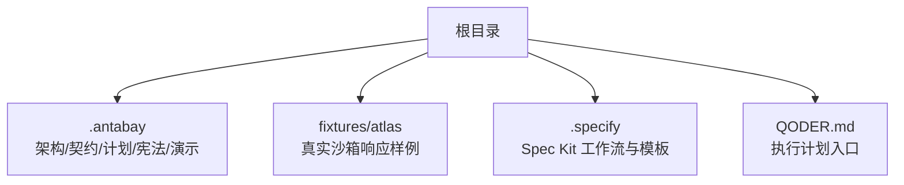
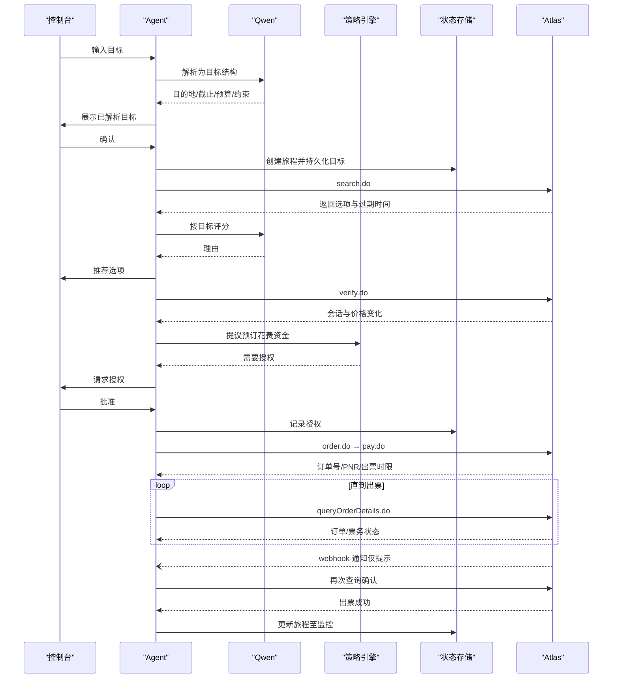
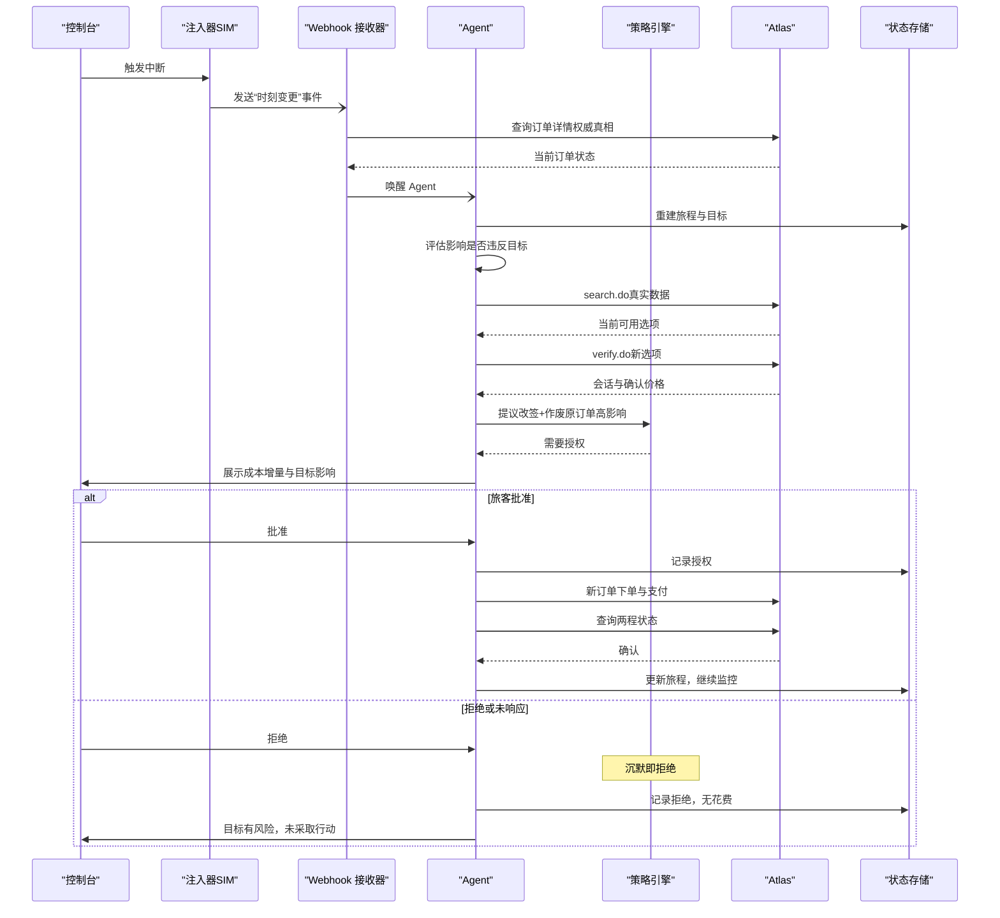
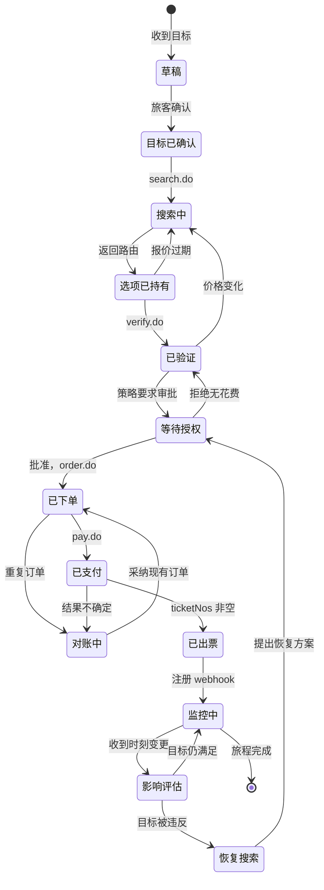
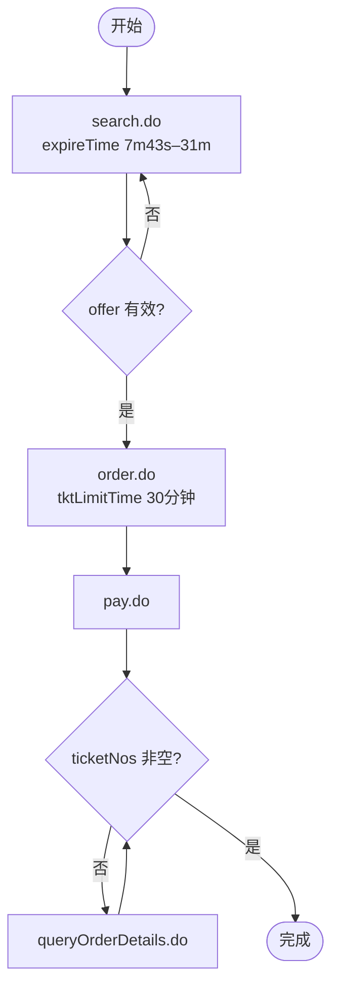
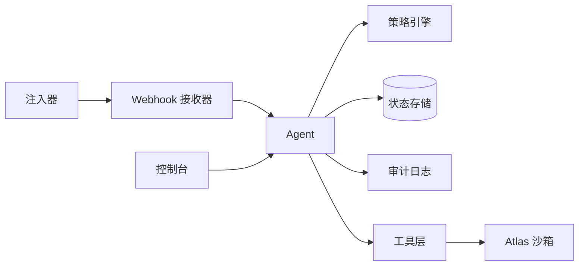

# 项目概述

<cite>
**本文引用的文件**
- [architecture.md](file://.antabay/architecture.md)
- [specs.md](file://.antabay/specs.md)
- [plan.md](file://.antabay/plan.md)
- [constitution.md](file://.antabay/constitution.md)
- [atlas-capability-map.md](file://.antabay/atlas-capability-map.md)
- [demo-scenario.md](file://.antabay/demo-scenario.md)
- [QODER.md](file://QODER.md)
</cite>

## 目录
1. [引言](#引言)
2. [项目结构](#项目结构)
3. [核心组件](#核心组件)
4. [架构总览](#架构总览)
5. [详细组件分析](#详细组件分析)
6. [依赖关系分析](#依赖关系分析)
7. [性能与成本考量](#性能与成本考量)
8. [故障排查指南](#故障排查指南)
9. [结论](#结论)
10. [附录](#附录)

## 引言
Antabay 是一个“智能旅行守护”系统：旅行者用自然语言给出目标，系统在旅程全生命周期内守护该目标。项目采用 Spec-Driven Development（规格驱动开发）方法，将需求、契约与实现严格对齐；在 AI Agent 中实现 ReAct 循环（理解→观察→推理→行动→验证→适应），确保每一步决策都可追溯、可审计、可解释。

项目的核心价值在于：
- 以真实外部数据为唯一事实来源，杜绝编造行程、价格或座位等关键信息。
- 通过确定性策略引擎进行授权控制，任何涉及花费、取消或不可逆操作均需人类批准。
- 以“三时钟”机制管理报价有效期、会话有效期与出票时限，保障流程安全与时效性。
- 提供面向旅客的简洁视图与面向工程师的可观测控制台，兼顾易用性与可调试性。

本项目面向初学者提供清晰的概念说明，同时为有经验的开发者提供足够的技术深度与实现要点。

**章节来源**
- [constitution.md:11-21](file://.antabay/constitution.md#L11-L21)
- [specs.md:273-299](file://.antabay/specs.md#L273-L299)
- [demo-scenario.md:13-28](file://.antabay/demo-scenario.md#L13-L28)

## 项目结构
仓库围绕“规范先行、契约约束、可观测交付”组织：
- .antabay：包含架构、能力契约、演示场景、执行计划、宪法与控制台原型等核心文档。
- fixtures/atlas：来自真实沙箱的脱敏响应样例，用于测试与回放。
- .specify：Spec Kit 工作流与模板配置，支撑规格驱动开发。
- QODER.md：指向当前执行计划的入口提示。



**图表来源**
- [specs.md:11-101](file://.antabay/specs.md#L11-L101)
- [plan.md:11-123](file://.antabay/plan.md#L11-L123)

**章节来源**
- [specs.md:11-101](file://.antabay/specs.md#L11-L101)
- [plan.md:11-123](file://.antabay/plan.md#L11-L123)

## 核心组件
- Antabay Agent：内置 ReAct 循环，负责理解目标、检索选项、评分选择、下单支付、持续验证与恢复。
- 策略引擎（Authorisation Policy Engine）：基于规则决定是否需要人类授权，保证高影响操作受控。
- Webhook 接收器与对账器：接收外部事件（如订单出票、航班变更），仅作为“不受信任的提示”，必须通过 API 查询确认真实状态。
- 中断注入器（模拟）：在演示中触发“航班时刻变更”事件，标注为模拟，不伪造航司数据。
- 状态存储：持久化旅程目标、订单、时钟、审计轨迹与授权历史，支持进程重启后重建。
- 结构化追踪与审计日志：记录每次调用、决策、授权与结果，形成可回放的事件流。
- UI（Journey Console）：React + Vite 控制台，实时展示目标、状态、事件流与过期时钟；并提供旅客视图。

**章节来源**
- [architecture.md:19-86](file://.antabay/architecture.md#L19-L86)
- [specs.md:798-800](file://.antabay/specs.md#L798-L800)

## 架构总览
系统由前端控制台、后端服务、AI 推理模型、外部旅行 API（Atlas）与状态存储组成。Agent 通过工具层调用 Atlas 接口，所有外部交互均被记录并受策略控制。Webhook 事件进入后需经对账确认才更新状态。

```mermaid
graph TB
T["旅客"] --> UI["控制台React+Vite"]
UI --> AG["Antabay Agent<br/>ReAct 循环"]
AG --> POL["策略引擎"]
AG --> DB[("状态存储")]
AG --> LOG["结构化追踪/审计日志"]
AG --> TOOL["工具层search/verify/order/pay/query"]
TOOL --> ATLAS["Atlas 沙箱"]
ATLAS -.-> RX["Webhook 接收器"]
RX --> AG
INJ["中断注入器SIM"] -.-> RX
AG < --> QW["Qwen推理模型"]
```

**图表来源**
- [architecture.md:21-78](file://.antabay/architecture.md#L21-L78)

**章节来源**
- [architecture.md:19-86](file://.antabay/architecture.md#L19-L86)

## 详细组件分析

### 从目标到出票的“快乐路径”
该序列展示了从自然语言目标到最终出票的关键步骤，包括搜索、评分、验证、下单、支付与独立确认。



**图表来源**
- [architecture.md:91-148](file://.antabay/architecture.md#L91-L148)

**章节来源**
- [architecture.md:89-148](file://.antabay/architecture.md#L89-L148)

### 中断检测与恢复
当收到“航班时刻变更”事件时，系统会重新评估目标是否仍可实现，若违反则搜索替代方案，并在需要时请求人类授权执行恢复。



**图表来源**
- [architecture.md:154-208](file://.antabay/architecture.md#L154-L208)

**章节来源**
- [architecture.md:152-208](file://.antabay/architecture.md#L152-L208)

### 旅程状态机
旅程状态机明确定义了各阶段与转换条件，涵盖报价窗口、会话窗口与出票时限三类时钟。



**图表来源**
- [architecture.md:214-257](file://.antabay/architecture.md#L214-L257)

**章节来源**
- [architecture.md:212-257](file://.antabay/architecture.md#L212-L257)

### 三时钟机制
系统维护三个关键时钟：报价过期时间、会话有效期、出票时限。任一过期都会导致流程回退到搜索阶段，确保安全性与一致性。



**图表来源**
- [architecture.md:263-275](file://.antabay/architecture.md#L263-L275)
- [atlas-capability-map.md:304-313](file://.antabay/atlas-capability-map.md#L304-L313)

**章节来源**
- [architecture.md:261-279](file://.antabay/architecture.md#L261-L279)
- [atlas-capability-map.md:107-126](file://.antabay/atlas-capability-map.md#L107-L126)

### ReAct 循环在 Agent 中的实现
- 理解（Understand）：将自然语言目标解析为结构化目标（目的地、截止时间、预算、硬/软约束）。
- 观察（Observe）：调用 search.do 获取真实选项，记录每个选项的过期时间与稀缺信号。
- 推理（Reason）：使用 Qwen 对选项评分，生成可解释的理由，排除违反硬约束的选项。
- 行动（Act）：调用 verify.do、order.do、pay.do，遵循“写不等于证明”的原则。
- 验证（Verify）：通过 queryOrderDetails.do 独立确认出票状态，webhook 仅作为提示。
- 适应（Adapt）：收到中断事件后重新评估目标，必要时提出恢复方案并请求授权。

**章节来源**
- [architecture.md:19-86](file://.antabay/architecture.md#L19-L86)
- [specs.md:252-269](file://.antabay/specs.md#L252-L269)

### 规格驱动开发（Spec-Driven Development）的应用
- 以规格为单一事实来源：所有功能通过规格定义，构建时强制校验外部契约。
- 分阶段交付：按顺序实现契约、旅程模型、搜索与评分、控制台、价格验证、预订路径、后置验证、授权策略、Webhook、中断注入、影响评估与恢复执行。
- 最小可行提交：优先完成端到端演示所需的核心能力，再考虑扩展。

**章节来源**
- [specs.md:273-299](file://.antabay/specs.md#L273-L299)
- [plan.md:177-531](file://.antabay/plan.md#L177-L531)

## 依赖关系分析
- 外部依赖：Atlas 沙箱 API（search/verify/order/pay/query/webhook），Qwen 推理模型。
- 内部依赖：Agent 依赖策略引擎进行授权判定；控制台依赖事件流进行渲染；Webhook 接收器依赖对账逻辑避免误信事件。
- 耦合与内聚：Agent 与工具层松耦合，通过声明式契约隔离外部变化；状态存储与 Agent 解耦，支持进程重启后的重建。



**图表来源**
- [architecture.md:21-78](file://.antabay/architecture.md#L21-L78)

**章节来源**
- [architecture.md:19-86](file://.antabay/architecture.md#L19-L86)

## 性能与成本考量
- 速率限制：search.do 10 QPS，verify.do/getOffers.do 共享 60 QPM，需在每旅程内设置调用预算并遵守 wait 指令。
- 报价时效：offer 过期窗口短且可能部分老化，必须在决策前检查新鲜度。
- 货币混合风险：不同字段可能使用不同货币，禁止直接相加，需显式转换。
- 模型路由：核心流程不依赖顶级模型，推理-heavy 任务才使用更高级别模型，控制成本。
- 离线时段运行：建议在 UTC 14:00–00:00 运行以降低费用。

**章节来源**
- [atlas-capability-map.md:107-126](file://.antabay/atlas-capability-map.md#L107-L126)
- [specs.md:234-249](file://.antabay/specs.md#L234-L249)

## 故障排查指南
- 重复订单（错误码 318）：读取服务器返回的 duplicateOrders，对账现有订单，不要重试。
- 认证失败（错误码 900）：检查凭据或账户问题，不重试。
- 订单不存在（错误码 800）：视为自身状态异常，需修复而非重试。
- Webhook 不可信：任何入站事件都需通过 queryOrderDetails.do 确认，不能仅凭 status 判断成功。
- 价格变化：verify.do 返回价格升高时需重新获得人类确认，之前授权失效。
- 不确定结果：对订单创建或支付的不确定结果进行对账，绝不重复调用。

**章节来源**
- [atlas-capability-map.md:400-415](file://.antabay/atlas-capability-map.md#L400-L415)
- [atlas-capability-map.md:315-379](file://.antabay/atlas-capability-map.md#L315-L379)
- [constitution.md:44-60](file://.antabay/constitution.md#L44-L60)

## 结论
Antabay 通过规格驱动开发与 ReAct 循环，将 AI 推理与确定性策略结合，实现了可审计、可解释、可恢复的智能旅行预订系统。它以真实外部数据为唯一事实来源，严格管控授权与成本，并通过控制台与事件流提供强大的可观测性。对于初学者，项目提供了清晰的业务概念与可视化界面；对于资深开发者，项目展现了严谨的契约治理、状态机设计与容错恢复实践。

## 附录
- 演示场景：锁定 SEL→TYO 的真实数据与约束，包含“陷阱”选项（夜间中转）与推荐选项（ZE605/LJ201），以及完整的视频节拍表。
- 执行计划：四阶段快速交付路径，聚焦契约与旅程模型、预订路径、控制台与追踪、中断/授权/恢复。
- 宪法原则：真实性、验证、权威、模拟透明、运营纪律、工程治理、测试与提交约束。

**章节来源**
- [demo-scenario.md:13-169](file://.antabay/demo-scenario.md#L13-L169)
- [plan.md:151-173](file://.antabay/plan.md#L151-L173)
- [constitution.md:24-105](file://.antabay/constitution.md#L24-L105)