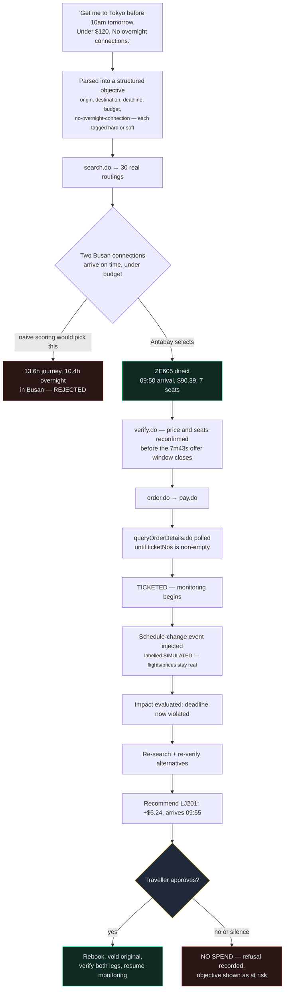
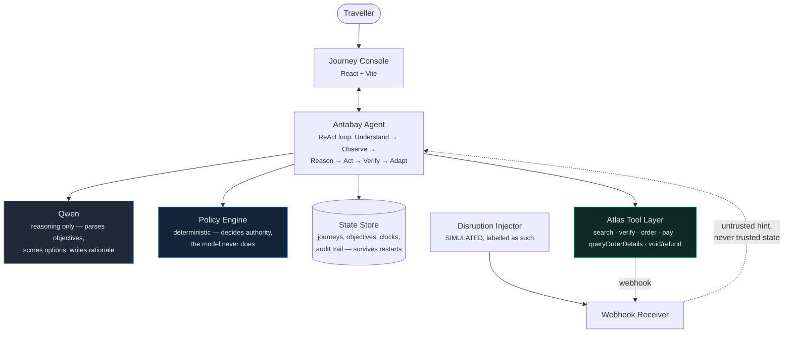
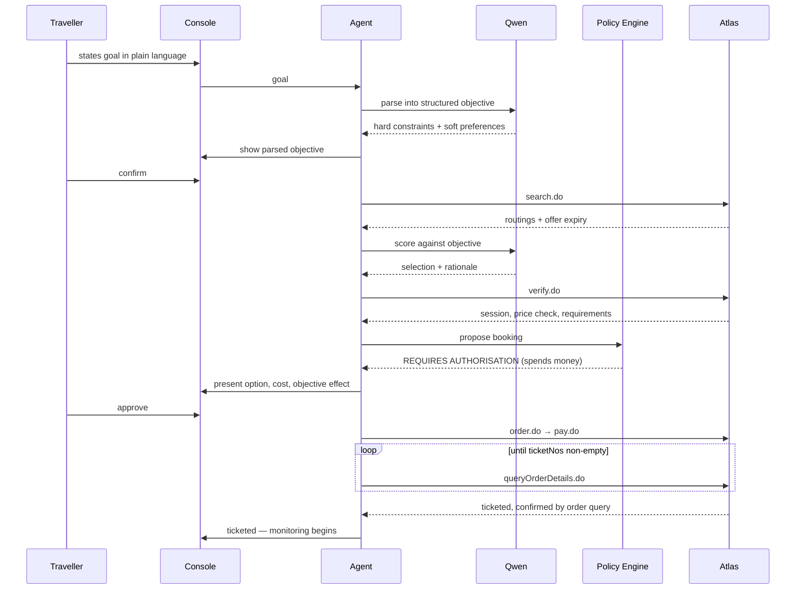
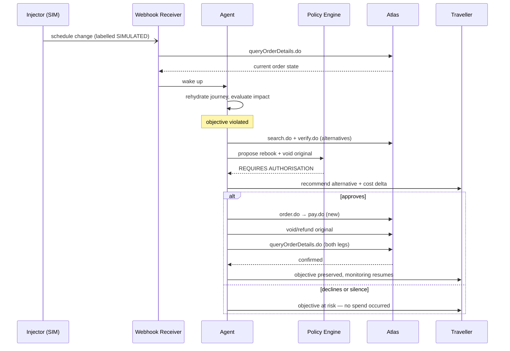
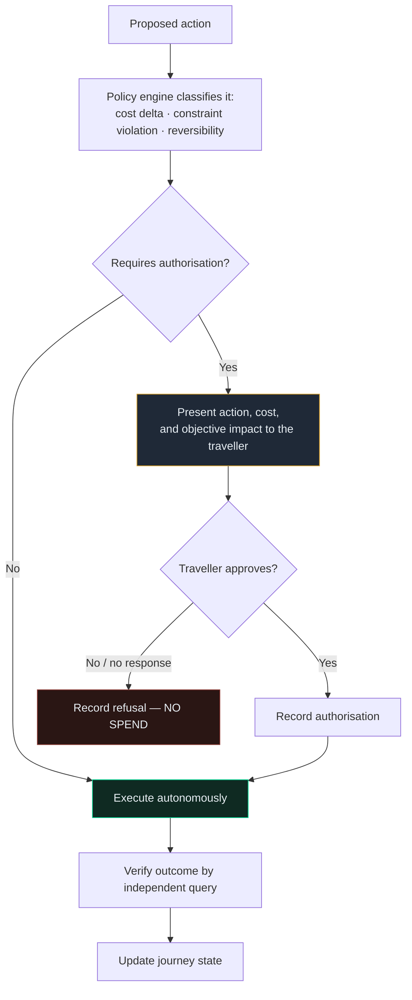
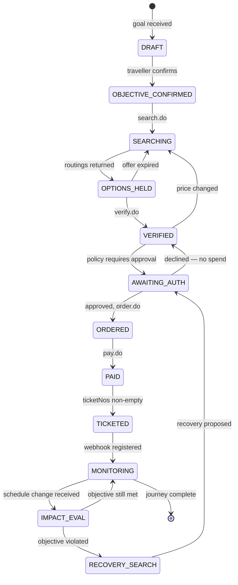

# Antabay

**An AI agent that turns "get me to Tokyo before 10am, under $120, no overnight layovers" into a ticketed flight — and never spends your money without asking.**

Antabay parses a traveller's goal, searches real inventory, defends its choice against cheaper-looking traps, books through a verified travel API, and watches the journey afterwards so it can recover from disruptions on its own. A deterministic policy engine — not the model — decides when a human has to approve something.

[](https://www.youtube.com/watch?v=El7PMixAv4c)

---

## Summary

| | |
|---|---|
| **Demo video** | [youtube.com/watch?v=El7PMixAv4c](https://www.youtube.com/watch?v=El7PMixAv4c) |
| **What it is** | An autonomous travel-booking agent with a hard authorisation gate around every action that spends money, voids a booking, or breaks a stated constraint |
| **Problem solved** | Booking agents that "sort by price and time" pick options that are technically compliant and practically wrong — and once disruption hits, nobody is watching |
| **How** | Parse the goal into hard constraints + soft preferences → search real inventory → score and defend the selection → book with independent verification at every step → monitor and recover, gated by policy, not by the model's own judgement |
| **Reasoning model** | Qwen (via DashScope) — parses objectives, scores options, writes the rationale. It never has spending authority; a deterministic policy engine does |
| **Core rule** | Webhooks are hints, not truth. `queryOrderDetails.do` is truth. Every fact shown to the traveller traces to a real Atlas response |
| **Status** | 12 of 14 specs shipped and tested end-to-end against the live Atlas sandbox; two more (traveller-facing mobile view, demo capture) in progress — see [Specs](#specs) |
| **Stack** | FastAPI + SQLAlchemy + httpx (backend), React 19 + Vite + TypeScript (console), pytest + Playwright + Vitest (tests) |

## The problem

A travel agent that scores flights on arrival time and price alone will happily book you thirteen hours in an airport lounge in Busan, because the number on screen says it arrives on time and under budget.

This actually happened in Antabay's own sandbox data. Two connecting itineraries exist for Seoul → Tokyo that both pass a naive "arrives before 10am, under $120" filter:

| Legs | Layover | Total journey | Price | Arrives |
|---|---|---|---|---|
| 7C907 + 7C1151 | 10.4 hours in Busan | 13.6 hours | $98.93 | 09:30 next day |
| 7C907 + 7C1153 | 13.9 hours in Busan | 17.1 hours | $175.06 | 13:00 next day |

Both look fine on the two numbers a naive filter checks. Neither is fine. Antabay has to reject them and say why — not because a rule for "no Busan" exists, but because "no overnight connections" was one of the traveller's stated hard constraints, and constraint-checking is not the same operation as sorting.

The second half of the problem shows up after booking: disruptions happen mid-journey, and an agent that isn't watching, or that fixes things without asking, is either useless or dangerous. Antabay treats every inbound signal — including its own "did the ticket succeed" question — as something to verify against the authoritative source, never something to trust at face value.

## A concrete example

This is the actual locked demo scenario, run against a real Atlas sandbox (SEL→TYO, 2026-09-05):



Payment succeeding is not proof the ticket exists — Antabay polls `queryOrderDetails.do` until real ticket numbers come back before it calls the booking done. And when the disruption hits, the fix that costs $6.24 more but keeps every constraint intact is the one it recommends — not the cheapest reshuffle, and not something it executes without asking first.

Full scenario, live pricing, and the video beat sheet: [`.antabay/demo-scenario.md`](.antabay/demo-scenario.md).

## How it works



Four rules hold this together, and none of them are optional:

1. **Qwen reasons; the policy engine decides authority.** The model parses the goal, scores options, and writes the rationale a human reads. It never gets to decide that an action doesn't need approval — that line never crosses.
2. **Journey state lives outside the agent.** Every wake-up — a webhook, a scheduled check, a traveller action — rehydrates the full journey from durable storage. Nothing is held in memory between turns.
3. **Webhooks are untrusted hints.** `queryOrderDetails.do` is the truth. A webhook saying "ticketed" or "schedule changed" is a reason to go check, never a reason to update state directly.
4. **Every fact shown to the traveller traces to a real Atlas response.** Nothing is invented, interpolated, or "probably fine."

### The booking path, step by step



### What happens after booking



### The authorisation gate

Every proposed action passes through the same deterministic check before it can spend a cent:



Silence is refusal. Every classification, approval, and refusal is written to an append-only audit trail — nothing is decided or spent off the record.

### Journey lifecycle



Three clocks bound this whole path, and each expiry sends the journey back to search: an **offer window** off `search.do` (as short as 7m43s, sometimes already partly aged on arrival), a **session** from `verify.do` (up to ~2 hours), and a **ticketing deadline** from `order.do` (~30 minutes). All three are tracked in state and shown live in the console.

## The console

Two views render from the same event stream: an operator console showing the agent's full trace (tool calls, rationale, clocks), and a traveller-facing view showing only what a traveller needs — the plain-language objective, current status, and any pending decision.

```
┌──────────────────────────────┬─────────────────────────────────┐
│  JOURNEY: SEL → TYO           │  AGENT TRACE                    │
│  Deadline 10:00 · Budget $120 │                                 │
│                                │  search.do        → 30 options │
│  STATUS: MONITORING           │  score             → ZE605      │
│  Booked: ZE605 · 09:50 arr.   │    "Busan connection rejected — │
│  10-min buffer to deadline    │     violates no-overnight rule" │
│                                │  verify.do         → OK         │
│  ⚠ SIMULATED: schedule change │  order.do → pay.do → TICKETED  │
│    now arrives 10:35 — LATE   │                                 │
│                                │  AUTHORISATION REQUIRED         │
│  Recommended: LJ201            │    rebook + void original       │
│  +$6.24 · arrives 09:55        │    reason: keeps deadline +     │
│                                │    budget intact                │
│  [ Approve ]   [ Decline ]     │                                 │
└──────────────────────────────┴─────────────────────────────────┘
```

**[→ Open the live, interactive mockup](https://claude.ai/code/artifact/bc5b8338-61f5-4bff-a9f5-1428ee267d4a)** (source: [`.antabay/console-mockup.html`](.antabay/console-mockup.html)).

## Project structure

```text
antabay/
├── backend/            FastAPI service — agent, policy engine, webhook
│   ├── journey/           receiver, Atlas tool layer, state store
│   └── tests/          pytest suites (unit, integration, live-sandbox)
├── frontend/           React + Vite console (operator + traveller views)
│   ├── src/               plus Playwright e2e specs
│   └── e2e/
├── specs/              One directory per feature — spec → clarify →
│   └── NNN-feature/       plan → tasks → implementation, spec-kit driven
├── fixtures/atlas/     Redacted real Atlas sandbox responses, used to
│                          keep tests fast and deterministic
└── .antabay/           Architecture, constitution, capability map,
                           and the locked demo scenario
```

## Specs

Built spec-first: every feature goes through `/speckit.specify → /speckit.clarify → /speckit-plan → /speckit-tasks → /speckit.implement`, with test-first development and full traceability back to functional requirements.

| # | Feature | Status |
|---|---|---|
| 000 | Atlas Capability Contract | Superseded — findings folded into later specs |
| 001 | Journey Objective Model | Shipped |
| 002 | Flight Search | Shipped |
| 003 | Option Scoring | Shipped |
| 004 | Price Verification | Shipped |
| 005 | Booking Path | Shipped |
| 006 | Agent Trace Console | Shipped |
| 007 | Webhook Receiver | Shipped |
| 008 | Disruption Injector | Shipped |
| 009 | Impact Evaluation | Shipped |
| 010 | Authorisation Policy | Shipped |
| 011 | Recovery Execution | Shipped |
| 012 | Post-Action Verification | Shipped |
| 013 | Traveller Mobile Experience | In progress |
| 014 | Demonstration Capture | Shipped |

Every already-shipped feature has been verified against the real Atlas sandbox, not just against mocked HTTP calls — that distinction matters: a mocked test suite passing is not proof the system works against the live API, which is exactly how a six-feature authentication-header bug stayed invisible until someone actually ran it live.

## Getting started

```bash
# Backend
cd backend
python -m venv .venv && source .venv/bin/activate
pip install -e ".[dev]"
uvicorn journey.api.main:app --reload

# Frontend
cd frontend
npm install
npm run dev

# Tests
cd backend && python -m pytest tests/ --tb=short
cd frontend && npx vitest run && npx playwright test
```

`.env` at the repo root holds Atlas sandbox and DashScope credentials (never committed — see `.gitignore`).

## Further reading

- Architecture and design rules: [`.antabay/architecture.md`](.antabay/architecture.md)
- Governing principles (the 21 constitution rules every feature is checked against): [`.antabay/constitution.md`](.antabay/constitution.md)
- Verified Atlas endpoint contract: [`.antabay/atlas-capability-map.md`](.antabay/atlas-capability-map.md)
- Locked demo scenario and video beat sheet: [`.antabay/demo-scenario.md`](.antabay/demo-scenario.md)
- Full generated wiki (architecture, testing strategy, deployment, per-component deep dives): [`.qoder/repowiki/en/content/`](.qoder/repowiki/en/content/)
